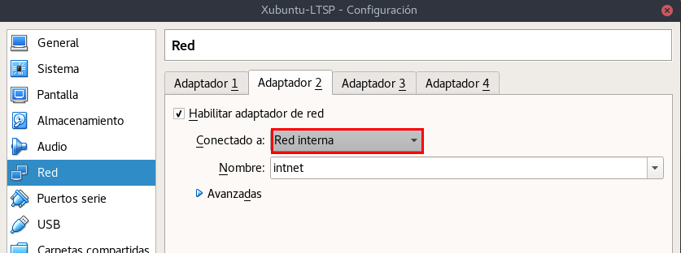

# 1. LTSP/Xubuntu

## 1.1 Configuración Máquina Virtual Server Xubuntu 16.04.1

Creamos primero una nueva máquina virtual en el VirtualBox. Es necesario crear dos tarjetas de red.

* Tarjeta de Red Adaptador Puente

* Tarjeta de Red Interna

    * La dirección IP 192.168.67.1 /24

### 1.1.1 Instalación Xubuntu 16.04.1
