# LTSP/Xubuntu

- [Configuración Máquina Virtual Server Xubuntu 16.04.1](#id1)

    - [Instalación Xubuntu 16.04.1](#id2)

    - [Configuración de las Tarjetas de red](#id3)

    - [Creación de usuarios](#id4)

    - [Instalación el servicio LTSP](#id5)

    - [Configuración de servicio DHCP en LTSP](#id6)

- [Preparar MV Cliente](#id7)

- [Video del proceso de funcionamiento del Servidor ltsp con el cliente](#id8)

## Configuración Máquina Virtual Server Xubuntu 16.04.1 

Creamos primero una nueva máquina virtual en el VirtualBox. Es necesario crear dos tarjetas de red.

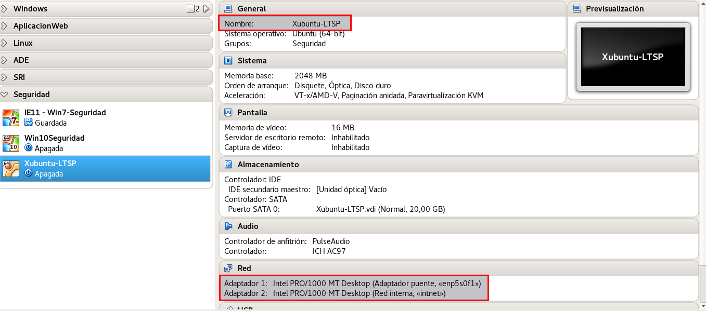

* Tarjeta de Red Adaptador Puente

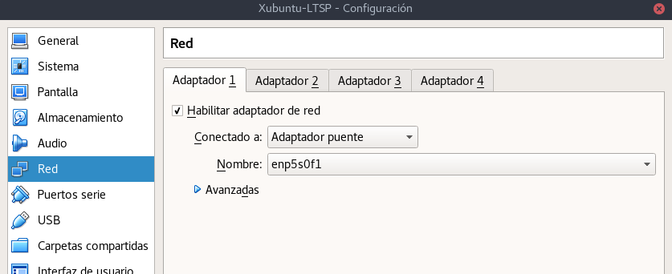

* Tarjeta de Red Interna

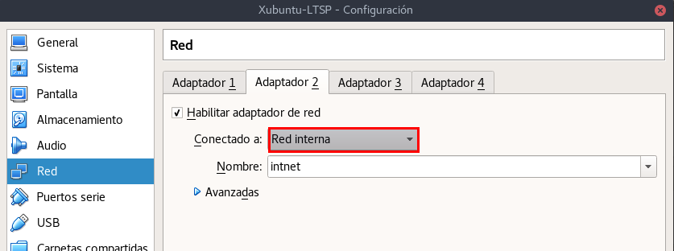

    * La dirección IP 192.168.67.1 /24

### Instalación Xubuntu 16.04.1 
Ejecutamos la iso de Xubuntu en el VirtualBox. Instalamos el Xubuntu y configuramos todos por defecto.

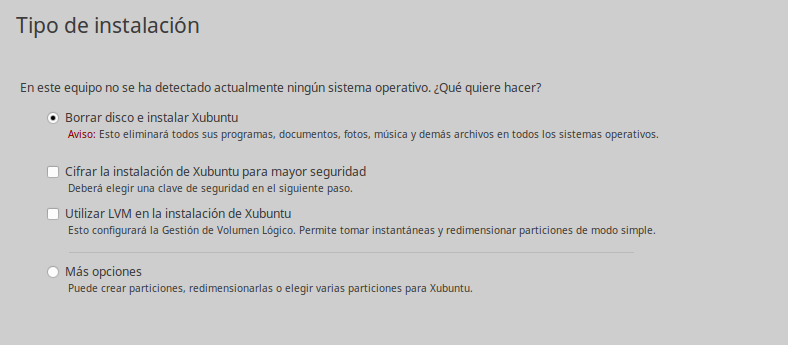

Configuración del usuario y nombre de Equipo.

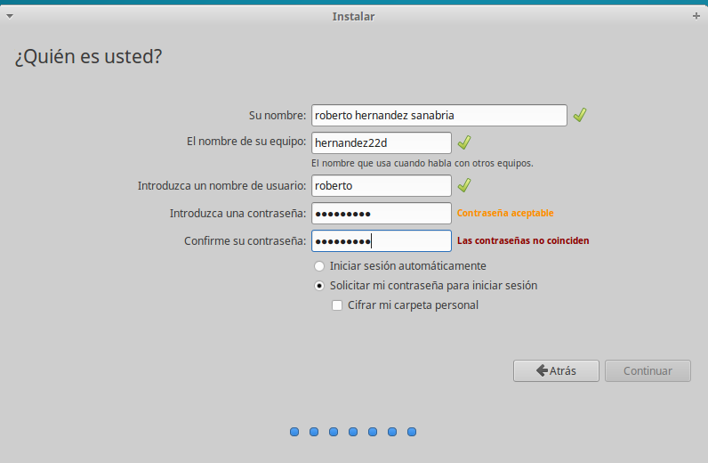

### Configuración de las Tarjetas de red 
*  Tarjeta de Red Externa

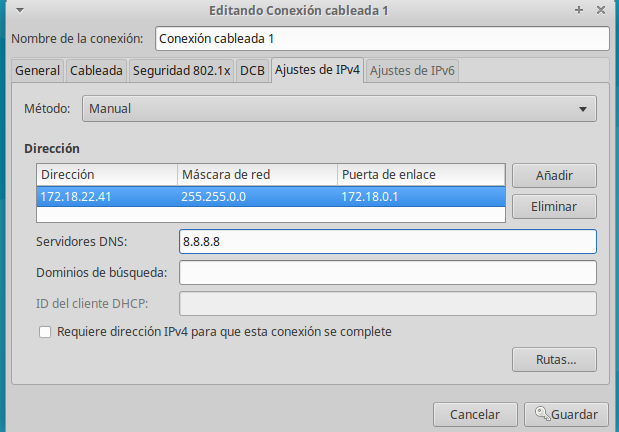

* Tarjeta de Red Interna

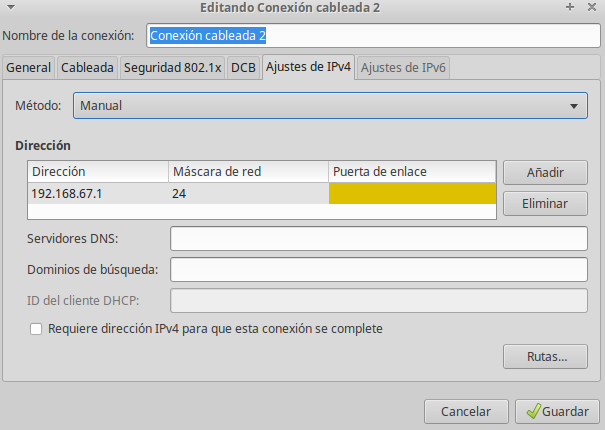

Comprobación de la instalación de Xubuntu con las configuraciones especificas

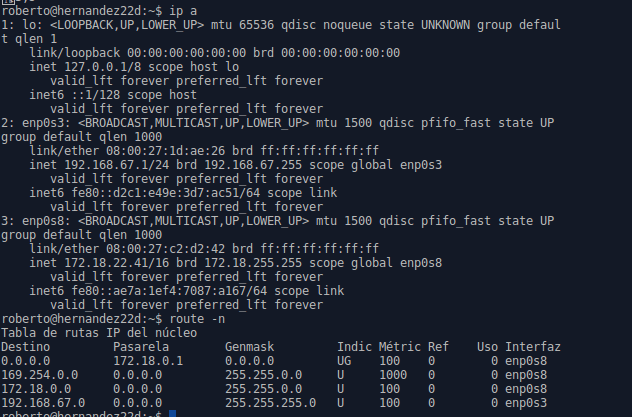

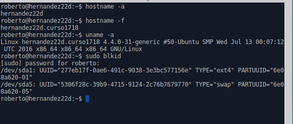

### Creación de usuarios 
Para crear nuevos usuarios escribimos el comando adduser "Nombre-Usuario"

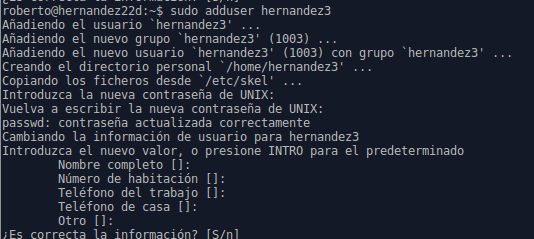

Confirmación de los usuarios creados

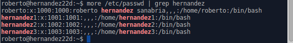

### Instalación el servicio LTSP 

Primero tenemos que instalar el servicio ssh, para permitir acceso remoto a la máquina.
> * apt-get install ssh

Modificamos el fichero /etc/ssh/sshd_config y permitimos
> * PermitRootLogin Yes

Comenzamos con la instalacion del LTSP
> * apt-get install ltsp-server-standalone

Termina de instalarse el ltsp. Procesamos en crear una imagen del SO.

> *  ltsp-build-client

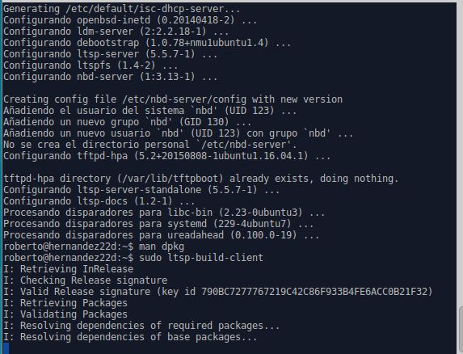

Ejecutamos el siguiente comando para verificar la información

> * ltsp-info

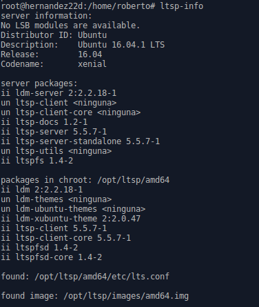

### Configuración de servicio DHCP en LTSP 

Consultamos el fichero /etc/ltsp/dhcpd.conf

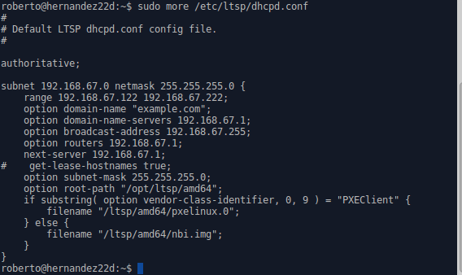

> Nota para actualizar la imagen

>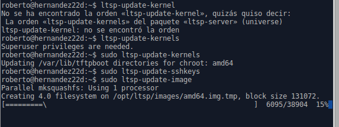

Comprobamos que el servicio esta corriendo.
> dhcpd

> >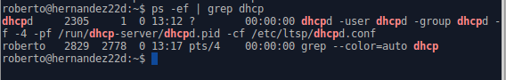

> tftp

> >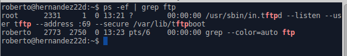

    32 bits o 64 bits

    Si el servidor es de 64-bits pero los clientes tienen
    arquitectura de 32-bits entonces usar el comando siguiente
    ltsp-build-client --arch i386 para crear una imagen de 32 bits.

    Ejecutar ltsp-info, para consultar información.

    NOTA

    En el caso de tenemos problemas con la imagen, estos son
    los comandos LTSP para volver a actualizar la imagen.

        * ltsp-update-kernel
        * ltsp-update-sshkeys
        * ltsp-update-image

## Preparar MV Cliente 

Creamos una máquina virtual en VirtualBox:

    * Sin disco duro y sin unidad de DVD.
    * Sólo tiene RAM, floppy
    * Tarjeta de red PXE en modo "red interna".

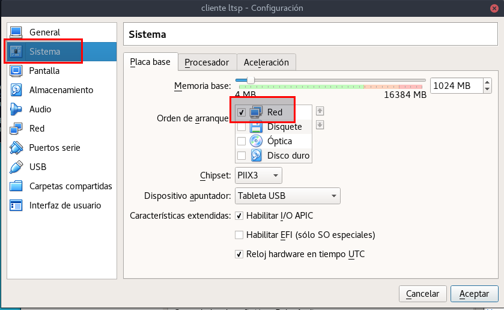

Se comprueba que inicia en el equipo cliente el sistema operativo del servidor ltsp.

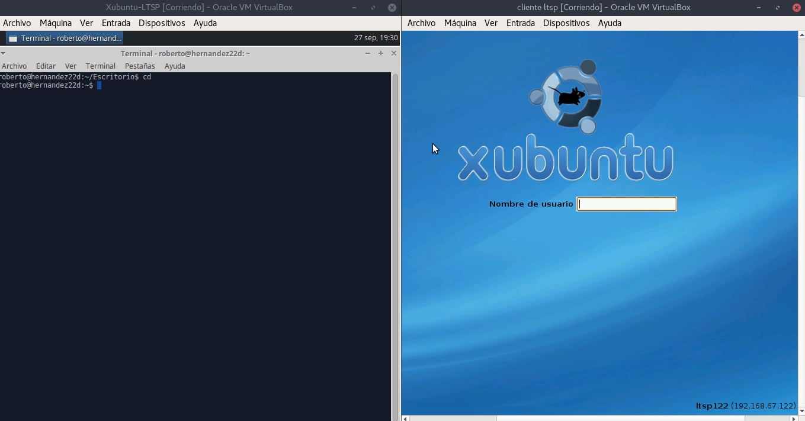

> Nota:
> > En las máquinas virtuales tiene que habilitar la siguiente configuración:

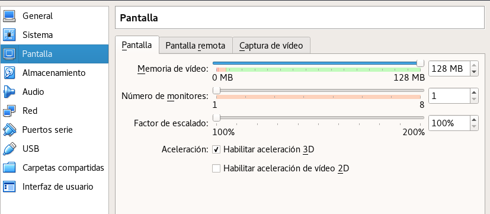

Comprobación de los siguientes comando para ver información de los usuarios, el sistema y las conexiones.

    * whoami        # Muestra el usuario actual
    * who           # Muestra los usuarios conectados al sistema
    * arp           # Muestra la tabla ARP (Asociaciones de IP con MAC)
    * netstat -ntap # Muestras las conexiones con el exterior

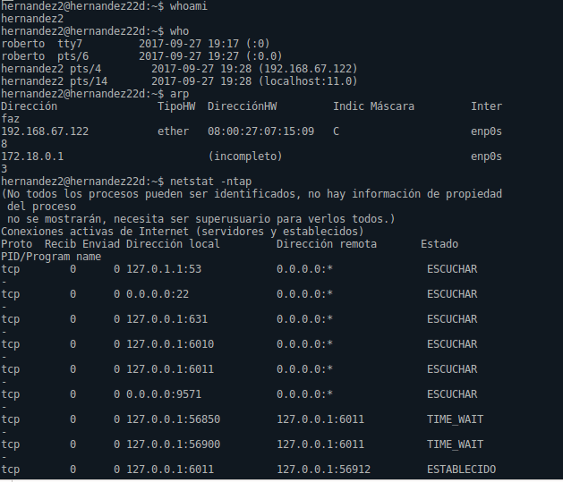

## Video del proceso de funcionamiento del Servidor ltsp con el cliente.

