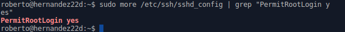

# 1. LTSP/Xubuntu

## 1.1 Configuración Máquina Virtual Server Xubuntu 16.04.1

Creamos primero una nueva máquina virtual en el VirtualBox. Es necesario crear dos tarjetas de red.

* Tarjeta de Red Adaptador Puente

* Tarjeta de Red Interna

    * La dirección IP 192.168.67.1 /24

### 1.1.1 Instalación Xubuntu 16.04.1
Ejecutamos la iso de Xubuntu en el VirtualBox. Instalamos el Xubuntu y configuramos todos por defecto.

Configuración del usuario y nombre de Equipo.

### 1.1.2 Configuración de las Tarjetas de red
*  Tarjeta de Red Externa

* Tarjeta de Red Interna

Comprobación de la instalación de Xubuntu con las configuraciones especificas

### 1.1.3 Creación de usuarios
Para crear nuevos usuarios escribimos el comando adduser "Nombre-Usuario"

Confirmación de los usuarios creados

### 1.1.4 Instalación el servicio LTSP

Primero tenemos que instalar el servicio ssh, para permitir acceso remoto a la máquina.
* apt-get install ssh

Modificamos el fichero /etc/ssh/sshd_config y permitimos
* PermitRootLogin Yes

Comenzamos con la instalacion del LTSP
* apt-get install ltsp-server-standalone

Termina de instalarse el ltsp. Procesamos en crear una imagen del SO.

*   ltsp-build-client

Ejecutamos el siguiente comando para verificar la información

* ltsp-info

### 1.1.5 Configuración de servicio DHCP en LTSP

Consultamos el fichero /etc/ltsp/dhcpd.conf

> Nota para actualizar la imagen

>

Comprobamos que el servicio esta corriendo.

