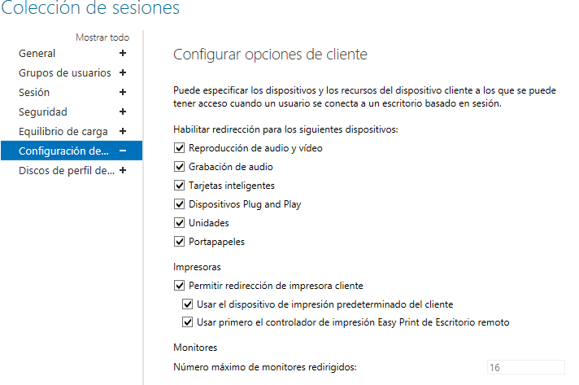
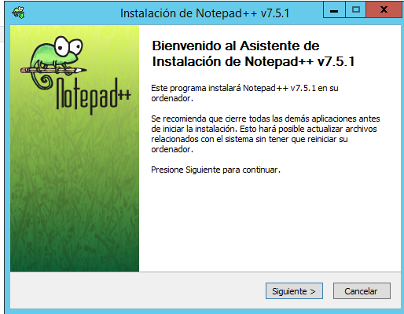

# Remote Desktop Protocol Windows Server 2012

- [Instalación de RDP (Remote Desktop Protocol) en Windows Server 2012](#1)

- [2. Comprobación en el Servidor si funciona por Acceso a Web el Escritorio remoto y RemotoAPP](#2)

    - [2.1 Conexión Remota al Escritorio de Windows 7](#3)

        - [2.1.1 Comprobación en el Servidor que establece conexión el Cliente Windows 7](#4)

- [3. Creación de Usuario para RDP](#5)

- [4. Establecer aplicaciones para el RemoteAPP](#6)

    - [Instalación de aplicación NotePad++](#7)

    - [4.2 Publicar Aplicación en el RemotoAPP](#8)

- [5. Conexión RemotaAPP desde Windows 7 -> NotePad++](#9)

## 1. Instalación de RDP (Remote Desktop Protocol) en Windows Server 2012.

Lo primero que tenemos que realizar es crear un directorio activo. Es obligatorio para utilizar el RDP de Windows Server 2012.
Tenemos ya instalado un directorio Activo.

Para la instalación de RDP solo tenemos que ir `administrador de servidor -> administrar -> agregar nuevos roles`

Le damos siguiente y seguimos el asistente.

Debemos seleccionar `instalación de servicios de Escritorio Remoto`

seleccionamos `inicio rápido`

seleccionamos `implementación de escritior basado en sesión`

Por defecto ya nos debe establecer nuestro servidor.

Le damos siguiente y comienza el proceso de instalación.

El servidor se reiniciará varias veces.

El proceso de instalación termino.

## 2. Comprobación en el Servidor si funciona por Acceso a Web el Escritorio remoto y RemotoAPP.

Solo tenemos que escribir en nuestro navegador el siguiente link `https://hernandez22s.skynet.edu/rdweb` o `https://172.18.22.21/rdweb`

Tenemos que marcar vaya a este sitio Web, esto ocurre porque no tenemos un certificado digital validado en un entidad certificadora.

Solo escribimos nuestro dominio `skynet\administrador` y su `contraseña`.

Comprobamos que tenemos varias aplicaciones disponibles para utilizar, las que vienen por defecto en la instalación del RDP.

Ejecutamos una aplicación.

### 2.1 Conexión Remota al Escritorio de Windows 7

Solo tenemos que ir a la pestaña de conectarse a un equipo remoto. Nos pedirá `usuario y contraseña`.

Le damos a conectar.

Establecemos conexión.

> Todos lo Sistemas Operativos Windows  tienen instalado por defecto la aplicación de cliente rdp por lo tanto con una dirección IP o el dominio correspondiente podemos conectarnos al Servidor mediante conexión remota.

#### 2.1.1 Comprobación en el Servidor que establece conexión el Cliente Windows 7

Utilizamos en el servidor desde una línea de comando el siguiente comando. `netstat`

## 3. Creación de Usuario para RDP

Tenemos que ir a `usuario y equipos del directorio activo -> user -> crear nuevo usuario`

## 4. Establecer aplicaciones para el RemoteAPP

Tenemos que abrir el `administrador de servidor -> servicio de escritorio remoto`.

Tenemos que dar clic al `QuickSession -> Tareas -> Editar`

Podemos agregar grupos y usuarios para que dichas aplicaciones solo puedan utilizarlas los usuarios y grupos agregados.

### 4.1 Instalación de aplicación NotePad++

Solo tenemos que instalar la aplicación en el servidor.

### 4.2 Publicar Aplicación en el RemotoAPP.

Tenemos que dar clic al `QuickSession -> Tareas -> Publicar programas RemotoAPP`

Seleccionamos en el servidor el programa instalado.

Confirmamos la aplicación.

Se comprueba que ya tenemos agregado la nueva aplicación.

## 5. Conexión RemotaAPP desde Windows 7 -> NotePad++

Establecemos la IP del servidor en el navegador del Equipo de Windows 7.

Escribimos el `dominio\usuario y contraseña`

Ejecutamos la aplicación.

Le damos conectar.

Tenemos nuestra aplicación NotePad++ en nuestro Windows 7.

