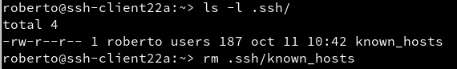
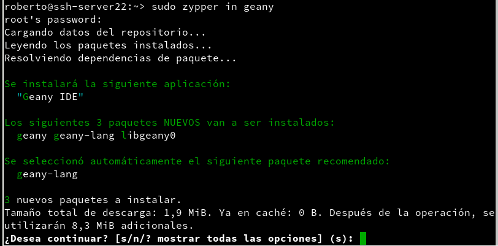

# Acceso remoto SSH

- [Servidor SSH](#id1)

    - [Configuración IP](#id2)

    - [Cambio de Nombre ssh-server22](#id3)

    - [Añadir los Equipos al fichero hosts](#id4)

    - [Comprobación de los siguientes comandos](#id5)

    - [Creación de los siguientes usuarios](#id6)

- [Cliente OpenSuSe](#id7)

    - [Configuración de la dirección IP estática](#id8)

    - [Nombre del Equipo y fichero hosts](#id9)

    - [Realizar ping a ssh-server22 y ssh-client22b](#id10)

- [Cliente Windows 7](#id11)

    - [Configuración de la dirección IP estática](#id12)

    - [Configuración de Nombre Equipos](#id13)

    - [Configuración fichero hosts](#id14)

    - [Realizar ping a ssh-server22 y ssh-client22a](#id15)

    - [Instalación de herramienta putty para la conexion ssh](#id16)

- [Instalación de Servicio openssh](#id17)

    - [Comprobación del Servicio ssh](#id18)

- [Primera conexión SSH desde ssh-client22a](#id19)

    - [Comprobación del Puerto SSH abierto en el ssh-server22](#id20)

    - [Conexión desde ssh-client22a al ssh-server22](#id21)

    - [Fichero de la clave de identificador ssh sha2](#id22)

- [Primera conexión ssh-client22b al ssh-server22](#id23)

    - [Comprobación de la clave de conexión](#id24)

- [Cambiar las claves del servidor](#id25)

- [Regenerar Claves RSA nuevas en SSH](#id26)

- [Comprobación en los Equipos ssh-client22a y ssh-client22b las claves RSA](#id27)

- [Personalización del prompt del BASH](#id28)

    - [Creación de alias](#id29)

- [Autenticación mediante claves públicas](#id30)

- [Uso de SSH como túnel para X](#id31)

    - [Instalación geany en el ssh-server22](#id32)

    - [Configuración del fichero sshd_config](#id33)

    - [Ejecutar aplicación desde ssh-server22 en ssh-client22a](#id34)

- [Aplicaciones Windows nativas](#id35)

- [Restricciones de uso para el Usuario hernandez2](#id36)

- [Restricción sobre una aplicación](#id37)

## Servidor SSH

Ya tenemos una instalación de OpenSuSe, pero primero tenemos que preparla antes de realizar la instalación de ssh-server.

### Configuración IP 

Tenemos que establecer una dirección IP estática.

### Cambio de Nombre ssh-server22 

Para cambiar el nombre de la máquina solo debemos escribir el siguiente comando.

- `sudo nano /etc/hostname`

- `sudo nano /etc/hosts`

Comprobamos que el nombre esta cambiado.

### Añadir los Equipos al fichero hosts 

Para crear un DNS con el fichero hosts.

`sudo nano /etc/hosts`

Solo debemos escribir el

`Dirección IP   NombreEquipo`

Fijate en la siguiente imagen.

### Comprobación de los siguientes comandos 

- ip a  #Comprobar IP y máscara

- route -n           #Comprobar puerta de enlace

- ping 8.8.4.4 -i 2  #Comprobar conectividad externa

- host www.google.es #Comprobar el servidor DNS

- ping ssh-client22a #Comprobar conectividad con cliente A

- ping ssh-client22b #Comprobar conectividad con cliente B

- lsblk              #Consultar particiones

- blkid              #Consultar UUID de la instalación

### Creación de los siguientes usuarios 

- hernandez1
- hernandez2
- hernandez3
- hernandez4

La creación de usuarios se realizo mediante la herramienta de yast.

Comprobación de los usuarios creados.

## Cliente OpenSuSe

### Configuración de la dirección IP estática

Tenemos que configurar una dirección IP estática

### Nombre del Equipo y fichero hosts

Escribimos en el fichero `hosts y hostname`, el nombre del Equipo.

En el fichero `hosts` también escribimos las siguientes IP, para crear un DNS simple.

### Realizar ping a ssh-server22 y ssh-client22b

## Cliente Windows 7

### Configuración de la dirección IP estática 

### Configuración de Nombre Equipos

### Configuración fichero hosts

La ruta es `c:\windows\system32\drivers\etc\hosts`

### Realizar ping a ssh-server22 y ssh-client22a

### Instalación de herramienta putty para la conexion ssh

Solo tenemos que ir a la página Web putty y descargar su aplicación.

## Instalación de Servicio openssh

Primero tenemos que comprobar si tenemos instalado el servicio.

Para instalar el servicio solo tenemos que escribir `sudo zypper install openssh`

### Comprobación del Servicio ssh

Tenemos que escribir el siguiente comando para ver su status `sudo systemctl status sshd`

También podemos comprobar el servicio con el siguiente comando. `sudo ps -ef | grep sshd`

Para habilitar en el inicio del sistema escribimos el siguiente comando.

`sudo systemctl enable sshd`

Para saber que el servidor esta escuchando el puerto 22 de ssh.

## Primera conexión SSH desde ssh-client22a

Primero realizamos una comprobación con le ping para ver si se comunican.

### Comprobación del Puerto SSH abierto en el ssh-server22

Primero necesitamos instalar el nmap.`sudo zypper in nmap`

Escribimos el siguiente comando para ver los puerto de ssh habilitados al ssh-server22.

### Conexión desde ssh-client22a al ssh-server22

Para la conexión solo tenemos que escribir el siguiente comando para conectarnos al ssh-server22

Una vez dentro del ssh-server22.

Salimos fuera de la conexión.

### Fichero de la clave de identificador ssh sha2

## Primera conexión ssh-client22b al ssh-server22

Tenemos que abrir la aplicación de PuTTy.

Para conectarnos solo tenemos que escribir el nombre del servidor o la dirección IP.

Solo tenemos que escribir el usuario de conexión del servidor y la contraseña.

### Comprobación de la clave de conexión

## Cambiar las claves del servidor.

Primero tenemos que ver en qué ruta están las claves. `ls -l /etc/ssh/`

Tenemos que modificar el fichero `sshd_config`.

Primero realizo una copia de seguridad del fichero de configuración.

Abrimos con nano el fichero de configuración `sshd_config` y solo tenemos que quitar la línea que esta comentada.

### Regenerar Claves RSA nuevas en SSH

Solo tenemos que escribir el siguiente comando. `sudo ssh-keygen -t rsa -f /etc/ssh/ssh_host_rsa_key`

Cuando pide una contraseña, en esté caso no escribimos ninguna contraseña.

Esto genera una claves rsa nuevas, Privadas y Públicas.

Solo nos faltas reiniciar el servicio de sshd

### Comprobación en los Equipos ssh-client22a y ssh-client22b las claves RSA

- ssh-client22a

Cuando iniciamos un ssh al ssh-server22, nos sale el siguiente mensaje.

Tenemos que borrar desde la máquina cliente ssh-client22a el fichero `known_hosts`.

Cuando volvemos a conectarnos mediante ssh al ssh-server22, nos sale la nuevas claves RSA.

- ssh-client22b

Abrimos la aplicación de PuTTy y escribimos de nuevo en el host el nombre del servidor ssh-server22.

Se comprueba que al iniciar ssh nos dice la nuevas claves RSA.

Inicia correctamente el ssh

## Personalización del prompt del BASH

Tenemos que ir a la máquina ssh-server22 y buscar el siguiente fichero del usuario hernandez1 `.bashrc`.

Solo tenemos que escribir los siguientes parámetros para cambiar el color al prompt del usuario `hernandez1`.

Nos conectamos desde un equipo ssh-client22a y ssh-client22b al ssh-server.

### Creación de alias.

Tenemos que estar en la ruta home del usuario hernandez1 y creamos un fichero oculto llamado `.alias`.

## Autenticación mediante claves públicas

El objetivo de la práctia es lograr con el usuario hernandez4 acceder desde ssh sin contraseña, mediante las claves públicas y privadas.

En el client22a vamos a generar una par de claves.

Como se comprueba en la siguiente imagen.

El siguiente proceso es subir la clave pública al servidor ssh-server22, solo tenemos que escribir el siguiente comando, primero ' `ssh-copy-id "usuariodelserver"@"nombreservidor o IP"`

Comprobación que el usuario hernandez4 tiene la clave pública

Comprobar que ahora al acceder remotamente vía SSH
- Desde ssh-client22a, NO se pide password.

- Desde ssh-client22b, SI se pide el password.

## Uso de SSH como túnel para X

Comprobamos que en el equipo ssh-client22a no tiene instalado el geany.

### Instalación geany en el ssh-server22

### Configuración del fichero sshd_config

solo tenemos que estar en el servidor ssh-server22 y modificar el fichero `sshd_config`

Tenemos que tener descomentada la línea `X11Forwarding yes`

### Ejecutar aplicación desde ssh-server22 en ssh-client22a

Solo tenemos que escribir el siguiente comando, ssh -X hernandez1@ssh-server22

Escribimos el comando geany y se ejecuta.

## Aplicaciones Windows nativas

Instalación de la aplicación `Wine` en el servidor ssh-server22.

Abrimos desde la terminal del ssh-client22a y nos conectamos remoto al ssh-server22.

Ejecutamos la siguiente aplicación. `wine notepad` desde el ssh-client22a

Vemos como se guarda el fichero

Ejecutamos la aplicación `wine notepad` desde el ssh-server22.

## Restricciones de uso para el Usuario hernandez2

Creamos una restricción para un usuario, hernandez2.

Solo tenemos que ir al fichero de configuración de `sshd_config`

Comprobamos desde el equipo ssh-client22a con el usuario hernandez2 y siempre nos pide la contraseña, no podemos acceder vía ssh.

Comprobamos la restricción al acceder desde los clientes con el usuario hernandez2 y no inicia.

## Restricción sobre una aplicación

Vamos a crear una restricción de permisos sobre determinadas aplicaciones.

- Crear grupo remoteapps

- Incluir al usuario hernandez4 en el grupo remoteapps.

Localizar el programa APP1. Posiblemente tenga permisos 755.

Poner al programa APP1 el grupo propietario a remoteapps.

Poner los permisos del ejecutable de APP1 a 750. Para impedir que los usuarios que no pertenezcan al grupo puedan ejecutar el programa.

Comprobamos el funcionamiento en el servidor.

Comprobamos el funcionamiento desde el cliente.

Si iniciamos el SSH con el usuario hernandez4
podemos abrir el geany

Si iniciamos el SSH con el usuario hernandez1 no podemos abrir el geany.

