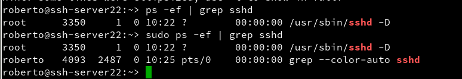

# Acceso remoto SSH

- 

- 

- 

- 

- 

# Preparativos

## Servidor SSH

Ya tenemos una instalación de OpenSuSe, pero primero tenemos que preparla antes de realizar la instalación de ssh-server.

### Configuración IP 

Tenemos que establecer una dirección IP estática.

### Cambio de Nombre ssh-server22 

Para cambiar el nombre de la máquina solo debemos escribir el siguiente comando.

- `sudo nano /etc/hostname`

- `sudo nano /etc/hosts`

Comprobamos que el nombre esta cambiado.

### Añadir los Equipos al fichero hosts 

Para crear un DNS con el fichero hosts.

`sudo nano /etc/hosts`

Solo debemos escribir el

`Dirección IP   NombreEquipo`

Fijate en la siguiente imagen.

### Comprobación de los siguientes comandos 

- ip a  #Comprobar IP y máscara

- route -n           #Comprobar puerta de enlace

- ping 8.8.4.4 -i 2  #Comprobar conectividad externa

- host www.google.es #Comprobar el servidor DNS

- ping ssh-clientXXa #Comprobar conectividad con cliente A

- ping ssh-clientXXb #Comprobar conectividad con cliente B

- lsblk              #Consultar particiones

- blkid              #Consultar UUID de la instalación

### Creación de los siguientes usuarios 

- hernandez1
- hernandez2
- hernandez3
- hernandez4

La creación de usuarios se realizo mediante la herramienta de yast.

Comprobación de los usuarios creados.

## Cliente OpenSuSe

### Configuración de la dirección IP estática

Tenemos que configurar una dirección IP estática

### Nombre del Equipo y fichero hosts

Escribimos en el fichero `hosts y hostname`, el nombre del Equipo.

En el fichero `hosts` también escribimos las siguientes IP, para crear un DNS simple.

### Realizar ping a ssh-server22 y ssh-client22b

## Cliente Windows 7

### Configuración de la dirección IP estática

### Configuración de Nombre Equipos

### Configuración fichero hosts

La ruta es `c:\windows\system32\drivers\etc\hosts`

### Realizar ping a ssh-server22 y ssh-client22a

## Instalación de Servicio openssh

Primero tenemos que comprobar si tenemos instalado el servicio.

Para instalar el servicio solo tenemos que escribir `sudo zypper install openssh`

### Comprobación del Servicio ssh

Tenemos que escribir el siguiente comando para ver su status `sudo systemctl status sshd`

También podemos comprobar el servicio con el siguiente comando. `sudo ps -ef | grep sshd`

Para habilitar en el inicio del sistema escribimos el siguiente comando.

`sudo systemctl enable sshd`

Para saber que el servidor esta escuchando el puerto 22 de ssh.

## Primera conexión SSH desde ssh-client22a

Primero realizamos una comprobación con le ping para ver si se comunican.

### Comprobación del Puerto SSH abierto en el ssh-server22

Primero necesitamos instalar el nmap.`sudo zypper in nmap`

Escribimos el siguiente comando para ver los puerto de ssh habilitados al ssh-server22.

### Conexión desde ssh-client22a al ssh-server22

Para la conexión solo tenemos que escribir el siguiente comando para conectarnos al ssh-server22

Una vez dentro del ssh-server22.

Salimos fuera de la conexión.

### Fichero de la clave de identificador ssh sha2

