# VNC en Windows y OpenSuse

- [Instalación VNC en OpenSuse](#id1)

    - [Configuración de VNC-SERVER](#id2)

    - [Comprobar el funcionamiento en el Equipo](#id3)

    - [Comprobación con el comando netstat ](#id4)

- [Instalación de VNC en Windows](#id5)

    - [Equipo Cliente acceder al Servidor-VNC](#id6)

        - [Comprobación con el comando netstat](#id7)

- [Comprobación que se conecta mediante VNC de OpenSuse a Windows 7](#id8)

    - [Comprobación con el comando netstat](#id9)

## Instalación de VNC en OpenSuse

El opensuse por defecto viene instalado el vnc, solo tenemos que ir a:

    yast/vnc

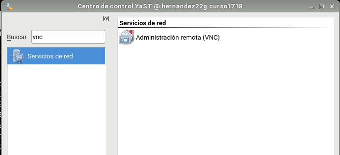

Ejecutamos el administración de remoto.(VNC)

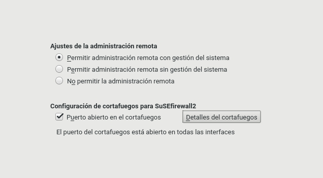

Marcamos las opciones como tenemos en la imagen.
Se instalaran unos paquetes necesarios.

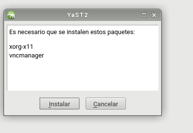

### Configuración de VNC-SERVER
Escribimos en la línea de comando vncserver y establecemos unas contraseñas de administrador.

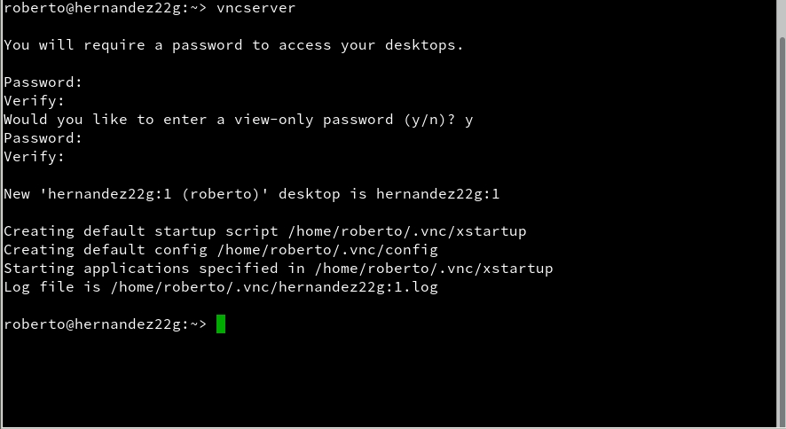

### Comprobar el funcionamiento en el Equipo

En el equipo que es cliente, ejecutamos el siguiente comando y accedemos al escritorio mediante VNC.

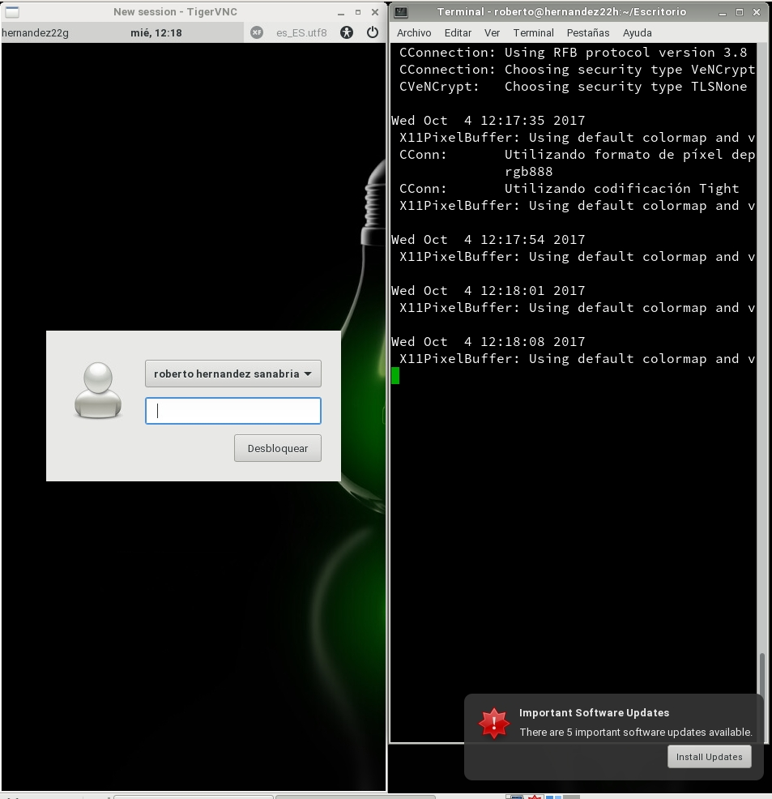

Muestra la siguiente ventana y debemos escribir la dirección IP.

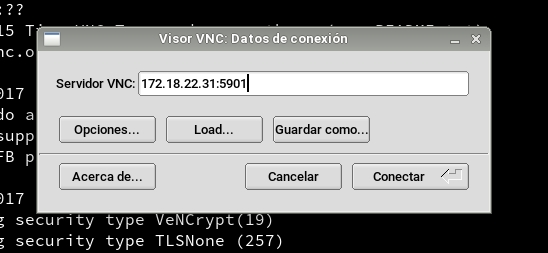

### Comprobación con el comando netstat

Escribimos en la terminal el comando.

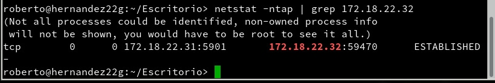

## Instalación de VNC en Windows

Tenemos que buscar el programa TightVNC y lo descargamos de la página oficial.

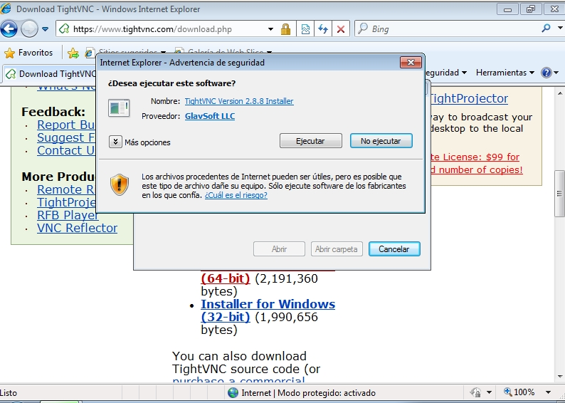

Le damos ejecutar y seguimos el proceso de instalación.

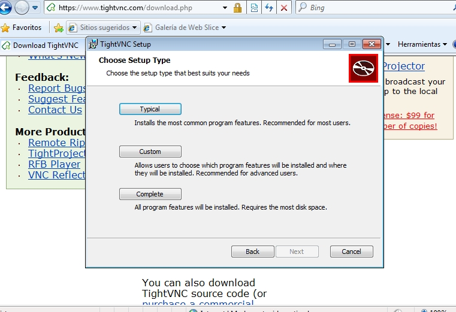

Cuando termine la instalación pide unas configuraciones, son las constraseñas del administrador.

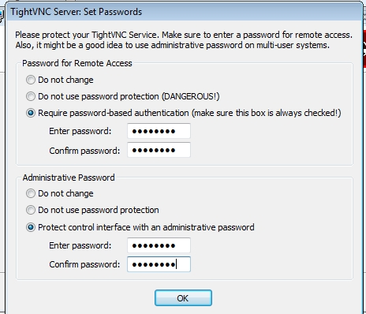

### Equipo Cliente acceder al Servidor-VNC

Ejecutamos el programa llamado TightVNC-Viewer, escribimos la contraseña.

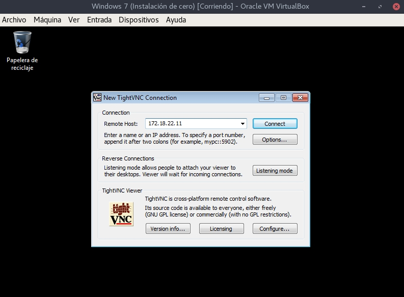

Nos pide la contraseña que configuramos después de la instalación del VNC en le servidor.

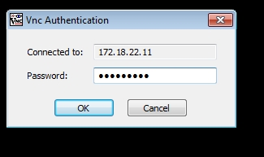

Se comprueba que se conecta correctamente del cliente al servidor VNC.

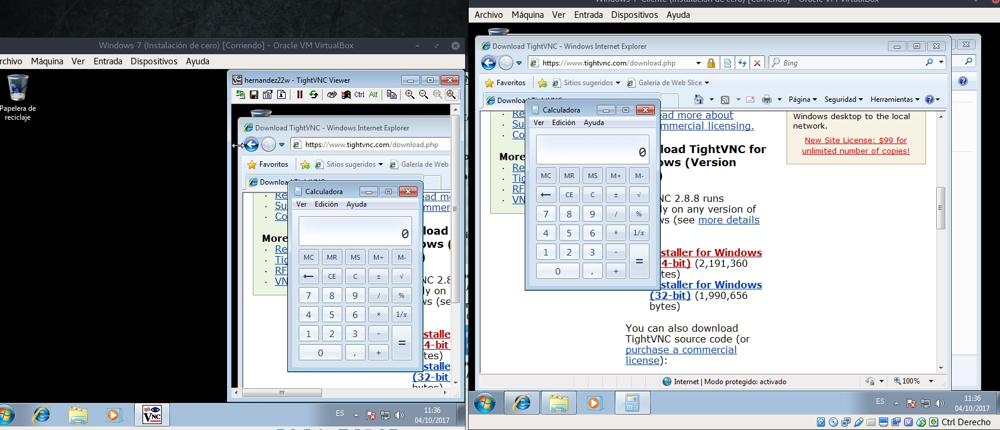

### Comprobación con el comando netstat

Escribimos en la línea de comando el siguiente comando.

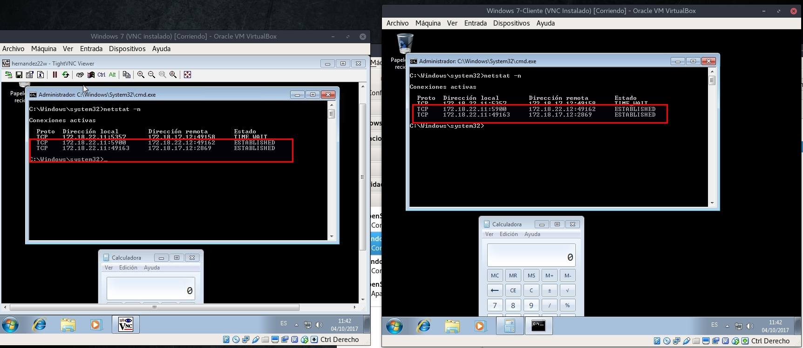

## Comprobación que se conecta mediante VNC de OpenSuse a Windows 7

En OpenSuse escribimos en la línea de comando vncviewer, nos pedirá la dirección IP del servidor VNC, luego nos pedirá la contraseña de sesión.

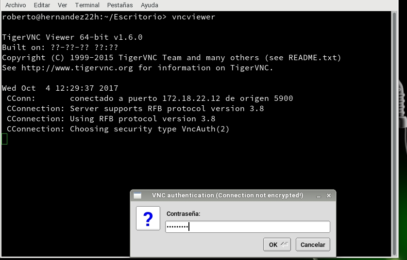

### Comprobación con el comando netstat

Escribimos en la línea de comando el siguiente comando.

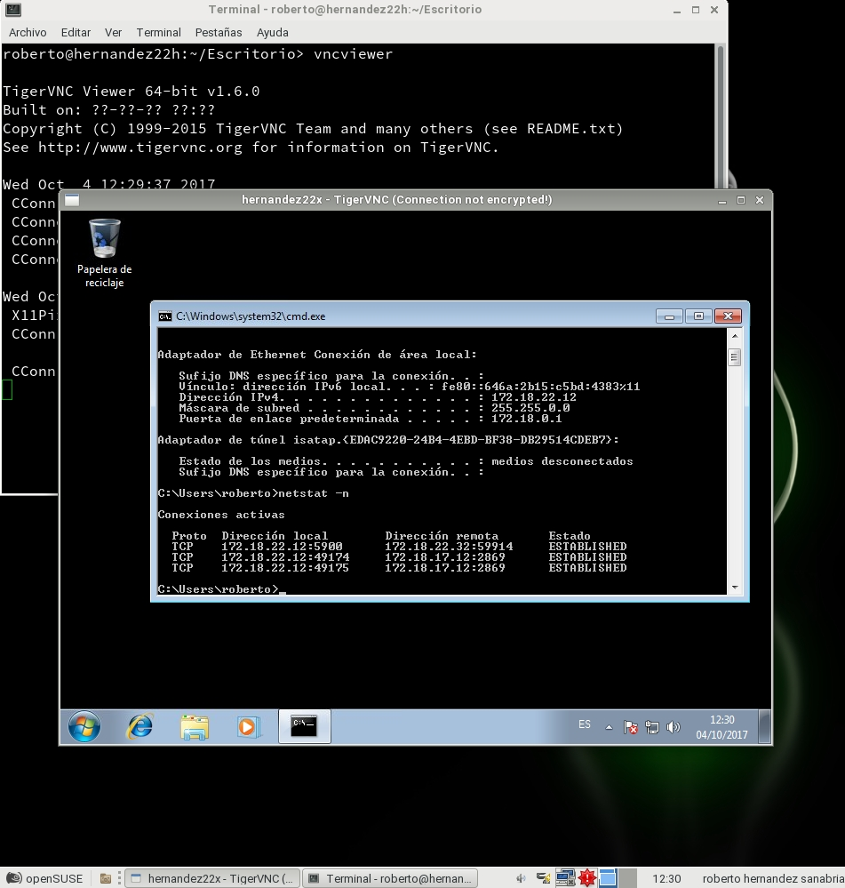

## DISPLAY 0 en GNU/Linux

[Enlace de interés](https://wiki.archlinux.org/index.php/TigerVNC_)

Cuando queremos ejecutar vncserver para controlar directamente la pantalla local usaremos x0vncserver de tigervnc.

    x0vncserver -display :0 -passwordfile ~/.vnc/passwd

Para más información, véase man x0vncserver
