# Samba con OpenSUSE

- [1. Servidor Samba](#1)

    - [1.1 Preparativos](#2)
    - [1.2 Usuarios Locales](#3)
    - [1.3 Crear las carpetas para los futuros recursos compartidos](#4)
    - [1.4 Instalar Samba server](#5)
    - [1.5 Configurar el servidor Samba](#6)
    - [1.6 Usuarios Samba](#7)
    - [1.7 Reiniciar el Servicio Samba](#8)


- [2. Windows smb-cli22b](#9)

    - [2.1 Cliente Windows GUI](#10)
    - [2.2 Cliente Windows comandos](#11)
    - [2.3 Montaje automático](#12)


- [3. Cliente OpenSUSE smb-client22a](#13)

    - [3.1 Cliente OpenSUSE GUI](#14)
    - [3.2 Cliente OpenSUSE comandos](#15)
    - [3.3 Montaje automático](#16)


- [4. Preguntas para resolver](#17)


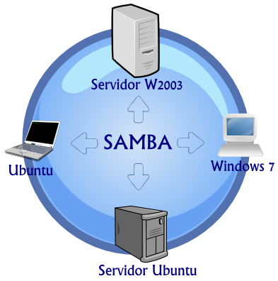


## 1. Servidor Samba (MV1)<a name="1"></a>
### 1.1 Preparativos<a name="2"></a>

Configurar el servidor OpenSUSE.

- Nombre de equipo: smb-server22

```console

roberto@smb-server22:~> hostname -a
smb-server22
roberto@smb-server22:~> hostname -d
curso1718
roberto@smb-server22:~>


```


- Añadir en /etc/hosts los equipos smb-cli22a y smb-cli22b

```console

roberto@smb-server22:~> sudo cat /etc/hosts | grep -e smb-server22 -e smb-client22
root's password:
127.0.0.1       smb-server22
172.18.22.31    smb-server22.curso1718	smb-server22
172.18.22.32	smb-client22a
172.18.22.11	smb-client22b
roberto@smb-server22:~>


```

Capturar salida de los comandos siguientes en el servidor:

- hostname -f

```console

roberto@smb-server22:~> hostname -f
smb-server22.curso1718

```
- ip a

```console

roberto@smb-server22:~> ip a
1: lo: <LOOPBACK,UP,LOWER_UP> mtu 65536 qdisc noqueue state UNKNOWN group default qlen 1
    link/loopback 00:00:00:00:00:00 brd 00:00:00:00:00:00
    inet 127.0.0.1/8 scope host lo
       valid_lft forever preferred_lft forever
    inet6 ::1/128 scope host
       valid_lft forever preferred_lft forever
2: eth0: <BROADCAST,MULTICAST,UP,LOWER_UP> mtu 1500 qdisc pfifo_fast state UP group default qlen 1000
    link/ether 08:00:27:b9:f7:e9 brd ff:ff:ff:ff:ff:ff
    inet 172.18.22.31/16 brd 172.18.255.255 scope global eth0
       valid_lft forever preferred_lft forever
    inet6 fe80::a00:27ff:feb9:f7e9/64 scope link
       valid_lft forever preferred_lft forever


```
- lsblk

``` console

roberto@smb-server22:~> lsblk
NAME   MAJ:MIN RM  SIZE RO TYPE MOUNTPOINT
sda      8:0    0   15G  0 disk
├─sda1   8:1    0    2G  0 part [SWAP]
└─sda2   8:2    0   13G  0 part /var/spool
sr0     11:0    1  4,1G  0 rom  

```
- sudo blkid

```console

roberto@smb-server22:~> sudo blkid
root's password:
/dev/sda1: UUID="9fec4fe4-2a8f-4893-b111-66a8285d645d" TYPE="swap" PARTUUID="000ca8c8-01"
/dev/sda2: UUID="c8b48f30-4767-4fac-8501-1e8163fb1918" UUID_SUB="22a11a88-9f87-476e-b602-3e67873fe10c" TYPE="btrfs" PTTYPE="dos" PARTUUID="000ca8c8-02"
/dev/sr0: UUID="2016-11-09-10-39-11-00" LABEL="openSUSE-Leap-42.2-DVD-x86_64028" TYPE="iso9660" PTUUID="135a2181" PTTYPE="dos"


```


### 1.2 Usuarios locales<a name="3"></a>


Vamos a OpenSUSE, y creamos los siguientes grupos y usuarios:

- Crear los grupos piratas, soldados y todos.

```console

roberto@smb-server22:~> sudo groupadd piratas; sudo groupadd soldados; sudo groupadd todos
root's password:
roberto@smb-server22:~> sudo cat /etc/group | grep -e soldados -e piratas -e todos
piratas:x:1001:
soldados:x:1002:
todos:x:1003:


```

- Crear el usuario smbguest.
- Vamos a modificar este usuario y le ponemos como shell /bin/false.

```console

roberto@smb-server22:~> sudo useradd smbguest -m
root's password:
roberto@smb-server22:~> sudo nano /etc/passwd
roberto@smb-server22:~> sudo cat /etc/passwd | grep smbguest
smbguest:x:1005:100::/home/smbguest:/bin/false
roberto@smb-server22:~> sudo passwd smbguest
Nueva contraseña:
Vuelva a escribir la nueva contraseña:
passwd: contraseña actualizada correctamente


```

- Creación de los usuarios de soldado1,soldado2,pirata1,pirata2,supersamba


```console

roberto@smb-server22:~> sudo useradd pirata1 -m;sudo useradd pirata2 -m;sudo useradd supersamba -m;sudo useradd soldado1 -m;sudo useradd soldado2 -m
roberto@smb-server22:~> sudo cat /etc/passwd | grep -e pirata -e soldado -e supersamba
pirata1:x:1006:100::/home/pirata1:/bin/bash
pirata2:x:1007:100::/home/pirata2:/bin/bash
supersamba:x:1008:100::/home/supersamba:/bin/bash
soldado1:x:1009:100::/home/soldado1:/bin/bash
soldado2:x:1010:100::/home/soldado2:/bin/bash


```

- Dentro del grupo piratas incluir a los usuarios pirata1, pirata2 y supersamba.

- Dentro del grupo soldados incluir a los usuarios soldado1 y soldado2 y supersamba.

- Dentro del grupo todos, poner a todos los usuarios soldados, pitatas, supersamba y a smbguest.

```console

roberto@smb-server22:~> sudo usermod -a -G piratas pirata1
roberto@smb-server22:~> sudo usermod -a -G piratas pirata2
roberto@smb-server22:~> sudo usermod -a -G piratas supersamba
roberto@smb-server22:~> sudo usermod -a -G soldados supersamba
roberto@smb-server22:~> sudo usermod -a -G soldados soldado1
roberto@smb-server22:~> sudo usermod -a -G soldados soldado2
roberto@smb-server22:~> sudo usermod -a -G todos pirata1
roberto@smb-server22:~> sudo usermod -a -G todos pirata2
roberto@smb-server22:~> sudo usermod -a -G todos supersamba
roberto@smb-server22:~> sudo usermod -a -G todos smbguest
roberto@smb-server22:~> sudo usermod -a -G todos soldado1
roberto@smb-server22:~> sudo usermod -a -G todos soldado2
roberto@smb-server22:~> sudo cat /etc/group | grep -e piratas -e soldados -e todos
piratas:x:1001:pirata1,pirata2,supersamba
soldados:x:1002:supersamba,soldado1,soldado2
todos:x:1003:pirata1,pirata2,supersamba,smbguest,soldado1,soldado2
roberto@smb-server22:~>


```
### 1.3 Crear las carpetas para los futuros recursos compartidos<a name="4"></a>

Vamos a crear las carpetas de los recursos compartidos con los permisos siguientes:

- /srv/samba22/public.d
    - Usuario propietario supersamba.
    - Grupo propietario todos.
    - Poner permisos 775.

```console
roberto@smb-server22:~> sudo mkdir -p /srv/samba22/public.d
roberto@smb-server22:~> sudo chown -R supersamba:todos /srv/samba22/public.d/  
roberto@smb-server22:~> sudo chmod -R 775 /srv/samba22/public.d/


```

- /srv/samba22/castillo.d
    - Usuario propietario supersamba.
    - Grupo propietario soldados.
    - Poner permisos 770.

    ```console

    roberto@smb-server22:~> sudo mkdir -p /srv/samba22/castillo.d
    roberto@smb-server22:~> sudo chown -R supersamba:soldados /srv/samba22/castillo.d/
    roberto@smb-server22:~> sudo chmod -R 770 /srv/samba22/castillo.d/

    ```

- /srv/samba22/barco.d
    - Usuario propietario supersamba.
    - Grupo propietario piratas.
    - Poner permisos 770.

    ```console

    roberto@smb-server22:~> sudo mkdir -p /srv/samba22/barco.d
    roberto@smb-server22:~> sudo chown -R supersamba:piratas /srv/samba22/barco.d/
    roberto@smb-server22:~> sudo chmod -R 770 /srv/samba22/barco.d/

    ```

- Comprobamos el resultado final de las carpeta creadas con sus permisos y grupos.

```console

roberto@smb-server22:~> ls -l /srv/samba22/
total 0
drwxrwx--- 1 supersamba piratas  0 oct 26 09:37 barco.d
drwxrwx--- 1 supersamba soldados 0 oct 26 09:37 castillo.d
drwxrwxr-x 1 supersamba todos    0 oct 26 09:37 public.d


```
### 1.4 Instalar Samba Server<a name="5"></a>

Comprobamos que tenemos instalado el samba en nuestro OpenSUSE.

```console

roberto@smb-server22:~> sudo zypper se yast2-samba-server
Cargando datos del repositorio...
Leyendo los paquetes instalados...

E | Nombre             | Resumen                                   | Tipo   
--+--------------------+-------------------------------------------+--------
i | yast2-samba-server | YaST2: configuración de un servidor Samba | paquete


```

- Vamos a hacer una copia de seguridad del fichero de configuración existente cp `/etc/samba/smb.conf /etc/samba/smb.conf.000.`

```console

roberto@smb-server22:~> sudo cp /etc/samba/smb.conf /etc/samba/smb.conf.000
root's password:
roberto@smb-server22:~> ls -l /etc/samba/
total 16
-rw-r--r-- 1 root root  249 oct 19  2016 lmhosts
-rw-r--r-- 1 root root 1238 oct 19  2016 smb.conf
-rw-r--r-- 1 root root 1238 oct 26 09:53 smb.conf.000
-rw-r--r-- 1 root root  379 oct 19  2016 smbusers

```

Podemos usar comandos o el entorno gráfico para instalar y configurar el servicio Samba. Como estamos en OpenSUSE vamos a usar Yast.

- Yast -> Samba Server

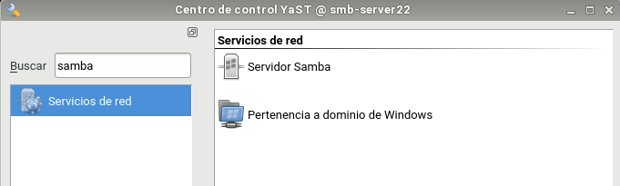


- Workgroup: mar1718

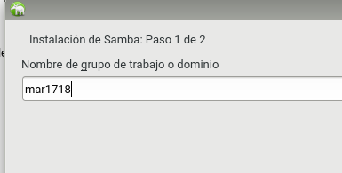

- Sin controlador de dominio.

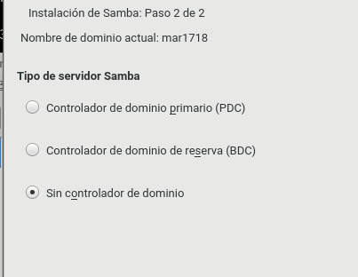

En la pestaña de Inicio definimos

- Iniciar el servicio durante el arranque de la máquina.

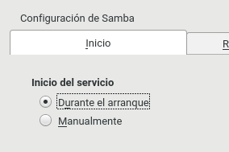

- Ajustes del cortafuegos -> Abrir puertos

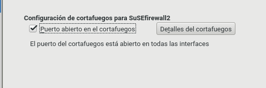

### 1.5 Configurar el servidor Samba<a name="6"></a>

Configuración de los recursos compartido del servidor Samba.

Podemos hacerlo modificando el fichero de configuración `/etc/samba/smb.conf` o por entorno gráfico con Yast.

Capturar imágenes del proceso.

- `Yast -> Samba Server -> Recursos compartidos`

Tenemos que montar una configuración como la siguiente:

será un recurso compartido accesible para todos los usuarios en modo lectura.
cdrom, es el recurso dispositivo cdrom de la máquina donde está instalado el servidor samba.

- [global]
  - netbios name = smb-serverXX
  - workgroup = mar1617
  - server string = Servidor de nombre-alumno-XX
  - security = user
  - map to guest = bad user
  - guest account = smbguest

- [cdrom]
  - path = /dev/cdrom
  - guest ok = yes
  - read only = yes

 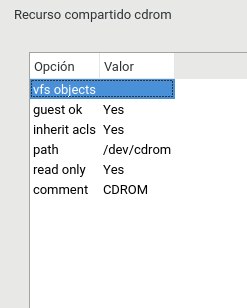

- [public]
  - path = /srv/samba22/public.d
  - guest ok = yes
  - read only = yes

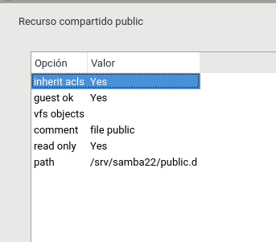

- [castillo]
  - path = /srv/samba22/castillo.d
  - read only = no
  - valid users = @soldados

 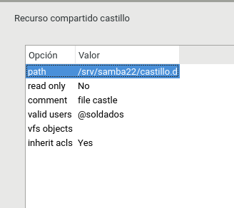

- [barco]
  - path = /srv/sambaXX/piratas.d
  - read only = no
  - valid users = pirata1, pirata2

 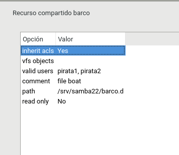

- Resultado final desde gráfico.

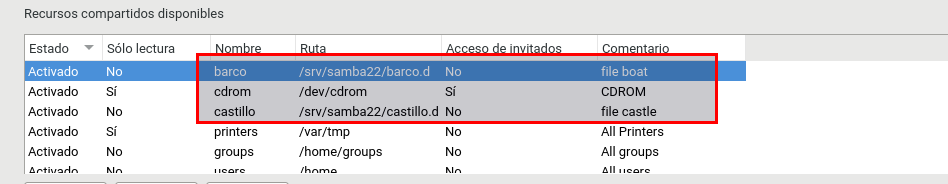


Abrimos una consola para comprobar los resultados.

```console

roberto@smb-server22:~> sudo cat /etc/samba/smb.conf
root's password:
# smb.conf is the main Samba configuration file. You find a full commented
# version at /usr/share/doc/packages/samba/examples/smb.conf.SUSE if the
# samba-doc package is installed.
[global]
	workgroup = mar1718
	passdb backend = tdbsam
	printing = cups
	printcap name = cups
	printcap cache time = 750
	cups options = raw
	map to guest = Bad User
	include = /etc/samba/dhcp.conf
	logon path = \\%L\profiles\.msprofile
	logon home = \\%L\%U\.9xprofile
	logon drive = P:
	usershare allow guests = No
	add machine script = /usr/sbin/useradd  -c Machine -d /var/lib/nobody -s /bin/false %m$
	domain logons = No
	domain master = No
	security = user
[homes]
	comment = Home Directories
	valid users = %S, %D%w%S
	browseable = No
	read only = No
	inherit acls = Yes
[profiles]
	comment = Network Profiles Service
	path = %H
	read only = No
	store dos attributes = Yes
	create mask = 0600
	directory mask = 0700
[users]
	comment = All users
	path = /home
	read only = No
	inherit acls = Yes
	veto files = /aquota.user/groups/shares/
[groups]
	comment = All groups
	path = /home/groups
	read only = No
	inherit acls = Yes
[printers]
	comment = All Printers
	path = /var/tmp
	printable = Yes
	create mask = 0600
	browseable = No
[print$]
	comment = Printer Drivers
	path = /var/lib/samba/drivers
	write list = @ntadmin root
	force group = ntadmin
	create mask = 0664
	directory mask = 0775

## Share disabled by YaST
# [netlogon]

[barco]
	comment = file boat
	inherit acls = Yes
	path = /srv/samba22/barco.d
	read only = No
	valid users = pirata1, pirata2
	vfs objects =

[castillo]
	comment = file castle
	inherit acls = Yes
	path = /srv/samba22/castillo.d
	read only = No
	valid users = @soldados
	vfs objects =

[cdrom]
	comment = CDROM
	guest ok = Yes
	inherit acls = Yes
	path = /dev/cdrom
	read only = Yes
	vfs objects =

[public]
	comment = file public
	guest ok = Yes
	inherit acls = Yes
	path = /srv/samba22/public.d
	read only = Yes
	vfs objects =

```
Utilizamos el siguiente comando en la terminal `testparm`

```console

roberto@smb-server22:~> testparm
Load smb config files from /etc/samba/smb.conf
rlimit_max: increasing rlimit_max (1024) to minimum Windows limit (16384)
Can't find include file /etc/samba/dhcp.conf
Processing section "[homes]"
Processing section "[profiles]"
Processing section "[users]"
Processing section "[groups]"
Processing section "[printers]"
Processing section "[print$]"
Processing section "[barco]"
Processing section "[castillo]"
Processing section "[cdrom]"
Processing section "[public]"
Loaded services file OK.
Server role: ROLE_STANDALONE

Press enter to see a dump of your service definitions

# Global parameters
[global]
	workgroup = MAR1718
	domain master = No
	add machine script = /usr/sbin/useradd -c Machine -d /var/lib/nobody -s /bin/false %m$
	logon drive = P:
	logon home = \\%L\%U\.9xprofile
	logon path = \\%L\profiles\.msprofile
	printcap name = cups
	map to guest = Bad User
	security = USER
	idmap config * : backend = tdb
	include = /etc/samba/dhcp.conf
	cups options = raw


[homes]
	comment = Home Directories
	browseable = No
	inherit acls = Yes
	read only = No
	valid users = %S %D%w%S


[profiles]
	comment = Network Profiles Service
	path = %H
	store dos attributes = Yes
	create mask = 0600
	directory mask = 0700
	read only = No


[users]
	comment = All users
	path = /home
	veto files = /aquota.user/groups/shares/
	inherit acls = Yes
	read only = No


[groups]
	comment = All groups
	path = /home/groups
	inherit acls = Yes
	read only = No


[printers]
	comment = All Printers
	path = /var/tmp
	browseable = No
	printable = Yes
	create mask = 0600


[print$]
	comment = Printer Drivers
	path = /var/lib/samba/drivers
	create mask = 0664
	directory mask = 0775
	force group = ntadmin
	write list = @ntadmin root


[barco]
	comment = file boat
	path = /srv/samba22/barco.d
	inherit acls = Yes
	read only = No
	valid users = pirata1 pirata2


[castillo]
	comment = file castle
	path = /srv/samba22/castillo.d
	inherit acls = Yes
	read only = No
	valid users = @soldados


[cdrom]
	comment = CDROM
	path = /dev/cdrom
	guest ok = Yes
	inherit acls = Yes


[public]
	comment = file public
	path = /srv/samba22/public.d
	guest ok = Yes
	inherit acls = Yes
```


### 1.6 Usuarios Samba<a name="7"></a>

Tenemos que añadir los usuarios locales a samba.

- `smbpasswd -a nombreusuario`

```console

roberto@smb-server22:~> sudo smbpasswd -a soldado1
New SMB password:
Retype new SMB password:
Added user soldado1.
roberto@smb-server22:~> sudo smbpasswd -a soldado2
New SMB password:
Retype new SMB password:
Added user soldado2.
roberto@smb-server22:~> sudo smbpasswd -a pirata1
New SMB password:
Retype new SMB password:
Added user pirata1.
roberto@smb-server22:~> sudo smbpasswd -a pirata2
New SMB password:
Retype new SMB password:
Added user pirata2.
roberto@smb-server22:~> sudo smbpasswd -a smbguest
New SMB password:
Retype new SMB password:
Added user smbguest.
roberto@smb-server22:~> sudo smbpasswd -a supersamba
New SMB password:
Retype new SMB password:
Added user supersamba.
roberto@smb-server22:~>

```

- `pdbedit -L`, para comprobar la lista de usuarios Samba.

``` console

roberto@smb-server22:~> sudo pdbedit -L
soldado1:1009:
pirata1:1006:
smbguest:1005:
soldado2:1010:
pirata2:1007:
supersamba:1008:
roberto@smb-server22:~>

```


### 1.7 Reiniciar<a name="8"></a>

Tenemos que reiniciar el servicio de samba.

- Servicio smb
    - systemctl stop smb
    - systemctl start smb
    - systemctl status smb

```console
roberto@smb-server22:~> sudo systemctl stop smb
roberto@smb-server22:~> sudo systemctl start smb
roberto@smb-server22:~> sudo systemctl status smb
● smb.service - Samba SMB Daemon
   Loaded: loaded (/usr/lib/systemd/system/smb.service; enabled; vendor preset: disabled)
   Active: active (running) since jue 2017-10-26 10:38:15 WEST; 2s ago
  Process: 8471 ExecStartPre=/usr/share/samba/update-apparmor-samba-profile (code=exited, status=0/SUCCESS)
 Main PID: 8482 (smbd)
   Status: "smbd: ready to serve connections..."
    Tasks: 4 (limit: 512)
   CGroup: /system.slice/smb.service
           ├─8482 /usr/sbin/smbd -D
           ├─8483 /usr/sbin/smbd -D
           ├─8484 /usr/sbin/smbd -D
           └─8486 /usr/sbin/smbd -D

oct 26 10:38:15 smb-server22 systemd[1]: Starting Samba SMB Daemon...
oct 26 10:38:15 smb-server22 systemd[1]: smb.service: Supervising process 8482 which is not our child. We'll most likel...exits.
oct 26 10:38:15 smb-server22 smbd[8482]: [2017/10/26 10:38:15.408331,  0] ../lib/util/become_daemon.c:124(daemon_ready)
oct 26 10:38:15 smb-server22 systemd[1]: Started Samba SMB Daemon.
oct 26 10:38:15 smb-server22 smbd[8482]:   STATUS=daemon 'smbd' finished starting up and ready to serve connections
Hint: Some lines were ellipsized, use -l to show in full.

```

- Servicio nmb
    - systemctl stop nmb
    - systemctl start nmb
    - systemctl status nmb


```console

roberto@smb-server22:~> sudo systemctl stop nmb
roberto@smb-server22:~> sudo systemctl start nmb
roberto@smb-server22:~> sudo systemctl status nmb
● nmb.service - Samba NMB Daemon
   Loaded: loaded (/usr/lib/systemd/system/nmb.service; enabled; vendor preset: disabled)
   Active: active (running) since jue 2017-10-26 10:39:16 WEST; 5s ago
 Main PID: 8507 (nmbd)
   Status: "nmbd: ready to serve connections..."
    Tasks: 1 (limit: 512)
   CGroup: /system.slice/nmb.service
           └─8507 /usr/sbin/nmbd -D

oct 26 10:39:16 smb-server22 systemd[1]: Starting Samba NMB Daemon...
oct 26 10:39:16 smb-server22 systemd[1]: nmb.service: Supervising process 8507 which is not our child. We'll most likel...exits.
oct 26 10:39:16 smb-server22 systemd[1]: Started Samba NMB Daemon.
oct 26 10:39:16 smb-server22 nmbd[8507]: [2017/10/26 10:39:16.440900,  0] ../lib/util/become_daemon.c:124(daemon_ready)
oct 26 10:39:16 smb-server22 nmbd[8507]:   STATUS=daemon 'nmbd' finished starting up and ready to serve connections
Hint: Some lines were ellipsized, use -l to show in full.

```


Demonios Samba y servicios relacionados
Capturar imagen de los siguientes comando de comprobación:

    - sudo testparm     # Verifica la sintaxis del fichero de configuración del servidor Samba

```console

roberto@smb-server22:~> sudo testparm
Load smb config files from /etc/samba/smb.conf
rlimit_max: increasing rlimit_max (1024) to minimum Windows limit (16384)
Can't find include file /etc/samba/dhcp.conf
Processing section "[homes]"
Processing section "[profiles]"
Processing section "[users]"
Processing section "[groups]"
Processing section "[printers]"
Processing section "[print$]"
Processing section "[barco]"
Processing section "[castillo]"
Processing section "[cdrom]"
Processing section "[public]"
Loaded services file OK.
Server role: ROLE_STANDALONE

Press enter to see a dump of your service definitions

# Global parameters
[global]
	workgroup = MAR1718
	domain master = No
	add machine script = /usr/sbin/useradd -c Machine -d /var/lib/nobody -s /bin/false %m$
	logon drive = P:
	logon home = \\%L\%U\.9xprofile
	logon path = \\%L\profiles\.msprofile
	printcap name = cups
	map to guest = Bad User
	security = USER
	idmap config * : backend = tdb
	include = /etc/samba/dhcp.conf
	cups options = raw


[homes]
	comment = Home Directories
	browseable = No
	inherit acls = Yes
	read only = No
	valid users = %S %D%w%S


[profiles]
	comment = Network Profiles Service
	path = %H
	store dos attributes = Yes
	create mask = 0600
	directory mask = 0700
	read only = No


[users]
	comment = All users
	path = /home
	veto files = /aquota.user/groups/shares/
	inherit acls = Yes
	read only = No


[groups]
	comment = All groups
	path = /home/groups
	inherit acls = Yes
	read only = No


[printers]
	comment = All Printers
	path = /var/tmp
	browseable = No
	printable = Yes
	create mask = 0600


[print$]
	comment = Printer Drivers
	path = /var/lib/samba/drivers
	create mask = 0664
	directory mask = 0775
	force group = ntadmin
	write list = @ntadmin root


[barco]
	comment = file boat
	path = /srv/samba22/barco.d
	inherit acls = Yes
	read only = No
	valid users = pirata1 pirata2


[castillo]
	comment = file castle
	path = /srv/samba22/castillo.d
	inherit acls = Yes
	read only = No
	valid users = @soldados


[cdrom]
	comment = CDROM
	path = /dev/cdrom
	guest ok = Yes
	inherit acls = Yes


[public]
	comment = file public
	path = /srv/samba22/public.d
	guest ok = Yes
	inherit acls = Yes


```
    - sudo netstat -tap # Vemos que el servicio SMB/CIF está a la escucha
Comprobar CORTAFUEGOS

```console

roberto@smb-server22:~> sudo netstat -tap
Active Internet connections (servers and established)
Proto Recv-Q Send-Q Local Address           Foreign Address         State       PID/Program name   
tcp        0      0 *:5801                  *:*                     LISTEN      1475/xinetd         
tcp        0      0 *:netbios-ssn           *:*                     LISTEN      8482/smbd           
tcp        0      0 *:5901                  *:*                     LISTEN      1470/vncmanager     
tcp        0      0 *:ssh                   *:*                     LISTEN      1498/sshd           
tcp        0      0 smb-server22.curso1:ipp *:*                     LISTEN      1460/cupsd          
tcp        0      0 *:microsoft-ds          *:*                     LISTEN      8482/smbd           
tcp        0      0 *:netbios-ssn           *:*                     LISTEN      8482/smbd           
tcp        0      0 *:5901                  *:*                     LISTEN      1470/vncmanager     
tcp        0      0 *:ssh                   *:*                     LISTEN      1498/sshd           
tcp        0      0 localhost:ipp           *:*                     LISTEN      1460/cupsd          
tcp        0      0 localhost:smtp          *:*                     LISTEN      1750/master         
tcp        0      0 *:microsoft-ds          *:*                     LISTEN      8482/smbd       

```

Para descartar un problema con el cortafuegos del servidor Samba.
Probamos el comando `nmap -Pn smb-server22` desde la máquina real, u otra máquina GNU/Linux. Deberían verse los puertos SMB/CIFS(139 y 445) abiertos.

```console

roberto@smb-server22:~> sudo nmap -Pn smb-server22

Starting Nmap 6.47 ( http://nmap.org ) at 2017-10-26 10:45 WEST
Nmap scan report for smb-server22 (127.0.0.1)
Host is up (0.0000030s latency).
Other addresses for smb-server22 (not scanned): 172.18.22.31
rDNS record for 127.0.0.1: smb-server22.curso1718
Not shown: 994 closed ports
PORT     STATE SERVICE
22/tcp   open  ssh
139/tcp  open  netbios-ssn
445/tcp  open  microsoft-ds
631/tcp  open  ipp
5801/tcp open  vnc-http-1
5901/tcp open  vnc-1

Nmap done: 1 IP address (1 host up) scanned in 1.56 seconds


```


## 2. Windows (MV3 smb-cli22b)<a name="9"></a>
Configurar el cliente Windows.
Usar nombre smb-cli22b y la IP que hemos establecido.

```console

Microsoft Windows [Versión 6.1.7601]
Copyright (c) 2009 Microsoft Corporation. Reservados todos los derechos.

C:\Windows\system32>hostname
smb-client22b

C:\Windows\system32>ipconfig

Configuración IP de Windows


Adaptador de Ethernet Conexión de área local:

   Sufijo DNS específico para la conexión. . :
   Vínculo: dirección IPv6 local. . . : fe80::1036:42a:63e0:b9b%11
   Dirección IPv4. . . . . . . . . . . . . . : 172.18.22.11
   Máscara de subred . . . . . . . . . . . . : 255.255.0.0
   Puerta de enlace predeterminada . . . . . : 172.18.0.1

Adaptador de túnel isatap.{EDAC9220-24B4-4EBD-BF38-DB29514CDEB7}:

   Estado de los medios. . . . . . . . . . . : medios desconectados
   Sufijo DNS específico para la conexión. . :

C:\Windows\system32>

```

Configurar el fichero `c:\windows\system32\drivers\etc\hosts`


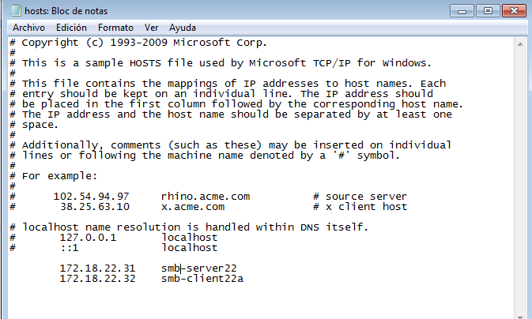


### 2.1 Cliente Windows GUI<a name="10"></a>

Desde un cliente Windows vamos a acceder a los recursos compartidos del servidor Samba.

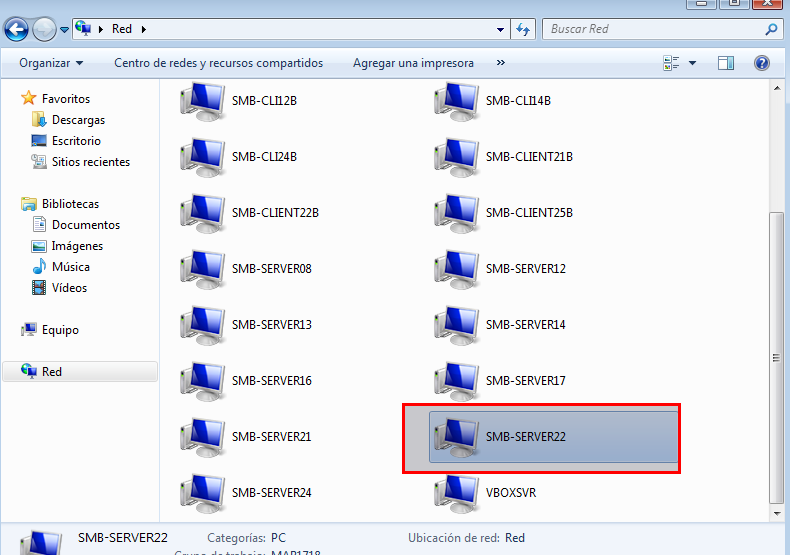

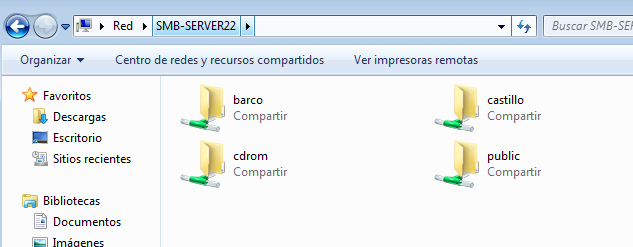

samba-win7-cliente-gui

Comprobar los accesos de todas las formas posibles. Como si fuéramos:

- Accedemos con soldado1 al recurso compartido de castillo

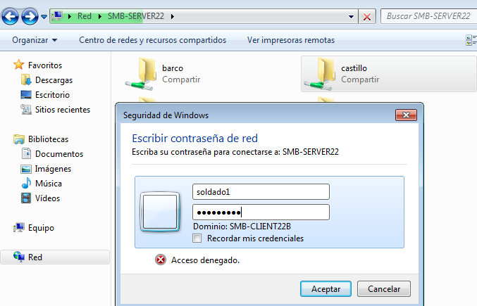

- Creamos un fichero de texto con soldado1

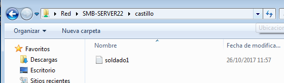


- Accedemos con pirata1 al recurso compartido de barco

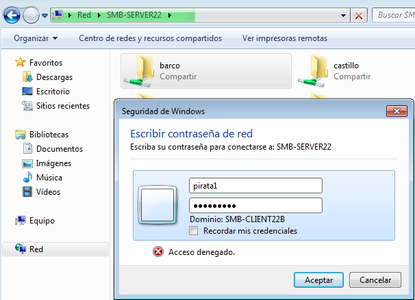

- Creamos un fichero de texto con pirata1

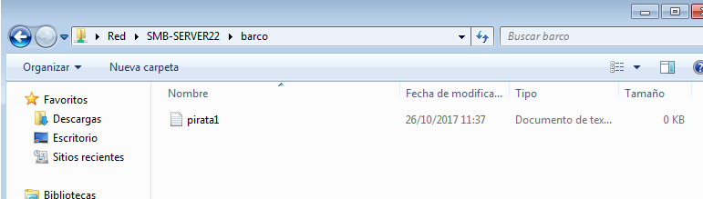


- Con la cuenta smbguest

Si accedemos al recurso barco o castillo no podemos acceder con la cuenta invitado.

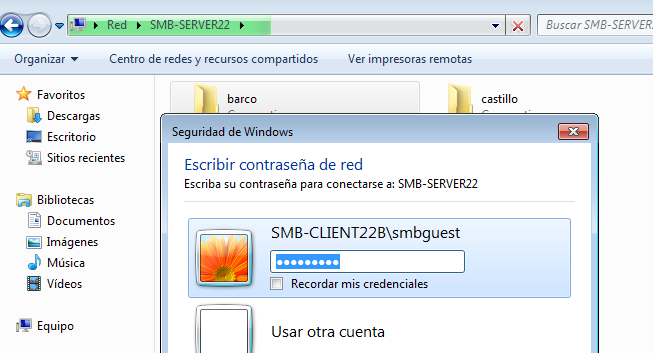


Después de cada conexión se quedan guardada la información en el cliente Windows (Ver comando net use).

net use * /d /y, para cerrar las conexión SMB/CIFS que se ha realizado desde el cliente al servidor.

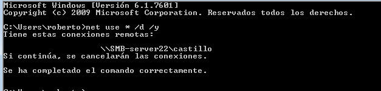

Capturar imagen de los siguientes comandos para comprobar los resultados:


- smbstatus, desde el servidor Samba.

```console
roberto@smb-server22:~> sudo smbstatus

Samba version 4.4.2-7.2-3709-SUSE-SLE_12-x86_64
PID     Username     Group        Machine                                   Protocol Version  Encryption           Signing              
----------------------------------------------------------------------------------------------------------------------------------------
7275    pirata2      users        172.18.22.11 (ipv4:172.18.22.11:49218)    SMB2_10           -                    -                    

Service      pid     Machine       Connected at                     Encryption   Signing     
---------------------------------------------------------------------------------------------
barco        7275    172.18.22.11  jue oct 26 12:04:47 2017 WEST    -            -           

Locked files:
Pid          Uid        DenyMode   Access      R/W        Oplock           SharePath   Name   Time
--------------------------------------------------------------------------------------------------
7275         1007       DENY_NONE  0x100081    RDONLY     NONE             /srv/samba22/barco.d   .   Thu Oct 26 12:04:47 2017


```
- netstat -ntap, desde el servidor Samba.

```console

roberto@smb-server22:~> sudo netstat -ntap
Active Internet connections (servers and established)
Proto Recv-Q Send-Q Local Address           Foreign Address         State       PID/Program name   
tcp        0      0 0.0.0.0:5801            0.0.0.0:*               LISTEN      1465/xinetd         
tcp        0      0 0.0.0.0:139             0.0.0.0:*               LISTEN      7255/smbd           
tcp        0      0 0.0.0.0:5901            0.0.0.0:*               LISTEN      1457/vncmanager     
tcp        0      0 0.0.0.0:22              0.0.0.0:*               LISTEN      1509/sshd           
tcp        0      0 127.0.0.1:631           0.0.0.0:*               LISTEN      1456/cupsd          
tcp        0      0 0.0.0.0:445             0.0.0.0:*               LISTEN      7255/smbd           
tcp        0      0 :::139                  :::*                    LISTEN      7255/smbd           
tcp        0      0 :::5901                 :::*                    LISTEN      1457/vncmanager     
tcp        0      0 :::22                   :::*                    LISTEN      1509/sshd           
tcp        0      0 ::1:631                 :::*                    LISTEN      1456/cupsd          
tcp        0      0 ::1:25                  :::*                    LISTEN      1769/master         
tcp        0      0 :::445                  :::*                    LISTEN      7255/smbd           
roberto@smb-server22:~>


```
- netstat -n, desde el cliente Windows.


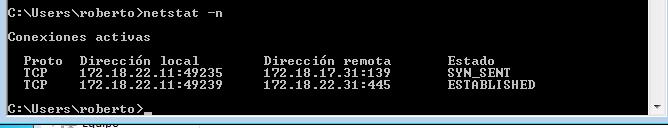


### 2.2 Cliente Windows comandos<a name="11"></a>

En el cliente Windows, para consultar todas las conexiones/recursos conectados hacemos `C:>net use`

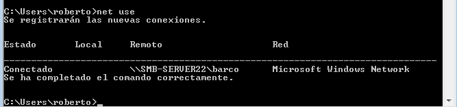


Si hubiera alguna conexión abierta la cerramos.

- `net use * /d /y`, para cerrar las conexiones SMB.


net use ahora vemos que NO hay conexiones establecidas.


Abrir una shell de windows. Usar el comando net use /?, para consultar la ayuda del comando.

```console


C:\Users\roberto>net use /?
La sintaxis de este comando es:

NET USE
[dispositivo | *] [\\equipo\recursoCompartido[\volumen] [contraseña | *]]
        [/USER:[dominio\]usuario]
        [/USER:[dominioPunteado\]usuario]
        [/USER:[usuario@dominio punteado]
        [/SMARTCARD]
        [/SAVECRED]
        [[/DELETE] | [/PERSISTENT:{YES | NO}]]

NET USE {dispositivo | *} [contraseña | *] /HOME

NET USE [/PERSISTENT:{YES | NO}]


C:\Users\roberto>
```
Vamos a conectarnos desde la máquina Windows al servidor Samba usando el comando net.

```console

C:\Users\roberto>net use w: \\smb-server22\public /user:soldado1
Se ha completado el comando correctamente.


```
Con el comando net view, vemos las máquinas accesibles por la red.

```console

C:\Users\roberto>net view
Servidor               Descripción

-----------------------------------------------------------------------
\\SMB-CLIENT22B
\\SMB-SERVER22         Samba 4.4.2-7.2-3709-SUSE-SLE_12-x86_64
Se ha completado el comando correctamente.


C:\Users\roberto>

```


### 2.3 Montaje automático<a name="12"></a>

El comando `net use S: \\smb-server22\barco /USER:pirata1 clave` y lo monta en la unidad S.

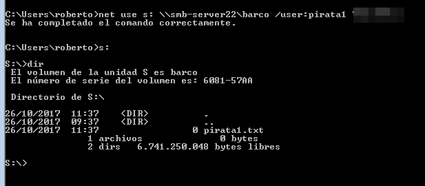

Ahora podemos entrar en la unidad S ("s:") y crear carpetas, etc.

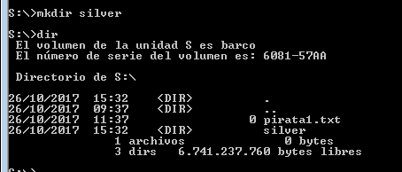


- smbstatus, desde el servidor Samba.

```console
roberto@smb-server22:~> sudo smbstatus
root's password:

Samba version 4.4.2-7.2-3709-SUSE-SLE_12-x86_64
PID     Username     Group        Machine                                   Protocol Version  Encryption           Signing              
----------------------------------------------------------------------------------------------------------------------------------------
1937    pirata1      users        172.18.22.11 (ipv4:172.18.22.11:49164)    SMB2_10           -                    -                    

Service      pid     Machine       Connected at                     Encryption   Signing     
---------------------------------------------------------------------------------------------
barco        1937    172.18.22.11  jue oct 26 15:30:34 2017 WEST    -            -           

Locked files:
Pid          Uid        DenyMode   Access      R/W        Oplock           SharePath   Name   Time
--------------------------------------------------------------------------------------------------
1937         1006       DENY_NONE  0x100081    RDONLY     NONE             /srv/samba22/barco.d   .   Thu Oct 26 15:30:44 2017

roberto@smb-server22:~>

```

- netstat -ntap, desde el servidor Samba.

```console

roberto@smb-server22:~> sudo netstat -ntap
Active Internet connections (servers and established)
Proto Recv-Q Send-Q Local Address           Foreign Address         State       PID/Program name   
tcp        0      0 0.0.0.0:5801            0.0.0.0:*               LISTEN      1460/xinetd         
tcp        0      0 0.0.0.0:139             0.0.0.0:*               LISTEN      1831/smbd           
tcp        0      0 0.0.0.0:5901            0.0.0.0:*               LISTEN      1459/vncmanager     
tcp        0      0 0.0.0.0:22              0.0.0.0:*               LISTEN      1501/sshd           
tcp        0      0 127.0.0.1:631           0.0.0.0:*               LISTEN      1446/cupsd          
tcp        0      0 0.0.0.0:445             0.0.0.0:*               LISTEN      1831/smbd           
tcp        0      0 172.18.22.31:445        172.18.22.11:49164      ESTABLISHED 1937/smbd           
tcp        0      0 :::139                  :::*                    LISTEN      1831/smbd           
tcp        0      0 :::5901                 :::*                    LISTEN      1459/vncmanager     
tcp        0      0 :::22                   :::*                    LISTEN      1501/sshd           
tcp        0      0 ::1:631                 :::*                    LISTEN      1446/cupsd          
tcp        0      0 ::1:25                  :::*                    LISTEN      1779/master         
tcp        0      0 :::445                  :::*                    LISTEN      1831/smbd           
roberto@smb-server22:~>


```

- netstat -n, desde el cliente Windows.

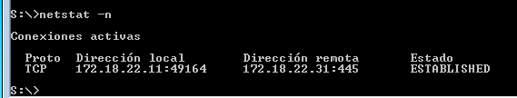


## 3 Cliente OpenSUSE (smb-client22a)<a name="13"></a>

Configurar el cliente OpenSUSE.
Usar nombre smb-client22a y la IP que hemos establecido.

```console

roberto@smb-client22a:~> hostname -a
smb-client22a
roberto@smb-client22a:~> hostname -d
curso1718
roberto@smb-client22a:~> hostname -f
smb-client22a.curso1718
roberto@smb-client22a:~> ip a
1: lo: <LOOPBACK,UP,LOWER_UP> mtu 65536 qdisc noqueue state UNKNOWN group default qlen 1
    link/loopback 00:00:00:00:00:00 brd 00:00:00:00:00:00
    inet 127.0.0.1/8 scope host lo
       valid_lft forever preferred_lft forever
    inet6 ::1/128 scope host
       valid_lft forever preferred_lft forever
2: eth0: <BROADCAST,MULTICAST,UP,LOWER_UP> mtu 1500 qdisc pfifo_fast state UP group default qlen 1000
    link/ether 08:00:27:66:f7:12 brd ff:ff:ff:ff:ff:ff
    inet 172.18.22.32/16 brd 172.18.255.255 scope global eth0
       valid_lft forever preferred_lft forever
    inet6 fe80::a00:27ff:fe66:f712/64 scope link
       valid_lft forever preferred_lft forever
roberto@smb-client22a:~>


```

Configurar el fichero /etc/hosts de la máquina.


```console

roberto@smb-client22a:~> cat /etc/hosts | grep -e smb
127.0.0.1       smb-client22a.curso1718	smb.client22a
172.18.22.32    smb-client22a.curso1718 smb-client22a
172.18.22.11	smb-client22b
172.18.22.31	smb-server22
roberto@smb-client22a:~>


```

### 3.1 Cliente OpenSUSE GUI<a name="14"></a>

Desde en entorno gráfico, podemos comprobar el acceso a recursos compartidos SMB/CIFS.

Solo tenemos que buscar las `redes -> Buscar en la red -> smb-server22 -> seleccionar nuestro recurso`


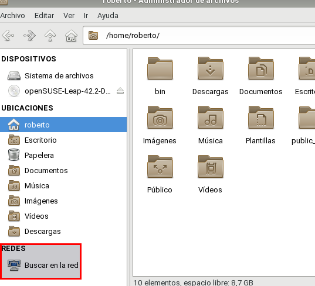

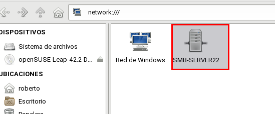

- Estos son nuestros recursos.

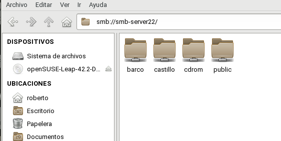

- Probar a crear carpetas/archivos en castillo y en barco.

    - Recurso compartido barco


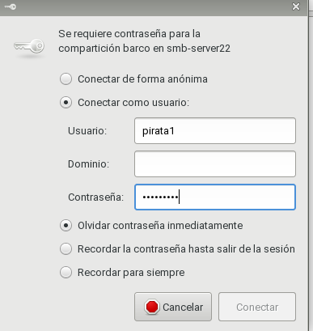

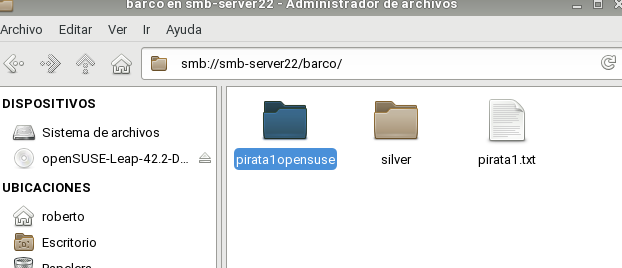

    - Recurso compartido castillo

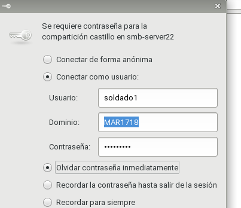

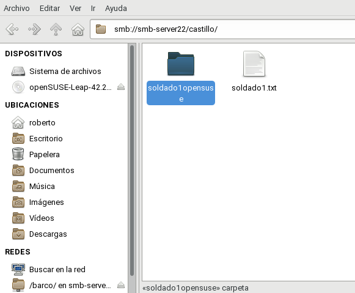

    - Recursos compartido Público

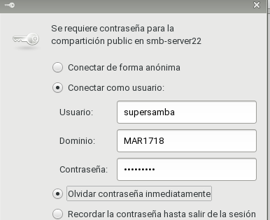


Comprobar que el recurso public es de sólo lectura.

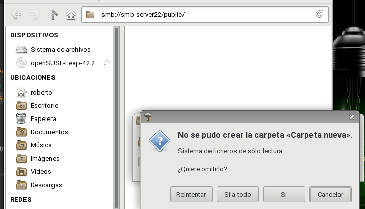

- smbstatus, desde el servidor Samba.

```console

roberto@smb-server22:~> sudo smbstatus
root's password:

Samba version 4.4.2-7.2-3709-SUSE-SLE_12-x86_64
PID     Username     Group        Machine                                   Protocol Version  Encryption           Signing              
----------------------------------------------------------------------------------------------------------------------------------------
2570    nobody       nobody       smb-client22a (ipv4:172.18.22.32:48872)   NT1               -                    -                    
2571    nobody       nobody       smb-client22a (ipv4:172.18.22.32:48874)   NT1               -                    -                    
2575    pirata1      users        172.18.22.32 (ipv4:172.18.22.32:51592)    NT1               -                    -                    
2577    soldado1     users        172.18.22.32 (ipv4:172.18.22.32:51596)    NT1               -                    -                    
2571    -1           -1           smb-client22a (ipv4:172.18.22.32:48874)   NT1               -                    -                    
2570    -1           -1           smb-client22a (ipv4:172.18.22.32:48872)   NT1               -                    -                    
2579    supersamba   users        172.18.22.32 (ipv4:172.18.22.32:51600)    NT1               -                    -                    

Service      pid     Machine       Connected at                     Encryption   Signing     
---------------------------------------------------------------------------------------------
IPC$         2570    smb-client22a jue oct 26 18:54:21 2017 WEST    -            -           
barco        2575    172.18.22.32  jue oct 26 18:58:05 2017 WEST    -            -           
castillo     2577    172.18.22.32  jue oct 26 18:58:53 2017 WEST    -            -           
public       2579    172.18.22.32  jue oct 26 18:59:33 2017 WEST    -            -           
IPC$         2571    smb-client22a jue oct 26 18:54:26 2017 WEST    -            -           

No locked files

roberto@smb-server22:~>


```

- netstat -ntap, desde el servidor Samba.

```console

roberto@smb-server22:~> sudo netstat -ntap
Active Internet connections (servers and established)
Proto Recv-Q Send-Q Local Address           Foreign Address         State       PID/Program name   
tcp        0      0 0.0.0.0:5801            0.0.0.0:*               LISTEN      1457/xinetd         
tcp        0      0 0.0.0.0:139             0.0.0.0:*               LISTEN      1835/smbd           
tcp        0      0 0.0.0.0:5901            0.0.0.0:*               LISTEN      1448/vncmanager     
tcp        0      0 0.0.0.0:22              0.0.0.0:*               LISTEN      1488/sshd           
tcp        0      0 127.0.0.1:631           0.0.0.0:*               LISTEN      1446/cupsd          
tcp        0      0 0.0.0.0:445             0.0.0.0:*               LISTEN      1835/smbd           
tcp        0      0 172.18.22.31:139        172.18.22.32:48872      ESTABLISHED 2570/smbd           
tcp        0      0 172.18.22.31:445        172.18.22.32:51600      ESTABLISHED 2579/smbd           
tcp        0      0 172.18.22.31:139        172.18.22.32:48874      ESTABLISHED 2571/smbd           
tcp        0      0 172.18.22.31:445        172.18.22.32:51596      ESTABLISHED 2577/smbd           
tcp        0      0 172.18.22.31:445        172.18.22.32:51592      ESTABLISHED 2575/smbd           
tcp        0      0 :::139                  :::*                    LISTEN      1835/smbd           
tcp        0      0 :::5901                 :::*                    LISTEN      1448/vncmanager     
tcp        0      0 :::22                   :::*                    LISTEN      1488/sshd           
tcp        0      0 ::1:631                 :::*                    LISTEN      1446/cupsd          
tcp        0      0 ::1:25                  :::*                    LISTEN      1760/master         
tcp        0      0 :::445                  :::*                    LISTEN      1835/smbd           
roberto@smb-server22:~>


```

- netstat -n, desde el cliente.

```console

roberto@smb-client22a:~> sudo netstat -n
Active Internet connections (w/o servers)
Proto Recv-Q Send-Q Local Address           Foreign Address         State      
tcp        4      0 172.18.22.32:51592      172.18.22.31:445        ESTABLISHED
tcp        8      0 172.18.22.32:48872      172.18.22.31:139        ESTABLISHED
tcp        4      0 172.18.22.32:48874      172.18.22.31:139        ESTABLISHED
tcp        0      0 172.18.22.32:51600      172.18.22.31:445        ESTABLISHED
tcp        4      0 172.18.22.32:51596      172.18.22.31:445        ESTABLISHED
udp        0      0 172.18.22.32:52356      8.8.8.8:53              ESTABLISHED
Active UNIX domain sockets (w/o servers)


```


### 3.2 Cliente OpenSUSE comandos smb-client22a<a name="15"></a>


Existen comandos `(smbclient, mount , smbmount, etc.)` para ayudarnos a acceder vía comandos al servidor Samba desde el cliente.

Primero comprobar el uso de las siguientes herramientas:
- `sudo smbtree`                       # Muestra todos los equipos/recursos de la red SMB/CIFS

Hay que abrir el cortafuegos para que funcione.

```console

roberto@smb-client22a:~/Escritorio> sudo smbtree
root's password:
Enter root's password:
MAR1718
	\\SMB-SERVER22   		Samba 4.4.2-7.2-3709-SUSE-SLE_12-x86_64
		\\SMB-SERVER22\IPC$           	IPC Service (Samba 4.4.2-7.2-3709-SUSE-SLE_12-x86_64)
		\\SMB-SERVER22\public         	file public
		\\SMB-SERVER22\cdrom          	CDROM
		\\SMB-SERVER22\castillo       	file castle
		\\SMB-SERVER22\barco          	file boat
roberto@smb-client22a:~/Escritorio>

```

- `smbclient --list=172.18.22.31` # Muestra los recursos SMB/CIFS de un equipo concreto

```console

roberto@smb-client22a:~> sudo smbclient --list=172.18.22.31
Enter root's password:
Domain=[MAR1718] OS=[Windows 6.1] Server=[Samba 4.4.2-7.2-3709-SUSE-SLE_12-x86_64]

	Sharename       Type      Comment
	---------       ----      -------
	barco           Disk      file boat
	castillo        Disk      file castle
	cdrom           Disk      CDROM
	public          Disk      file public
	IPC$            IPC       IPC Service (Samba 4.4.2-7.2-3709-SUSE-SLE_12-x86_64)
Domain=[MAR1718] OS=[Windows 6.1] Server=[Samba 4.4.2-7.2-3709-SUSE-SLE_12-x86_64]

	Server               Comment
	---------            -------
	SMB-CLIENT22B        
	SMB-SERVER22         Samba 4.4.2-7.2-3709-SUSE-SLE_12-x86_64

	Workgroup            Master
	---------            -------
	MAR1718              SMB-SERVER22
roberto@smb-client22a:~>
```

Ahora crearemos en local la carpeta /mnt/samba22-remoto/corusant.
MONTAJE: Con el usuario root, usamos el siguiente comando para montar un recurso compartido de Samba Server, como si fuera una carpeta más de nuestro sistema: `mount -t cifs //172.18.22.31/castillo /mnt/samba22-remoto/castillo -o username=soldado1`

```console
roberto@smb-client22a:~> sudo mkdir -p /mnt/samba22-remoto/castillo
roberto@smb-client22a:~> ls -l /mnt/samba22-remoto/
total 0
drwxr-xr-x 1 root root 0 oct 26 16:18 castillo
roberto@smb-client22a:~> sudo mount -t cifs //172.18.22.31/castillo /mnt/samba22-remoto/castillo -o username=soldado1
Password for soldado1@//172.18.22.31/castillo:  *********
roberto@smb-client22a:~> sudo ls -l /mnt/samba22-remoto/castillo/
total 4
-rwxr--r--+ 1 1009 users 9 oct 26 13:56 soldado1.txt

```

Ejecutar el comando `df -hT`. Veremos que el recurso ha sido montado.

```console

roberto@smb-client22a:~> df -hT
S.ficheros              Tipo     Tamaño Usados  Disp Uso% Montado en
devtmpfs                devtmpfs   993M      0  993M   0% /dev
tmpfs                   tmpfs     1000M      0 1000M   0% /dev/shm
tmpfs                   tmpfs     1000M   2,2M  998M   1% /run
tmpfs                   tmpfs     1000M      0 1000M   0% /sys/fs/cgroup
/dev/sda2               btrfs       13G   4,7G  8,2G  37% /
/dev/sda2               btrfs       13G   4,7G  8,2G  37% /.snapshots
/dev/sda2               btrfs       13G   4,7G  8,2G  37% /usr/local
/dev/sda2               btrfs       13G   4,7G  8,2G  37% /var/lib/named
/dev/sda2               btrfs       13G   4,7G  8,2G  37% /var/crash
/dev/sda2               btrfs       13G   4,7G  8,2G  37% /var/lib/mysql
/dev/sda2               btrfs       13G   4,7G  8,2G  37% /var/lib/mailman
/dev/sda2               btrfs       13G   4,7G  8,2G  37% /var/opt
/dev/sda2               btrfs       13G   4,7G  8,2G  37% /home
/dev/sda2               btrfs       13G   4,7G  8,2G  37% /var/lib/libvirt/images
/dev/sda2               btrfs       13G   4,7G  8,2G  37% /var/log
/dev/sda2               btrfs       13G   4,7G  8,2G  37% /opt
/dev/sda2               btrfs       13G   4,7G  8,2G  37% /var/tmp
/dev/sda2               btrfs       13G   4,7G  8,2G  37% /var/lib/mariadb
/dev/sda2               btrfs       13G   4,7G  8,2G  37% /var/lib/machines
/dev/sda2               btrfs       13G   4,7G  8,2G  37% /tmp
/dev/sda2               btrfs       13G   4,7G  8,2G  37% /var/cache
/dev/sda2               btrfs       13G   4,7G  8,2G  37% /boot/grub2/i386-pc
/dev/sda2               btrfs       13G   4,7G  8,2G  37% /srv
/dev/sda2               btrfs       13G   4,7G  8,2G  37% /var/spool
/dev/sda2               btrfs       13G   4,7G  8,2G  37% /boot/grub2/x86_64-efi
/dev/sda2               btrfs       13G   4,7G  8,2G  37% /var/lib/pgsql
tmpfs                   tmpfs      200M    12K  200M   1% /run/user/1000
//172.18.22.31/castillo cifs        13G   6,2G  6,3G  50% /mnt/samba22-remoto/castillo

```
samba-linux-mount-cifs

Si montamos la carpeta de castillo, lo que escribamos en /mnt/remoto22/castillo debe aparecer en la máquina del servidor Samba. ¡Comprobarlo!

```console

roberto@smb-client22a:~> sudo ls -l /mnt/samba22-remoto/castillo/
total 4
-rwxr--r--+ 1 1009 users 9 oct 26 13:56 soldado1.txt

```

- Para desmontar el recurso remoto usamos el comando umount.

```console

roberto@smb-client22a:~> sudo umount /mnt/samba22-remoto/castillo
root's password:
roberto@smb-client22a:~> df -hT
S.ficheros     Tipo     Tamaño Usados  Disp Uso% Montado en
devtmpfs       devtmpfs   993M      0  993M   0% /dev
tmpfs          tmpfs     1000M      0 1000M   0% /dev/shm
tmpfs          tmpfs     1000M   2,2M  998M   1% /run
tmpfs          tmpfs     1000M      0 1000M   0% /sys/fs/cgroup
/dev/sda2      btrfs       13G   4,7G  8,2G  37% /
/dev/sda2      btrfs       13G   4,7G  8,2G  37% /.snapshots
/dev/sda2      btrfs       13G   4,7G  8,2G  37% /usr/local
/dev/sda2      btrfs       13G   4,7G  8,2G  37% /var/lib/named
/dev/sda2      btrfs       13G   4,7G  8,2G  37% /var/crash
/dev/sda2      btrfs       13G   4,7G  8,2G  37% /var/lib/mysql
/dev/sda2      btrfs       13G   4,7G  8,2G  37% /var/lib/mailman
/dev/sda2      btrfs       13G   4,7G  8,2G  37% /var/opt
/dev/sda2      btrfs       13G   4,7G  8,2G  37% /home
/dev/sda2      btrfs       13G   4,7G  8,2G  37% /var/lib/libvirt/images
/dev/sda2      btrfs       13G   4,7G  8,2G  37% /var/log
/dev/sda2      btrfs       13G   4,7G  8,2G  37% /opt
/dev/sda2      btrfs       13G   4,7G  8,2G  37% /var/tmp
/dev/sda2      btrfs       13G   4,7G  8,2G  37% /var/lib/mariadb
/dev/sda2      btrfs       13G   4,7G  8,2G  37% /var/lib/machines
/dev/sda2      btrfs       13G   4,7G  8,2G  37% /tmp
/dev/sda2      btrfs       13G   4,7G  8,2G  37% /var/cache
/dev/sda2      btrfs       13G   4,7G  8,2G  37% /boot/grub2/i386-pc
/dev/sda2      btrfs       13G   4,7G  8,2G  37% /srv
/dev/sda2      btrfs       13G   4,7G  8,2G  37% /var/spool
/dev/sda2      btrfs       13G   4,7G  8,2G  37% /boot/grub2/x86_64-efi
/dev/sda2      btrfs       13G   4,7G  8,2G  37% /var/lib/pgsql
tmpfs          tmpfs      200M    12K  200M   1% /run/user/1000
roberto@smb-client22a:~>

```

Capturar imagen de los siguientes comandos para comprobar los resultados:

- smbstatus, desde el servidor Samba.

```console

roberto@smb-server22:~> sudo smbstatus

Samba version 4.4.2-7.2-3709-SUSE-SLE_12-x86_64
PID     Username     Group        Machine                                   Protocol Version  Encryption           Signing              
----------------------------------------------------------------------------------------------------------------------------------------
2903    soldado1     users        172.18.22.32 (ipv4:172.18.22.32:34572)    NT1               -                    -                    

Service      pid     Machine       Connected at                     Encryption   Signing     
---------------------------------------------------------------------------------------------
castillo     2903    172.18.22.32  jue oct 26 16:44:57 2017 WEST    -            -           
IPC$         2903    172.18.22.32  jue oct 26 16:44:57 2017 WEST    -            -           

No locked files

roberto@smb-server22:~>


```

- netstat -ntap, desde el servidor Samba.

```console

roberto@smb-server22:~> sudo netstat -ntap
Active Internet connections (servers and established)
Proto Recv-Q Send-Q Local Address           Foreign Address         State       PID/Program name   
tcp        0      0 0.0.0.0:5801            0.0.0.0:*               LISTEN      1460/xinetd         
tcp        0      0 0.0.0.0:139             0.0.0.0:*               LISTEN      2890/smbd           
tcp        0      0 0.0.0.0:5901            0.0.0.0:*               LISTEN      1459/vncmanager     
tcp        0      0 0.0.0.0:22              0.0.0.0:*               LISTEN      1501/sshd           
tcp        0      0 127.0.0.1:631           0.0.0.0:*               LISTEN      1446/cupsd          
tcp        0      0 0.0.0.0:445             0.0.0.0:*               LISTEN      2890/smbd           
tcp        0      1 172.18.22.31:445        172.18.22.11:49164      FIN_WAIT1   -                   
tcp        0      0 172.18.22.31:445        172.18.22.32:34572      ESTABLISHED 2903/smbd           
tcp        0      0 :::139                  :::*                    LISTEN      2890/smbd           
tcp        0      0 :::5901                 :::*                    LISTEN      1459/vncmanager     
tcp        0      0 :::22                   :::*                    LISTEN      1501/sshd           
tcp        0      0 ::1:631                 :::*                    LISTEN      1446/cupsd          
tcp        0      0 ::1:25                  :::*                    LISTEN      1779/master         
tcp        0      0 :::445                  :::*                    LISTEN      2890/smbd           
roberto@smb-server22:~>


```

- netstat -n, desde el cliente OpenSUSE

```console
roberto@smb-client22a:~> netstat -n
Active Internet connections (w/o servers)
Proto Recv-Q Send-Q Local Address           Foreign Address         State      
tcp        0      0 172.18.22.32:34572      172.18.22.31:445        ESTABLISHED
udp        0    768 172.18.22.32:59041      8.8.8.8:53              ESTABLISHED
udp        0      0 172.18.22.32:56034      8.8.8.8:53              ESTABLISHED
udp        0   1536 172.18.22.32:55731      8.8.8.8:53              ESTABLISHED
Active UNIX domain sockets (w/o servers)

roberto@smb-client22a:~> netstat -n | grep 172.18.22.31
tcp        0      0 172.18.22.32:34572      172.18.22.31:445        ESTABLISHED
roberto@smb-client22a:~>


```

### 3.3 Montaje automático<a name="16></a>


Para configurar acciones de montaje automáticos cada vez que se inicie el equipo, debemos configurar el fichero `/etc/fstab`. Veamos un ejemplo:

- `//smb-server22/public /mnt/remoto22/public cifs username=soldado1,password=clave 0 0`


```console

roberto@smb-client22a:~> sudo mkdir /mnt/samba22-remoto/public
roberto@smb-client22a:~> sudo nano /etc/fstab
roberto@smb-client22a:~> sudo cat /etc/fstab | grep smb
//smb-server22/public /mnt/remoto22/public cifs username=soldado1,password=78619841e 0 0


```

Reiniciar el equipo y comprobar que se realiza el montaje automático al inicio.


```console

roberto@smb-client22a:~/Escritorio> df -hT | grep smb
//smb-server22/public cifs        13G   6,2G  6,3G  50% /mnt/remoto22/public
roberto@smb-client22a:~/Escritorio> ls -l /mnt/remoto22/public/
total 0
-rw-r--r--+ 1 root root 0 oct 26 19:13 hola.txt
roberto@smb-client22a:~/Escritorio> sudo cat /etc/fstab | grep smb
root's password:
//smb-server22/public /mnt/remoto22/public cifs username=soldado1,password=78619841e 0 0
roberto@smb-client22a:~/Escritorio>


```

## 4. Preguntas para resolver<a name="17"></a>

- ¿Las claves de los usuarios en OpenSUSE deben ser las mismas que las que usa Samba?

No es necesario

- ¿Puedo definir un usuario en Samba llamado soldado3, y que no exista como usuario del sistema?

Si

- ¿Cómo podemos hacer que los usuarios soldado1 y soldado2 no puedan acceder al sistema pero sí al samba?

Solo tenemos que explicar /bin/false

- Añadir el recurso [homes] al fichero smb.conf según los apuntes. ¿Qué efecto tiene?

Visualiza todas las carpetas y ficheros del usuario que inicia.

Añadimos al fichero de configuración smb.conf [homes].


``` console

## Share disabled by YaST
# [homes]
#       comment = Home Directories
#       valid users = %S, %D%w%S
#       browseable = No
#       read only = No
#       inherit acls = Yes


```
Solo tenemos que descomentar la línea y por lo tanto cuando un cliente se conecta, por lo tanto puede acceder a sus recursos de home.

```console
[homes]
        comment = Home Directories
        valid users = %S, %D%w%S
        browseable = No
        read only = No
        inherit acls = Yes

```

- Reiniciamos el servicio.


```console
roberto@smb-server22:~> sudo systemctl restart smb.service
root's password:
roberto@smb-server22:~> sudo systemctl status smb.service
● smb.service - Samba SMB Daemon
   Loaded: loaded (/usr/lib/systemd/system/smb.service; enabled; vendor preset: disabled)
   Active: active (running) since mar 2017-10-31 10:30:09 WET; 6s ago
  Process: 3008 ExecStartPre=/usr/share/samba/update-apparmor-samba-profile (code=exited, status=0/SUCCESS)
 Main PID: 3023 (smbd)
   Status: "smbd: ready to serve connections..."
    Tasks: 4 (limit: 512)
   CGroup: /system.slice/smb.service
           ├─3023 /usr/sbin/smbd -D
           ├─3024 /usr/sbin/smbd -D
           ├─3025 /usr/sbin/smbd -D
           └─3027 /usr/sbin/smbd -D

oct 31 10:30:08 smb-server22 systemd[1]: Stopped Samba SMB Daemon.
oct 31 10:30:08 smb-server22 systemd[1]: Starting Samba SMB Daemon...
oct 31 10:30:09 smb-server22 systemd[1]: smb.service: Supervising proc....

```

Establecemos conexión desde un equipo cliente.

Podemos acceder al home del usuario logeado en el recurso de barco.

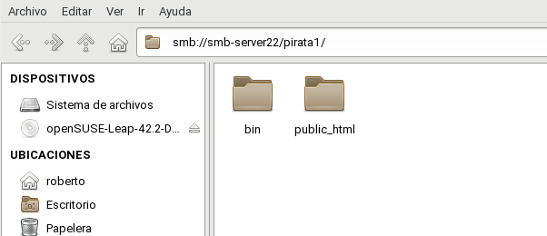

Comprobamos en el servidor que se establece conexión tanto con el recurso de barcos como el de home de pirata1.


```console
roberto@smb-server22:~> sudo smbstatus
root's password:

Samba version 4.4.2-7.2-3709-SUSE-SLE_12-x86_64
PID     Username     Group        Machine                                   Protocol Version  Encryption           Signing              
----------------------------------------------------------------------------------------------------------------------------------------
3066    -1           -1           smb-client22a (ipv4:172.18.22.32:49374)   NT1               -                    -                    
3068    pirata1      users        172.18.22.32 (ipv4:172.18.22.32:48666)    NT1               -                    -                    
3066    nobody       nobody       smb-client22a (ipv4:172.18.22.32:49374)   NT1               -                    -                    
3078    pirata1      users        172.18.22.32 (ipv4:172.18.22.32:48768)    NT1               -                    -                    
3058    soldado1     users        172.18.22.32 (ipv4:172.18.22.32:48658)    NT1               -                    -                    

Service      pid     Machine       Connected at                     Encryption   Signing     
---------------------------------------------------------------------------------------------
IPC$         3058    172.18.22.32  mar oct 31 10:31:36 2017 WET     -            -           
barco        3068    172.18.22.32  mar oct 31 10:36:58 2017 WET     -            -           
pirata1      3078    172.18.22.32  mar oct 31 10:38:05 2017 WET     -            -           
IPC$         3066    smb-client22a mar oct 31 10:36:42 2017 WET     -            -           
public       3058    172.18.22.32  mar oct 31 10:31:36 2017 WET     -            -           

No locked files

roberto@smb-server22:~> ls -l ../pirata1/
total 0
drwxr-xr-x 1 pirata1 users  0 oct  7  2016 bin
drwxr-xr-x 1 pirata1 users 20 oct  3 10:43 public_html
roberto@smb-server22:~>


```
