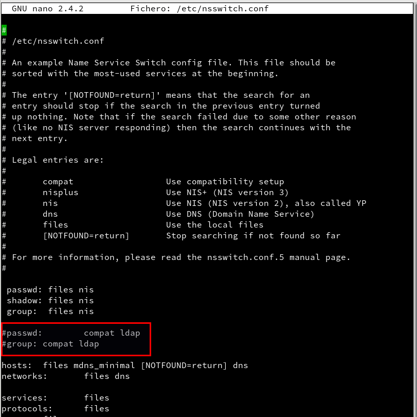

# Servidor LDAP - OpenSUSE


## 1. Servidor LDAP

Existen varias herramientas que implementan el protocolo de `LDAP`, pero en esta guía vamos a instalar la aplicación de `OpenLDADP`.

### 1.1 Preparar la máquina

Con el OpenSUSE 42.2 vamos a configurar:

- Nombre Equipo


- /etc/hosts


### 1.2 Instalación del Servidor LDAP

Instalamos el modulo `sudo zypper in yast2-auth-server`


- Tenemos que realizar los siguientes pasos:

    - `Yast -> Servidor de autenticación.`

    

    - Se requiere, además, instalar los paquetes: openldap2, krb5-server y krb5-client.

    

    - Iniciar servidor LDAP -> Sí

    

    - Registrar dameon SLP -> No

    

    - Puerto abierto en el cortafuegos -> Sí -> Siguiente

    

    - Tipo de servidor -> autónomo -> Siguiente

    

    - Configuración TLS -> NO habilitar -> Siguiente

    

    - Tipo de BD -> hdb

    - DN base -> dc=roberto22,dc=curso1718.

    - DN administrador -> dn=Administrator

    - Añadir DN base -> Sí

    - Contraseña del administrador

    - Directorio de BD -> /var/lib/ldap

    - Usar esta BD predeterminada para clientes LDAP -> Sí -> Siguiente

    

    - Autenticación Kerberos -> No

    

    Resumen de la configuración del servidor de autenticación.

    

    Comprobaciones

- `slaptest -f /etc/openldap/slapd.conf` para comprobar la sintaxis del fichero do configuración.

```console

roberto@ldap-server22:~> sudo slaptest -f /etc/openldap/slapd.conf
root's password:
config file testing succeeded
```

- `systemctl status slapd`, para comprobar el estado del servicio.

```console
roberto@ldap-server22:~> sudo systemctl status slapd.service
● slapd.service - OpenLDAP Server Daemon
   Loaded: loaded (/usr/lib/systemd/system/slapd.service; enabled; vendor preset: disabled)
   Active: active (running) since jue 2017-11-09 09:30:27 WET; 3min 49s ago
  Process: 1446 ExecStart=/usr/lib/openldap/start (code=exited, status=0/SUCCESS)
 Main PID: 1747 (slapd)
    Tasks: 3 (limit: 512)
   CGroup: /system.slice/slapd.service
           └─1747 /usr/sbin/slapd -h ldap:///  ldapi:/// -F /etc/openldap/sla...

nov 09 09:30:19 ldap-server22 systemd[1]: Starting OpenLDAP Server Daemon...
nov 09 09:30:21 ldap-server22 slapd[1446]: @(#) $OpenLDAP: slapd 2.4.44 $
                                                   opensuse-buildservice@ope...g
nov 09 09:30:27 ldap-server22 slapd[1747]: slapd starting
nov 09 09:30:27 ldap-server22 systemd[1]: Started OpenLDAP Server Daemon.
nov 09 09:30:27 ldap-server22 start[1446]: Starting ldap-server
Hint: Some lines were ellipsized, use -l to show in full.
roberto@ldap-server22:~>
```

- `nmap localhost | grep -P '389|636'`, para comprobar que el servidor LDAP es accesible desde la red.

```console

roberto@ldap-server22:~> sudo nmap localhost | grep -P '389|636'
389/tcp  open  ldap
```

- slapcat para comprobar que la base de datos está bien configurada.


```console
roberto@ldap-server22:~> sudo slapcat
dn: dc=roberto22,dc=curso1718
dc: roberto22
o: roberto22
objectClass: organization
objectClass: dcObject
structuralObjectClass: organization
entryUUID: 4b7cb422-58d1-1037-803f-c76e4a4fa927
creatorsName: cn=Administrator,dc=roberto22,dc=curso1718
createTimestamp: 20171108130553Z
entryCSN: 20171108130553.195896Z#000000#000#000000
modifiersName: cn=Administrator,dc=roberto22,dc=curso1718
modifyTimestamp: 20171108130553Z

dn: ou=group,dc=roberto22,dc=curso1718
objectClass: organizationalUnit
objectClass: top
ou: group
structuralObjectClass: organizationalUnit
entryUUID: 4b7d5bd4-58d1-1037-8040-c76e4a4fa927
creatorsName: cn=Administrator,dc=roberto22,dc=curso1718
createTimestamp: 20171108130553Z
entryCSN: 20171108130553.200190Z#000000#000#000000
modifiersName: cn=Administrator,dc=roberto22,dc=curso1718
modifyTimestamp: 20171108130553Z

dn: ou=people,dc=roberto22,dc=curso1718
objectClass: organizationalUnit
objectClass: top
ou: people
structuralObjectClass: organizationalUnit
entryUUID: 4b7d7cf4-58d1-1037-8041-c76e4a4fa927
creatorsName: cn=Administrator,dc=roberto22,dc=curso1718
createTimestamp: 20171108130553Z
entryCSN: 20171108130553.201039Z#000000#000#000000
modifiersName: cn=Administrator,dc=roberto22,dc=curso1718
modifyTimestamp: 20171108130553Z

dn: ou=ldapconfig,dc=roberto22,dc=curso1718
objectClass: organizationalUnit
objectClass: top
ou: ldapconfig
structuralObjectClass: organizationalUnit
entryUUID: 4b7d9c70-58d1-1037-8042-c76e4a4fa927
creatorsName: cn=Administrator,dc=roberto22,dc=curso1718
createTimestamp: 20171108130553Z
entryCSN: 20171108130553.201845Z#000000#000#000000
modifiersName: cn=Administrator,dc=roberto22,dc=curso1718
modifyTimestamp: 20171108130553Z

dn: cn=userconfiguration,ou=ldapconfig,dc=roberto22,dc=curso1718
objectClass: top
objectClass: suseModuleConfiguration
objectClass: suseUserConfiguration
suseDefaultBase: ou=people,dc=roberto22,dc=curso1718
suseDefaultTemplate: cn=usertemplate,ou=ldapconfig,dc=roberto22,dc=curso1718
suseMaxPasswordLength: 8
suseMaxUniqueId: 60000
suseMinPasswordLength: 5
suseMinUniqueId: 1000
suseNextUniqueId: 1000
susePasswordHash: SSHA
suseSearchFilter: objectClass=posixAccount
suseSkelDir: /etc/skel
structuralObjectClass: suseUserConfiguration
cn: userconfiguration
entryUUID: 4b7dbd9a-58d1-1037-8043-c76e4a4fa927
creatorsName: cn=Administrator,dc=roberto22,dc=curso1718
createTimestamp: 20171108130553Z
entryCSN: 20171108130553.202694Z#000000#000#000000
modifiersName: cn=Administrator,dc=roberto22,dc=curso1718
modifyTimestamp: 20171108130553Z

dn: cn=groupconfiguration,ou=ldapconfig,dc=roberto22,dc=curso1718
objectClass: top
objectClass: suseModuleConfiguration
objectClass: suseGroupConfiguration
suseDefaultBase: ou=group,dc=roberto22,dc=curso1718
suseDefaultTemplate: cn=grouptemplate,ou=ldapconfig,dc=roberto22,dc=curso171
 8
suseMaxUniqueId: 60000
suseMinUniqueId: 1000
suseNextUniqueId: 1000
suseSearchFilter: objectClass=posixGroup
structuralObjectClass: suseGroupConfiguration
cn: groupconfiguration
entryUUID: 4b7e3d92-58d1-1037-8044-c76e4a4fa927
creatorsName: cn=Administrator,dc=roberto22,dc=curso1718
createTimestamp: 20171108130553Z
entryCSN: 20171108130553.205969Z#000000#000#000000
modifiersName: cn=Administrator,dc=roberto22,dc=curso1718
modifyTimestamp: 20171108130553Z

dn: cn=usertemplate,ou=ldapconfig,dc=roberto22,dc=curso1718
objectClass: top
objectClass: suseObjectTemplate
objectClass: suseUserTemplate
suseDefaultValue: homeDirectory=/home/%uid
suseDefaultValue: loginShell=/bin/bash
suseNamingAttribute: uid
susePlugin: UsersPluginLDAPAll
structuralObjectClass: suseUserTemplate
cn: usertemplate
entryUUID: 4b7e70a0-58d1-1037-8045-c76e4a4fa927
creatorsName: cn=Administrator,dc=roberto22,dc=curso1718
createTimestamp: 20171108130553Z
entryCSN: 20171108130553.207277Z#000000#000#000000
modifiersName: cn=Administrator,dc=roberto22,dc=curso1718
modifyTimestamp: 20171108130553Z

dn: cn=grouptemplate,ou=ldapconfig,dc=roberto22,dc=curso1718
objectClass: top
objectClass: suseObjectTemplate
objectClass: suseGroupTemplate
suseNamingAttribute: cn
susePlugin: UsersPluginLDAPAll
structuralObjectClass: suseGroupTemplate
cn: grouptemplate
entryUUID: 4b7e8f68-58d1-1037-8046-c76e4a4fa927
creatorsName: cn=Administrator,dc=roberto22,dc=curso1718
createTimestamp: 20171108130553Z
entryCSN: 20171108130553.208065Z#000000#000#000000
modifiersName: cn=Administrator,dc=roberto22,dc=curso1718
modifyTimestamp: 20171108130553Z

roberto@ldap-server22:~>
```
Tenemos que instalar el paquete gráfico de `gq` en la terminal.

```console
roberto@ldap-server22:~> sudo zypper se gq
Cargando datos del repositorio...
Leyendo los paquetes instalados...

E | Nombre | Resumen               | Tipo   
--+--------+-----------------------+--------
  | gq     | Cliente LDAP para GTK | paquete
roberto@ldap-server22:~> sudo zypper in gq
Cargando datos del repositorio...
Leyendo los paquetes instalados...
Resolviendo dependencias de paquete...

El siguiente paquete NUEVO va a ser instalado:
  gq

1 nuevo paquete a instalar.
Tamaño total de descarga: 170,3 KiB. Ya en caché: 0 B. Después de la operación,
se utilizarán 542,4 KiB adicionales.
¿Desea continuar? [s/n/? mostrar todas las opciones] (s):
```
- Ejecutamos el `gq` para comprobar que funciona y podemos ver nuestro ldap.


### 1.4 Crear usuarios y grupos LDAP

- Yast -> Usuarios Grupos -> Filtro -> LDAP.


- Crear los grupos piratas (Estos se crearán dentro de la ou=groups).


- Crear los usuarios pirata21, pirata22 (Estos se crearán dentro de la ou=people).


- Usar gq para consultar el contenido de la base de datos LDAP.


- `ldapsearch -x -L -u -t "(uid=pirata21)"`, comando para consultar en la base de datos LDAP la información del usuario con uid concreto.

```console
roberto@ldap-server22:~> ldapsearch -x -L -u -t "(uid=pirata21)"
version: 1

#
# LDAPv3
# base <dc=roberto22,dc=curso1718> (default) with scope subtree
# filter: (uid=pirata21)
# requesting: ALL
#

# pirata21, people, roberto22.curso1718
dn: uid=pirata21,ou=people,dc=roberto22,dc=curso1718
ufn: pirata21, people, roberto22.curso1718
cn: pirata21
gidNumber: 1000
homeDirectory: /home/pirata21
loginShell: /bin/bash
objectClass: top
objectClass: posixAccount
objectClass: inetOrgPerson
sn: pirata21
uid: pirata21
uidNumber: 1011

# search result

# numResponses: 2
# numEntries: 1
roberto@ldap-server22:~>
```

## 2. Preparativos Máquina Cliente.

- Nombre equipo: ldap-client22


- Dominio: curso1718


- Asegurarse que tenemos definido en el fichero /etc/hosts del cliente, el nombre DNS con su IP correspondiente:


### 2.1 Comprobación

- `nmap -Pn ldap-serverXX | grep -P '389|636'`, para comprobar que el servidor LDAP es accesible desde el cliente.


- Usar gq en el cliente para comprobar que se han creado bien los usuarios.

Instalación de gp en el cliente.

```console
roberto@ldap-client22:~> sudo zypper se gq
Cargando datos del repositorio...
Leyendo los paquetes instalados...

E | Nombre | Resumen               | Tipo   
--+--------+-----------------------+--------
  | gq     | Cliente LDAP para GTK | paquete
roberto@ldap-client22:~> sudo zypper in gq
Cargando datos del repositorio...
Leyendo los paquetes instalados...
Resolviendo dependencias de paquete...

El siguiente paquete NUEVO va a ser instalado:
  gq

1 nuevo paquete a instalar.
Tamaño total de descarga: 170,3 KiB. Ya en caché: 0 B. Después de la operación,
se utilizarán 542,4 KiB adicionales.
¿Desea continuar? [s/n/? mostrar todas las opciones] (s): s
Recuperando paquete gq-1.2.3-94.4.x86_64
                                     (1/1), 170,3 KiB (542,4 KiB desempaquetado)
Recuperando: gq-1.2.3-94.4.x86_64.rpm ...............................[terminado]
Buscando conflictos de archivos: ....................................[terminado]
(1/1) Instalando: gq-1.2.3-94.4.x86_64 ..............................[terminado]
roberto@ldap-client22:~>
```
- Abrimos el gq


- File -> Preferencias -> Servidor -> Nuevo


- URI = ldap://ldap-server22


- Base DN = dc=roberto22,dc=curso1718


### 2.2 Instalar cliente LDAP

Vamos a configurar de la conexión del cliente con el servidor LDAP.

- Debemos instalar el paquete yast2-auth-client, que nos ayudará a configurar la máquina para autenticación.

```console
roberto@ldap-client22:~> sudo zypper in yast2-auth-client
root's password:
Cargando datos del repositorio...
Leyendo los paquetes instalados...
Resolviendo dependencias de paquete...

El siguiente paquete va a ser actualizado:
  yast2-auth-client

1 paquete a actualizar.
Tamaño total de descarga: 55,5 KiB. Ya en caché: 0 B. Después de la operación,
se liberarán 32,0 B.
¿Desea continuar? [s/n/? mostrar todas las opciones] (s): s
Recuperando paquete yast2-auth-client-3.3.13-3.1.noarch
                                     (1/1),  55,5 KiB (267,0 KiB desempaquetado)
Recuperando delta: ./noarch/yast2-auth-client-3.3.12_3.3.13-1.1_3.1.noarch.drpm, 13,9 KiB
Recuperando: yast2-auth-client-3.3.12_3.3.13-1.1_3.1.noarch.drpm ....[terminado]
Aplicando delta: ./yast2-auth-client-3.3.12_3.3.13-1.1_3.1.noarch.drp[terminado]
Buscando conflictos de archivos: ....................................[terminado]
(1/1) Instalando: yast2-auth-client-3.3.13-3.1.noarch ...............[terminado]
roberto@ldap-client22:~>
```
- Ir a Yast -> LDAP y cliente Kerberos.


- Configurar como la imagen de ejmplo. Al final usar la opción de Probar conexión


### 2.3 Comprobamos desde el cliente

- Vamos a la consola con nuestro usuario normal y comprobamos los siguientes comandos para ver si el usuario de ldap funciona en el equipo cliente.

```console
roberto@ldap-client22:~> getent passwd pirata21
pirata21:*:1011:1000:pirata21:/home/pirata21:/bin/bash
roberto@ldap-client22:~> getent group piratas2
piratas2:*:1000:
roberto@ldap-client22:~> id pirata21
uid=1011(pirata21) gid=1000(piratas2) grupos=1000(piratas2)
roberto@ldap-client22:~> finger pirata21
Login: pirata21       			Name: pirata21
Directory: /home/pirata21           	Shell: /bin/bash
Never logged in.
No Mail.
No Plan.
roberto@ldap-client22:~> cat /etc/passwd | grep pirata21
roberto@ldap-client22:~> cat /etc/group | grep piratas2
roberto@ldap-client22:~> su pirata21
Contraseña:
su: Fallo de autenticación
roberto@ldap-client22:~> su pirata21
Contraseña:
pirata21@ldap-client22:/home/roberto>
```
Realizamos la comprobación con el entorno gráfico.


# ANEXO Problema

En ocasiones al instalar en el cliente ldap no funciona y se queda sin iniciar sesión. Para solucionar el problema tenemos que entrar con un knoppix y modificar el fichero de configuración `/etc/nsswitch.conf`

Tenemos que comentar las siguientes líneas.
```console
#passwd:    compat ldap
#group:     compat ldap
```
y descomentar las siguientes líneas.

```console
passwd: files nis
shadow: files nis
group:  files nis
```


- Tenemos que volver de nuevo al yast -> ldap y cliente y volvemos a marcar usuario y grupo.


