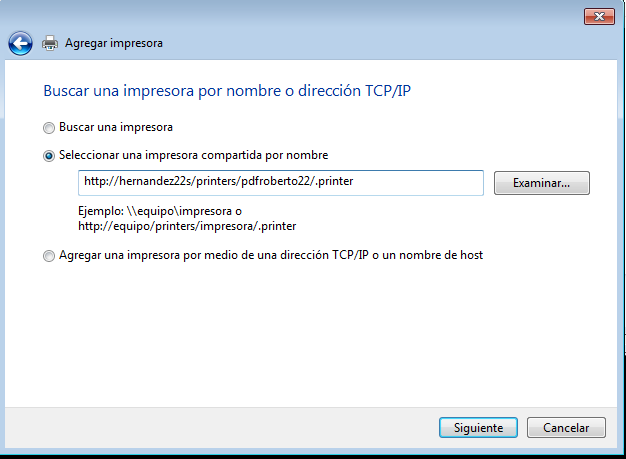
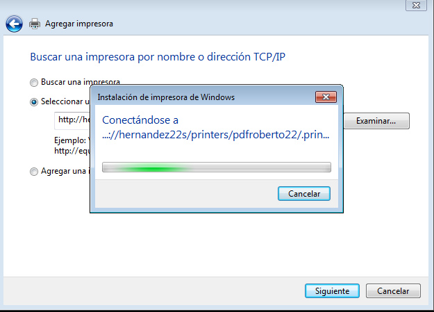
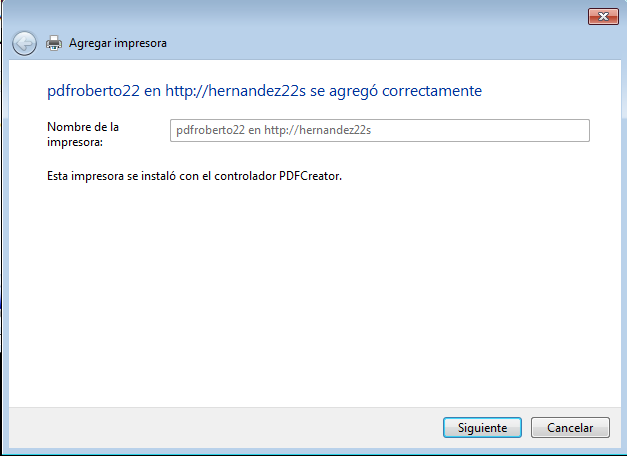
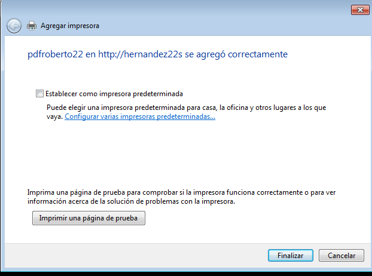
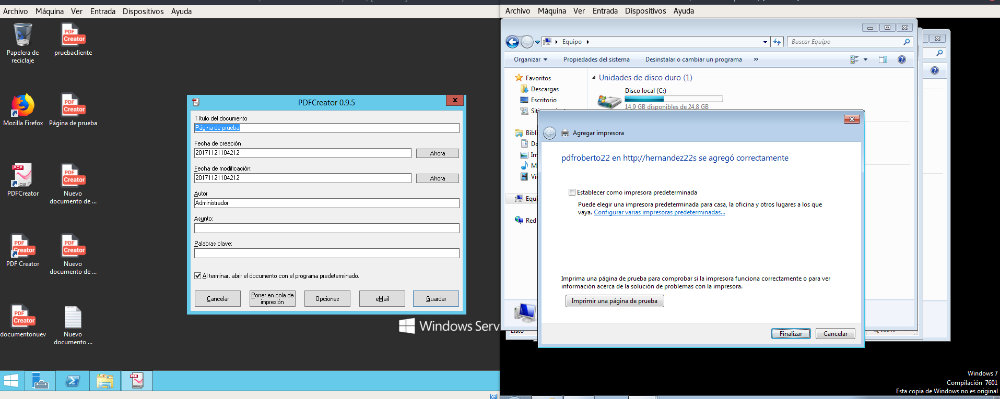
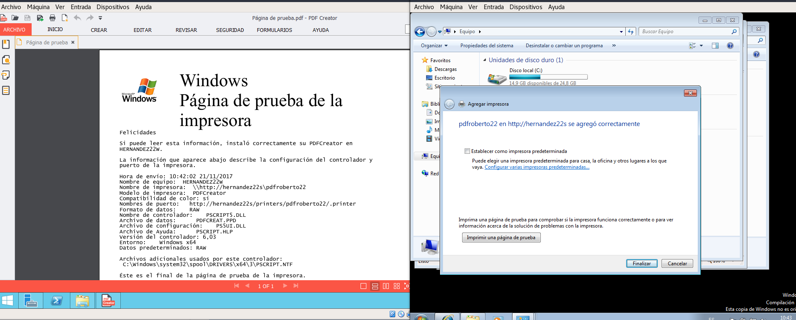
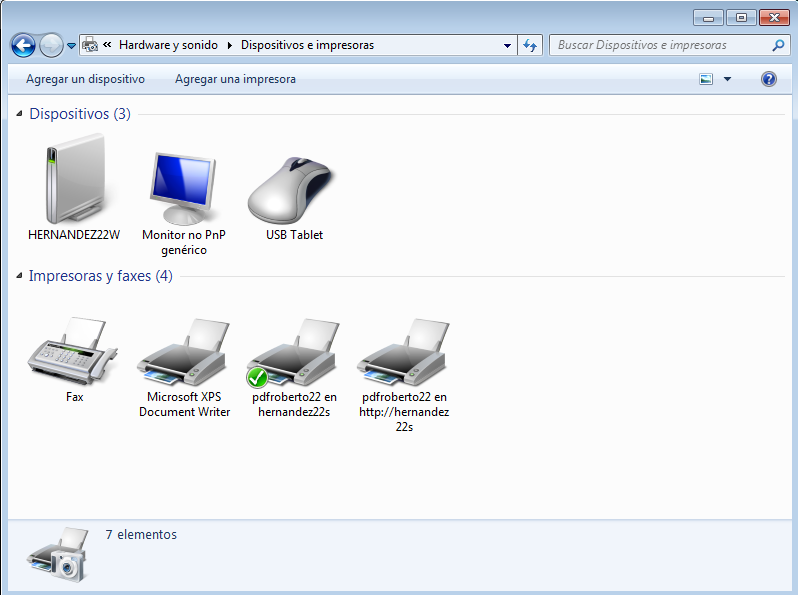

# Servidor de Impresión en Windows

Con el Sistema Operativo Windows vamos a crear un servicio de impresión para gestionar la cola de impresión y sus prioridades.

- [1. Impresora Compartida](#1)
    - [1.1. Rol Impresión](#2)
    - [1.2. Instalar Impresora en Windows Server 2012](#3)
    - [1.3. Compartir Impresora](#4)
- [2. Acceso Web y configuración de impresión](#5)
    - [2.1. Comprobación desde el navegador del cliente](#6)
    - [2.2. Agregar una Impresora desde la Web](#7)
    - [2.2.1 Agregar una Impresora desde un sitio de Web-Opción 2](#8)
    - [2.3. Comprobando el parar la impresora](#9)

## 1. Impresora compartida

### 1.1 Rol impresión

Tenemos que instalar el rol de `administración de servidor -> agregar nuevos roles` y tenemos que buscar el rol de `administración de impresión`.

El resultado de la instalación de la administración de impresión

### 1.2 Instalar impresora

Tenemos que instalar una impresora lógica al servidor en este caso vamos a crear una impresora mediante pdfcreator.

Tenemos que instalar la impresora mediante el software de `pdfcreator`

El resultado de la instalación del pdfcreator.

Comprobamos que la impresora está en dispositivos en Windows.

En esté caso la impresora se llamada pdfcreator. Está impresora fue creada por el software de pdfcreator.

Realizamos una prueba desde el Servidor y se imprime un documento a pdf.

- Nos sale una ventana  en el servidor del pdfcreator para guardar el doc a pdf.

### 1.3 Compartir por red

Para compartir la impresora de pdfcreator en la red debemos realizar el siguiente paso:

Solo tenemos que dar a propiedades de impresora y vamos a la pestaña de compartir y escribimos en el recurso de red `pdfroberto22`.

- Después de tener la impresora compartida en red, vamos al equipo cliente windows y buscamos la impresora por la red, debemos ir `panel de control -> agregar impresora` o escribimos en el navegador `\\hernandez22s\` nos sale un mensaje para autenticar la conexión. Solo tenemos que agregar la impresora a nuestro equipo cliente.

- Agregando desde los dispositivos de impresora.

- En este caso vamos a imprimir la página de prueba desde el cliente.

- Se comprueba que desde el cliente envía al Servidor de impresión la impresión y muestra un mensaje el pdfcreator para guardar la impresión.

- Se comprueba que imprime correctamente.

En el caso de introducir en el navegador `\\hernandez22s` solo tenemos que darle doble clic al recurso de la impresora.

Con instalar la confianza en la impresora. Ya la tenemos agregada.

Comprobamos que en nuestro equipo cliente tenemos la impresora de pdfcreator.

## 2. Acceso Web y configuración de impresión

Tenemos que tener instalado el rol de adminstración de impresión, que ya lo instalamos pero tenemos que instalar una opción para que sea por navegador web y por lo tanto debe instalar también el `IIS`.

La opción nueva o caracteristica se llama `impresión en Internet`

Solo tenemos que darle siguiente y nos dirá que tiene que instalar el servicio de IIS.

### 2.1 Comprobación desde el navegador del cliente.

Ejecutamos el cliente Windows 7 y abrimos un navegador de Internet y escribimos lo siguiente.

`http://hernandez22s/printers` por lo tantos podemos entrar en la configuración de las impresoras.

- Encontramos la impresora de pdfcreator con el nombre de `pdfroberto22`.

- Entramos dentro de la impresora y comprobamos que no tenemos ningún documento en cola.

### 2.2 Agregar una impresora desde la Web.

Solo tenemos que acceder a la página web de la impresora, `http://hernandez22s/printers` y vamos a la pestaña conectar y nos muestra un mensaje que indica si queremos agregar dicha impresora.

Nos muestra un mensaje como que se instalado la impresora en el equipo cliente.

### 2.2.1 Agregar una impresora desde un sitio de Web-Opción 2

Vamos a dispositivos y agregamos un nueva impresora.

Escribimos la siguiente dirección `http://hernandez22s/printers/pdfroberto22/.printer`

Esperamos que se conecte con la impresora pdf que tenemos agregada en el Servidor.

Realizamos una prueba de impresión y le damos a imprimir  una página de prueba.

Comprobamos que en el servidor nos sale el mensaje que debemos guardar el pdf y cuando seleccionamos la ruta que guardamos el pdf, comprobamos el fichero pdf.

Se comprueba que se imprime correctamente.

- Miramos en el equipo cliente las impresoras que tenemos agregadas y comprobamos que tenemos la pdfroberto22 agregada de modo local y la http://hernandez22s agregada de modo Web.

### 2.3 Comprobando el parar la impresora

Nos conectamos a la página web de la impresora, `http://hernandez22s/printers` y pausamos la impresora, realizamos una prueba de impresión y nos indica que tenemos un documento en cola. Si le quitamos el pause a la impresora y activamos que este disponible, imprime automaticamente el documento.

