# Vagrant y VirtualBox

## 1. Introducción

Según Wikipedia:

    Vagrant es una herramienta para la creación y configuración de entornos
    de desarrollo virtualizados.

    Originalmente se desarrolló para VirtualBox y sistemas de configuración tales
    como Chef, Salt y Puppet. Sin embargo desde la versión 1.1 Vagrant es
    capaz de trabajar con múltiples proveedores, como VMware, Amazon EC2, LXC, DigitalOcean, etc.2

    Aunque Vagrant se ha desarrollado en Ruby se puede usar en multitud de
    proyectos escritos en otros lenguajes.

## 2. Instalar Vagrant

La instalación de vagrant en la máquina real.

Vamos a la página de vagrant y descargamos el paquete `vagrant.deb` y lo instalamos de la siguiente manera.

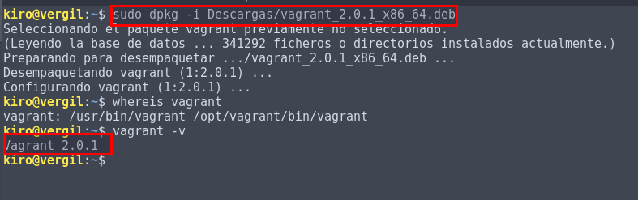

Para ver la versión de `vagrant`.

``` console
kiro@vergil:~$ vagrant -v
Vagrant 2.0.1
kiro@vergil:~$
```
Necesitamos comprobar la version de `VirtualBox`.

```console
kiro@vergil:~$ VBoxManage -v
5.2.0r118431
kiro@vergil:~$

```
### 2.2 Proyecto

Creamos un directorio para nuestro proyecto `vagrant`

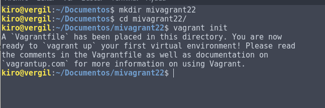

Comprobamos que se creo el fichero `Vagrantfile`

```console
kiro@vergil:~/Documentos/mivagrant22$ ls -l
total 4
-rw-r--r-- 1 kiro kiro 3011 nov 29 12:43 Vagrantfile
kiro@vergil:~/Documentos/mivagrant22$
```
### 2.3 Imagen, Caja o Box

Tenemos que descargar una imagen(caja,box) de un sistema operativo. Vamos, por ejemplo, a conseguir una imagen de un `Ubuntu Precise de 32 bits:`

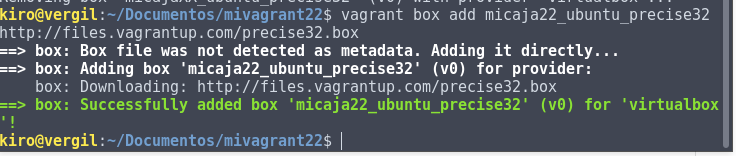

En caso de eliminar una caja o box debemos introducir el siguiente comando.

- `vagrant box remove nombrecaja`

```console
kiro@vergil:~/Documentos/mivagrant22$ vagrant box remove micaja22_ubuntu_precise32
Removing box 'micaja22_ubuntu_precise32' (v0) with provider 'virtualbox'...
kiro@vergil:~/Documentos/mivagrant22$
```

Comprobamos que tenemos la caja descargada.


Para realizar una caja determinada tenemos que modificar el fichero `vagrantfile`(dentro de la carpeta de nuestro proyecto mivagrant22)

Tenemos que configurar las líneas `config.vm.box = "base"` por `config.vm.box = "micaja22_ubuntu_precise32"`

Primero tenemos que copiar el fichero de configuración para tener un respaldo.

```console
kiro@vergil:~/Documentos/mivagrant22$ cp Vagrantfile Vagrantfile.bak
kiro@vergil:~/Documentos/mivagrant22$ ls -l
total 8
-rw-r--r-- 1 kiro kiro 3011 nov 29 12:43 Vagrantfile
-rw-r--r-- 1 kiro kiro 3011 nov 29 13:11 Vagrantfile.bak
kiro@vergil:~/Documentos/mivagrant22$
```
Modificamos el fichero de configuración `Vagrantfile`.

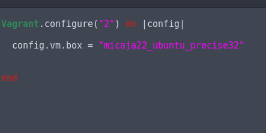

### 2.4 Iniciar una nueva máquina.

Vamos a iniciar una máquina virtual nueva usando `Vagrant`

- Entramos en nuestro directorio de vagrant y ejecutamos el siguiente comando para ejecutar la máquina virtual.

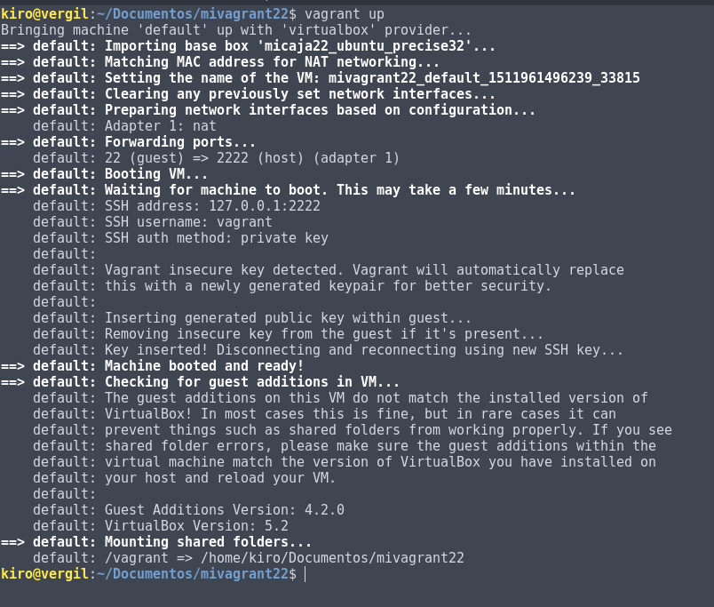

Si queremos conectarnos debemos utilizar el siguiente comando.

- `vagrant ssh` : Conectar/entrar en nuestra máquina.

Otros comando útiles de Vagrant son:

- `vagrant suspend`: Suspender la máquina virtual. Tener en cuenta que la MV en modo suspendido consume más espacio en disco debido a que el estado de la  máquina virtual que suele almacenarse en la RAM se pasa a disco.

- `vagrant resume` : Volver a despertar la máquina virtual.

- `vagrant halt`: Apagarla la máquina virtual.

- `vagrant status`: Estado actual de la máquina virtual.

- `vagrant destroy`: Para eliminar la máquina virtual (No los ficheros de configuración).

Comprobamos y nos conectamos a la máquina virtual.

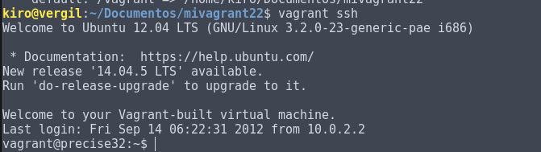

## 3. Configuración del Entorno Virtual.
### 3.1 Carpetas sincronizadas

Primero tenemos que identificar las carpetas compartidas dentro del entorno virtual.

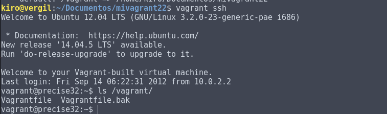

### 3.2 Redireccionamiento de los puertos

Primero tenemos que instalar el apache en la maquina virtual.

- `vagrant ssh`

- `apt-get install apache2`

Proceso de instalación.

```console

kiro@vergil:~/Documentos/mivagrant22$ vagrant ssh
Welcome to Ubuntu 12.04 LTS (GNU/Linux 3.2.0-23-generic-pae i686)

 * Documentation:  https://help.ubuntu.com/
New release '14.04.5 LTS' available.
Run 'do-release-upgrade' to upgrade to it.

Welcome to your Vagrant-built virtual machine.
Last login: Fri Sep 14 06:22:31 2012 from 10.0.2.2
vagrant@precise32:~$ ls /vagrant/
Vagrantfile  Vagrantfile.bak
vagrant@precise32:~$ apt-get install apache2
E: Could not open lock file /var/lib/dpkg/lock - open (13: Permission denied)
E: Unable to lock the administration directory (/var/lib/dpkg/), are you root?
vagrant@precise32:~$ sudo apt-get install apache2
Reading package lists... Done
Building dependency tree       
Reading state information... Done
The following extra packages will be installed:
  apache2-mpm-worker apache2-utils apache2.2-bin apache2.2-common libapr1 libaprutil1
  libaprutil1-dbd-sqlite3 libaprutil1-ldap ssl-cert
Suggested packages:
  www-browser apache2-doc apache2-suexec apache2-suexec-custom openssl-blacklist
The following NEW packages will be installed:
  apache2 apache2-mpm-worker apache2-utils apache2.2-bin apache2.2-common libapr1
  libaprutil1 libaprutil1-dbd-sqlite3 libaprutil1-ldap ssl-cert
0 upgraded, 10 newly installed, 0 to remove and 66 not upgraded.
Need to get 1,829 kB of archives.
After this operation, 5,311 kB of additional disk space will be used.
Do you want to continue [Y/n]? y
Get:1 http://us.archive.ubuntu.com/ubuntu/ precise/main libapr1 i386 1.4.6-1 [91.3 kB]
Get:2 http://us.archive.ubuntu.com/ubuntu/ precise/main libaprutil1 i386 1.3.12+dfsg-3 [75.4 kB]
Get:3 http://us.archive.ubuntu.com/ubuntu/ precise/main libaprutil1-dbd-sqlite3 i386 1.3.12+dfsg-3 [10.2 kB]
Get:4 http://us.archive.ubuntu.com/ubuntu/ precise/main libaprutil1-ldap i386 1.3.12+dfsg-3 [7,962 B]
Get:5 http://us.archive.ubuntu.com/ubuntu/ precise/main apache2.2-bin i386 2.2.22-1ubuntu1 [1,317 kB]
Get:6 http://us.archive.ubuntu.com/ubuntu/ precise/main apache2-utils i386 2.2.22-1ubuntu1 [89.2 kB]
Get:7 http://us.archive.ubuntu.com/ubuntu/ precise/main apache2.2-common i386 2.2.22-1ubuntu1 [221 kB]
Get:8 http://us.archive.ubuntu.com/ubuntu/ precise/main apache2-mpm-worker i386 2.2.22-1ubuntu1 [2,290 B]
Get:9 http://us.archive.ubuntu.com/ubuntu/ precise/main apache2 i386 2.2.22-1ubuntu1 [1,496 B]
Get:10 http://us.archive.ubuntu.com/ubuntu/ precise-updates/main ssl-cert all 1.0.28ubuntu0.1 [12.3 kB]
Fetched 1,829 kB in 1s (1,277 kB/s)
Preconfiguring packages ...
Selecting previously unselected package libapr1.
(Reading database ... 29361 files and directories currently installed.)
Unpacking libapr1 (from .../libapr1_1.4.6-1_i386.deb) ...
Selecting previously unselected package libaprutil1.
Unpacking libaprutil1 (from .../libaprutil1_1.3.12+dfsg-3_i386.deb) ...
Selecting previously unselected package libaprutil1-dbd-sqlite3.
Unpacking libaprutil1-dbd-sqlite3 (from .../libaprutil1-dbd-sqlite3_1.3.12+dfsg-3_i386.deb) ...
Selecting previously unselected package libaprutil1-ldap.
Unpacking libaprutil1-ldap (from .../libaprutil1-ldap_1.3.12+dfsg-3_i386.deb) ...
Selecting previously unselected package apache2.2-bin.
Unpacking apache2.2-bin (from .../apache2.2-bin_2.2.22-1ubuntu1_i386.deb) ...
Selecting previously unselected package apache2-utils.
Unpacking apache2-utils (from .../apache2-utils_2.2.22-1ubuntu1_i386.deb) ...
Selecting previously unselected package apache2.2-common.
Unpacking apache2.2-common (from .../apache2.2-common_2.2.22-1ubuntu1_i386.deb) ...
Selecting previously unselected package apache2-mpm-worker.
Unpacking apache2-mpm-worker (from .../apache2-mpm-worker_2.2.22-1ubuntu1_i386.deb) ...
Selecting previously unselected package apache2.
Unpacking apache2 (from .../apache2_2.2.22-1ubuntu1_i386.deb) ...
Selecting previously unselected package ssl-cert.
Unpacking ssl-cert (from .../ssl-cert_1.0.28ubuntu0.1_all.deb) ...
Processing triggers for man-db ...
Processing triggers for ufw ...
Processing triggers for ureadahead ...
ureadahead will be reprofiled on next reboot
Setting up libapr1 (1.4.6-1) ...
Setting up libaprutil1 (1.3.12+dfsg-3) ...
Setting up libaprutil1-dbd-sqlite3 (1.3.12+dfsg-3) ...
Setting up libaprutil1-ldap (1.3.12+dfsg-3) ...
Setting up apache2.2-bin (2.2.22-1ubuntu1) ...
Setting up apache2-utils (2.2.22-1ubuntu1) ...
Setting up apache2.2-common (2.2.22-1ubuntu1) ...
Enabling site default.
Enabling module alias.
Enabling module autoindex.
Enabling module dir.
Enabling module env.
Enabling module mime.
Enabling module negotiation.
Enabling module setenvif.
Enabling module status.
Enabling module auth_basic.
Enabling module deflate.
Enabling module authz_default.
Enabling module authz_user.
Enabling module authz_groupfile.
Enabling module authn_file.
Enabling module authz_host.
Enabling module reqtimeout.
Setting up apache2-mpm-worker (2.2.22-1ubuntu1) ...
 * Starting web server apache2                                                           apache2: Could not reliably determine the server's fully qualified domain name, using 127.0.1.1 for ServerName
                                                                                  [ OK ]
Setting up apache2 (2.2.22-1ubuntu1) ...
Setting up ssl-cert (1.0.28ubuntu0.1) ...
Processing triggers for libc-bin ...
ldconfig deferred processing now taking place
vagrant@precise32:~$
```

- Modificamos el fichero `Vagrantfile` de modo que el puerto 4567 del sistema anfitrión sea enrutado al puerto 80 del ambiente virtualizado.

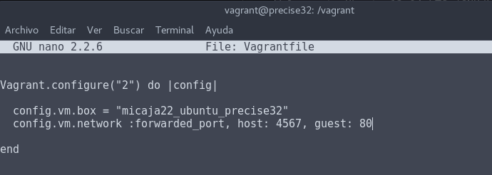

- Tenemos que recargar o refrescar los cambios en el fichero `Vagrantfile`.

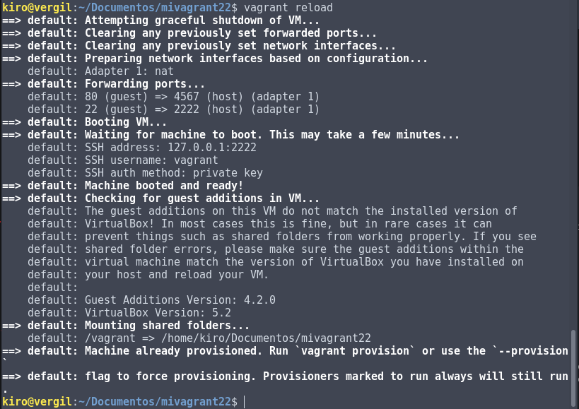

Para confirmar que hay un servicio a la escucha en 4567, desde la máquina real podemos ejecutar los siguientes comandos:

- nmap -p 4500-4600 localhost, debe mostrar 4567/tcp open tram.

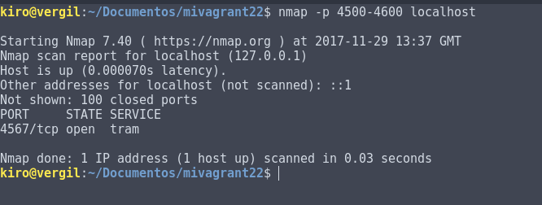

- netstat -ntap, debe mostrar tcp 0.0.0.0:4567 0.0.0.0:* ESCUCHAR.

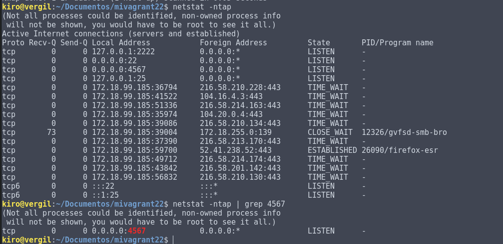

- En la máquina real, abrimos el navegador web con el URL http://127.0.0.1:4567. En realidad estamos accediendo al puerto 80 de nuestro sistema virtualizado.

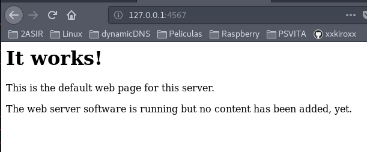

## 4. Ejemplos de configuración Vagrantfile

A continuación se muestran ejemplos de configuración Vagrantfile que NO ES NECESARIO hacer. Sólo es información.

    Enlace de interés Tutorial Vagrant. ¿Qué es y cómo usarlo?


Ejemplo para configurar la red:

    config.vm.network "private_network", ip: "192.168.33.10"

Ejemplo para configurar las carpetas compartidas:

    config.vm.synced_folder "htdocs", "/var/www/html"

Ejemplo para configurar la conexión SSH de vagrant a nuestra máquina virtual:

    config.ssh.username = 'root'
    config.ssh.password = 'vagrant'
    config.ssh.insert_key = 'true'

Ejemplo para configurar la ejecución remota de aplicaciones gráficas instaladas en la máquina virtual, mediante SSH:

    config.ssh.forward_agent = true
    config.ssh.forward_x11 = true

## 5. Suministro

Vamos a crear un aspectos de vagrant que usa herramientas de suministros. Para ello vamos a crear una scripts para el proceso de arranque del entorno virtual.


- `vagrant halt`, apagamos la MV.
- `vagrant destroy` y la destruimos para volver a empezar.

```console
kiro@vergil:~/Documentos/mivagrant22$ vagrant destroy
    default: Are you sure you want to destroy the 'default' VM? [y/N] y
==> default: Forcing shutdown of VM...
==> default: Destroying VM and associated drives...
kiro@vergil:~/Documentos/mivagrant22$ ls -l
total 12
-rwxr-xr-x 1 kiro kiro  258 nov 30 09:17 install_apache.sh
-rw-r--r-- 1 kiro kiro  208 nov 30 09:22 Vagrantfile
-rw-r--r-- 1 kiro kiro 3011 nov 29 13:11 Vagrantfile.bak
kiro@vergil:~/Documentos/mivagrant22$
```


### 5.1 Suministro mediante shell scripts

Vamos a crear una script a la máquina virtual.
- Nos conectamos a la máquina virtual.

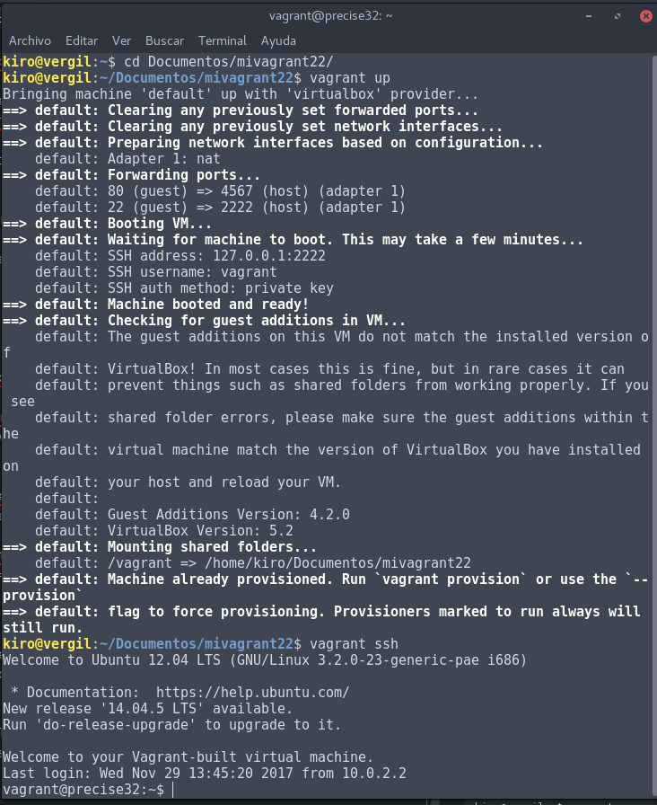

- Escribimos el scripts para actualizar y instalar el apache2 con una página web

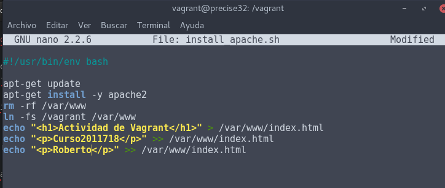


Tenemos que modificar los permisos del fichero creado llamado `install_apache.sh`


```console

vagrant@precise32:/vagrant$ chmod 755 install_apache.sh
vagrant@precise32:/vagrant$ ls -l
total 12
-rwxr-xr-x 1 vagrant vagrant  258 Nov 30 09:17 install_apache.sh
-rw-r--r-- 1 vagrant vagrant  150 Nov 29 13:31 Vagrantfile
-rw-r--r-- 1 vagrant vagrant 3011 Nov 29 13:11 Vagrantfile.bak
vagrant@precise32:/vagrant$
```

En el fichero de configuración de `Vagrantfile` vamos agregar una nueva línea para que siemrpe ejecute el script `install_apache.sh`

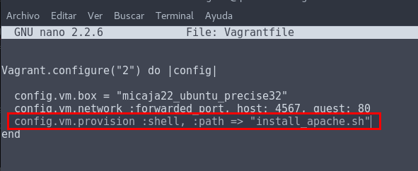

- Ejecutamos y creamos una nueva máquina virtual, debe ejecutarse el scripts con la instalación del apache y la página web.

Volvemos a ejecutar el comando `vagrant up` y comienza a montar la máquina virtual con el scripts que le hemos indicado.

```console
kiro@vergil:~/Documentos/mivagrant22$ vagrant reload
==> default: VM not created. Moving on...
kiro@vergil:~/Documentos/mivagrant22$ vagrant up
Bringing machine 'default' up with 'virtualbox' provider...
==> default: Importing base box 'micaja22_ubuntu_precise32'...
==> default: Matching MAC address for NAT networking...
==> default: Setting the name of the VM: mivagrant22_default_1512034080088_73961
==> default: Clearing any previously set network interfaces...
==> default: Preparing network interfaces based on configuration...
    default: Adapter 1: nat
==> default: Forwarding ports...
    default: 80 (guest) => 4567 (host) (adapter 1)
    default: 22 (guest) => 2222 (host) (adapter 1)
==> default: Booting VM...
==> default: Waiting for machine to boot. This may take a few minutes...
    default: SSH address: 127.0.0.1:2222
    default: SSH username: vagrant
    default: SSH auth method: private key
    default:
    default: Vagrant insecure key detected. Vagrant will automatically replace
    default: this with a newly generated keypair for better security.
    default:
    default: Inserting generated public key within guest...
    default: Removing insecure key from the guest if it's present...
    default: Key inserted! Disconnecting and reconnecting using new SSH key...
==> default: Machine booted and ready!
==> default: Checking for guest additions in VM...
    default: The guest additions on this VM do not match the installed version of
    default: VirtualBox! In most cases this is fine, but in rare cases it can
    default: prevent things such as shared folders from working properly. If you see
    default: shared folder errors, please make sure the guest additions within the
    default: virtual machine match the version of VirtualBox you have installed on
    default: your host and reload your VM.
    default:
    default: Guest Additions Version: 4.2.0
    default: VirtualBox Version: 5.2
==> default: Mounting shared folders...
    default: /vagrant => /home/kiro/Documentos/mivagrant22
==> default: Running provisioner: shell...
    default: Running: /tmp/vagrant-shell20171130-23624-14ydpoo.sh
    default: Get:1 http://security.ubuntu.com precise-security InRelease [55.7 kB]
    default: Ign http://us.archive.ubuntu.com precise InRelease
    default: Get:2 http://us.archive.ubuntu.com precise-updates InRelease [55.7 kB]
    default: Get:3 http://us.archive.ubuntu.com precise-backports InRelease [55.7 kB]
    default: Hit http://us.archive.ubuntu.com precise Release.gpg
    default: Get:4 http://security.ubuntu.com precise-security/main Sources [150 kB]
    default: Get:5 http://us.archive.ubuntu.com precise-updates/main Sources [503 kB]
    default: Get:6 http://security.ubuntu.com precise-security/restricted Sources [4,643 B]
    default: Get:7 http://security.ubuntu.com precise-security/universe Sources [57.9 kB]
    default: Get:8 http://security.ubuntu.com precise-security/multiverse Sources [3,032 B]
    default: Get:9 http://security.ubuntu.com precise-security/main i386 Packages [377 kB]
    default: Get:10 http://us.archive.ubuntu.com precise-updates/restricted Sources [8,837 B]
    default: Get:11 http://us.archive.ubuntu.com precise-updates/universe Sources [137 kB]
    default: Get:12 http://us.archive.ubuntu.com precise-updates/multiverse Sources [10.5 kB]
    default: Get:13 http://us.archive.ubuntu.com precise-updates/main i386 Packages [745 kB]
    default: Get:14 http://security.ubuntu.com precise-security/restricted i386 Packages [10.8 kB]
    default: Get:15 http://security.ubuntu.com precise-security/universe i386 Packages [154 kB]
    default: Get:16 http://security.ubuntu.com precise-security/multiverse i386 Packages [3,537 B]
    default: Get:17 http://security.ubuntu.com precise-security/main TranslationIndex [208 B]
    default: Get:18 http://security.ubuntu.com precise-security/multiverse TranslationIndex [199 B]
    default: Get:19 http://security.ubuntu.com precise-security/restricted TranslationIndex [202 B]
    default: Get:20 http://security.ubuntu.com precise-security/universe TranslationIndex [205 B]
    default: Get:21 http://security.ubuntu.com precise-security/main Translation-en [188 kB]
    default: Get:22 http://us.archive.ubuntu.com precise-updates/restricted i386 Packages [15.3 kB]
    default: Get:23 http://us.archive.ubuntu.com precise-updates/universe i386 Packages [297 kB]
    default: Get:24 http://security.ubuntu.com precise-security/multiverse Translation-en [1,993 B]
    default: Get:25 http://security.ubuntu.com precise-security/restricted Translation-en [2,802 B]
    default: Get:26 http://security.ubuntu.com precise-security/universe Translation-en [93.2 kB]
    default: Get:27 http://us.archive.ubuntu.com precise-updates/multiverse i386 Packages [17.3 kB]
    default: Get:28 http://us.archive.ubuntu.com precise-updates/main TranslationIndex [208 B]
    default: Get:29 http://us.archive.ubuntu.com precise-updates/multiverse TranslationIndex [202 B]
    default: Get:30 http://us.archive.ubuntu.com precise-updates/restricted TranslationIndex [202 B]
    default: Get:31 http://us.archive.ubuntu.com precise-updates/universe TranslationIndex [205 B]
    default: Get:32 http://us.archive.ubuntu.com precise-backports/main Sources [5,889 B]
    default: Get:33 http://us.archive.ubuntu.com precise-backports/restricted Sources [28 B]
    default: Get:34 http://us.archive.ubuntu.com precise-backports/universe Sources [44.2 kB]
    default: Get:35 http://us.archive.ubuntu.com precise-backports/multiverse Sources [5,742 B]
    default: Get:36 http://us.archive.ubuntu.com precise-backports/main i386 Packages [6,470 B]
    default: Get:37 http://us.archive.ubuntu.com precise-backports/restricted i386 Packages [28 B]
    default: Get:38 http://us.archive.ubuntu.com precise-backports/universe i386 Packages [46.0 kB]
    default: Get:39 http://us.archive.ubuntu.com precise-backports/multiverse i386 Packages [5,418 B]
    default: Get:40 http://us.archive.ubuntu.com precise-backports/main TranslationIndex [202 B]
    default: Get:41 http://us.archive.ubuntu.com precise-backports/multiverse TranslationIndex [202 B]
    default: Get:42 http://us.archive.ubuntu.com precise-backports/restricted TranslationIndex [193 B]
    default: Get:43 http://us.archive.ubuntu.com precise-backports/universe TranslationIndex [205 B]
    default: Hit http://us.archive.ubuntu.com precise Release
    default: Get:44 http://us.archive.ubuntu.com precise-updates/main Translation-en [344 kB]
    default: Get:45 http://us.archive.ubuntu.com precise-updates/multiverse Translation-en [10.1 kB]
    default: Get:46 http://us.archive.ubuntu.com precise-updates/restricted Translation-en [3,686 B]
    default: Get:47 http://us.archive.ubuntu.com precise-updates/universe Translation-en [174 kB]
    default: Get:48 http://us.archive.ubuntu.com precise-backports/main Translation-en [5,737 B]
    default: Get:49 http://us.archive.ubuntu.com precise-backports/multiverse Translation-en [4,852 B]
    default: Get:50 http://us.archive.ubuntu.com precise-backports/restricted Translation-en [28 B]
    default: Get:51 http://us.archive.ubuntu.com precise-backports/universe Translation-en [35.9 kB]
    default: Hit http://us.archive.ubuntu.com precise/main Sources
    default: Hit http://us.archive.ubuntu.com precise/restricted Sources
    default: Hit http://us.archive.ubuntu.com precise/universe Sources
    default: Hit http://us.archive.ubuntu.com precise/multiverse Sources
    default: Hit http://us.archive.ubuntu.com precise/main i386 Packages
    default: Hit http://us.archive.ubuntu.com precise/restricted i386 Packages
    default: Hit http://us.archive.ubuntu.com precise/universe i386 Packages
    default: Hit http://us.archive.ubuntu.com precise/multiverse i386 Packages
    default: Hit http://us.archive.ubuntu.com precise/main TranslationIndex
    default: Hit http://us.archive.ubuntu.com precise/multiverse TranslationIndex
    default: Hit http://us.archive.ubuntu.com precise/restricted TranslationIndex
    default: Hit http://us.archive.ubuntu.com precise/universe TranslationIndex
    default: Hit http://us.archive.ubuntu.com precise/main Translation-en
    default: Hit http://us.archive.ubuntu.com precise/multiverse Translation-en
    default: Hit http://us.archive.ubuntu.com precise/restricted Translation-en
    default: Hit http://us.archive.ubuntu.com precise/universe Translation-en
    default: Fetched 3,643 kB in 4s (779 kB/s)
    default: Reading package lists...
    default: Reading package lists...
    default: Building dependency tree...
    default: Reading state information...
    default: The following extra packages will be installed:
    default:   apache2-mpm-worker apache2-utils apache2.2-bin apache2.2-common libapr1
    default:   libaprutil1 libaprutil1-dbd-sqlite3 libaprutil1-ldap ssl-cert
    default: Suggested packages:
    default:   www-browser apache2-doc apache2-suexec apache2-suexec-custom
    default:   openssl-blacklist
    default: The following NEW packages will be installed:
    default:   apache2 apache2-mpm-worker apache2-utils apache2.2-bin apache2.2-common
    default:   libapr1 libaprutil1 libaprutil1-dbd-sqlite3 libaprutil1-ldap ssl-cert
    default: 0 upgraded, 10 newly installed, 0 to remove and 192 not upgraded.
    default: Need to get 1,844 kB of archives.
    default: After this operation, 5,321 kB of additional disk space will be used.
    default: Get:1 http://us.archive.ubuntu.com/ubuntu/ precise/main libapr1 i386 1.4.6-1 [91.3 kB]
    default: Get:2 http://us.archive.ubuntu.com/ubuntu/ precise/main libaprutil1 i386 1.3.12+dfsg-3 [75.4 kB]
    default: Get:3 http://us.archive.ubuntu.com/ubuntu/ precise/main libaprutil1-dbd-sqlite3 i386 1.3.12+dfsg-3 [10.2 kB]
    default: Get:4 http://us.archive.ubuntu.com/ubuntu/ precise/main libaprutil1-ldap i386 1.3.12+dfsg-3 [7,962 B]
    default: Get:5 http://us.archive.ubuntu.com/ubuntu/ precise-updates/main apache2.2-bin i386 2.2.22-1ubuntu1.11 [1,328 kB]
    default: Get:6 http://us.archive.ubuntu.com/ubuntu/ precise-updates/main apache2-utils i386 2.2.22-1ubuntu1.11 [89.2 kB]
    default: Get:7 http://us.archive.ubuntu.com/ubuntu/ precise-updates/main apache2.2-common i386 2.2.22-1ubuntu1.11 [225 kB]
    default: Get:8 http://us.archive.ubuntu.com/ubuntu/ precise-updates/main apache2-mpm-worker i386 2.2.22-1ubuntu1.11 [2,290 B]
    default: Get:9 http://us.archive.ubuntu.com/ubuntu/ precise-updates/main apache2 i386 2.2.22-1ubuntu1.11 [1,498 B]
    default: Get:10 http://us.archive.ubuntu.com/ubuntu/ precise-updates/main ssl-cert all 1.0.28ubuntu0.1 [12.3 kB]
    default: dpkg-preconfigure: unable to re-open stdin: No such file or directory
    default: Fetched 1,844 kB in 2s (726 kB/s)
    default: Selecting previously unselected package libapr1.
    default: (Reading database ...
    default: 29361 files and directories currently installed.)
    default: Unpacking libapr1 (from .../libapr1_1.4.6-1_i386.deb) ...
    default: Selecting previously unselected package libaprutil1.
    default: Unpacking libaprutil1 (from .../libaprutil1_1.3.12+dfsg-3_i386.deb) ...
    default: Selecting previously unselected package libaprutil1-dbd-sqlite3.
    default: Unpacking libaprutil1-dbd-sqlite3 (from .../libaprutil1-dbd-sqlite3_1.3.12+dfsg-3_i386.deb) ...
    default: Selecting previously unselected package libaprutil1-ldap.
    default: Unpacking libaprutil1-ldap (from .../libaprutil1-ldap_1.3.12+dfsg-3_i386.deb) ...
    default: Selecting previously unselected package apache2.2-bin.
    default: Unpacking apache2.2-bin (from .../apache2.2-bin_2.2.22-1ubuntu1.11_i386.deb) ...
    default: Selecting previously unselected package apache2-utils.
    default: Unpacking apache2-utils (from .../apache2-utils_2.2.22-1ubuntu1.11_i386.deb) ...
    default: Selecting previously unselected package apache2.2-common.
    default: Unpacking apache2.2-common (from .../apache2.2-common_2.2.22-1ubuntu1.11_i386.deb) ...
    default: Selecting previously unselected package apache2-mpm-worker.
    default: Unpacking apache2-mpm-worker (from .../apache2-mpm-worker_2.2.22-1ubuntu1.11_i386.deb) ...
    default: Selecting previously unselected package apache2.
    default: Unpacking apache2 (from .../apache2_2.2.22-1ubuntu1.11_i386.deb) ...
    default: Selecting previously unselected package ssl-cert.
    default: Unpacking ssl-cert (from .../ssl-cert_1.0.28ubuntu0.1_all.deb) ...
    default: Processing triggers for man-db ...
    default: Processing triggers for ureadahead ...
    default: ureadahead will be reprofiled on next reboot
    default: Processing triggers for ufw ...
    default: Setting up libapr1 (1.4.6-1) ...
    default: Setting up libaprutil1 (1.3.12+dfsg-3) ...
    default: Setting up libaprutil1-dbd-sqlite3 (1.3.12+dfsg-3) ...
    default: Setting up libaprutil1-ldap (1.3.12+dfsg-3) ...
    default: Setting up apache2.2-bin (2.2.22-1ubuntu1.11) ...
    default: Setting up apache2-utils (2.2.22-1ubuntu1.11) ...
    default: Setting up apache2.2-common (2.2.22-1ubuntu1.11) ...
    default: Enabling site default.
    default: Enabling module alias.
    default: Enabling module autoindex.
    default: Enabling module dir.
    default: Enabling module env.
    default: Enabling module mime.
    default: Enabling module negotiation.
    default: Enabling module setenvif.
    default: Enabling module status.
    default: Enabling module auth_basic.
    default: Enabling module deflate.
    default: Enabling module authz_default.
    default: Enabling module authz_user.
    default: Enabling module authz_groupfile.
    default: Enabling module authn_file.
    default: Enabling module authz_host.
    default: Enabling module reqtimeout.
    default: Setting up apache2-mpm-worker (2.2.22-1ubuntu1.11) ...
    default:  * Starting web server apache2
    default: apache2: Could not reliably determine the server's fully qualified domain name, using 127.0.1.1 for ServerName
    default:    ...done.
    default: Setting up apache2 (2.2.22-1ubuntu1.11) ...
    default: Setting up ssl-cert (1.0.28ubuntu0.1) ...
    default: Processing triggers for libc-bin ...
    default: ldconfig deferred processing now taking place
kiro@vergil:~/Documentos/mivagrant22$
```
- Comprobamos qué está ejecutando el script cada vez que necesitamos montar una máquina virtual nueva.

- Para verificar que todo funciona correctamente escribimos la `127.0.0.1:4567` en nuestra máquina real.

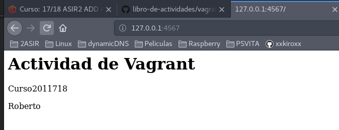

### 5.2 Suministro mediante Puppet

Tenemos que agregar en el fichero `Vagrantfile` la siguiente configuración para puppet.

- Tenemos que crear el directorio manifests.

```console
kiro@vergil:~/Documentos/mivagrant22$ mkdir manifests
kiro@vergil:~/Documentos/mivagrant22$ ls -l
total 20
-rw-r--r-- 1 kiro kiro   65 nov 30 09:28 index.html
-rwxr-xr-x 1 kiro kiro  258 nov 30 09:17 install_apache.sh
drwxr-xr-x 2 kiro kiro 4096 nov 30 09:38 manifests
-rw-r--r-- 1 kiro kiro  293 nov 30 09:36 Vagrantfile
-rw-r--r-- 1 kiro kiro 3011 nov 29 13:11 Vagrantfile.bak
kiro@vergil:~/Documentos/mivagrant22$ cd manifests/
kiro@vergil:~/Documentos/mivagrant22/manifests$ nano default.pp
```
- Creamos el fichero default.pp y agregamos los siguiente.

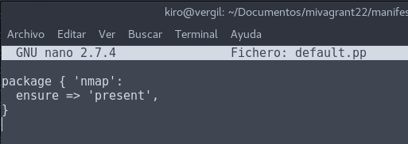

Tenemos que apagar la máguina virtual, destruirla y volver a cargarla o instalarla.

```console
kiro@vergil:~/Documentos/mivagrant22$ vagrant halt
==> default: Attempting graceful shutdown of VM...
kiro@vergil:~/Documentos/mivagrant22$ vagrant destroy
    default: Are you sure you want to destroy the 'default' VM? [y/N] y
==> default: Destroying VM and associated drives...
kiro@vergil:~/Documentos/mivagrant22$ vagrant up
Bringing machine 'default' up with 'virtualbox' provider...
==> default: Importing base box 'micaja22_ubuntu_precise32'...
==> default: Matching MAC address for NAT networking...
==> default: Setting the name of the VM: mivagrant22_default_1512035110766_25729
==> default: Clearing any previously set network interfaces...
==> default: Preparing network interfaces based on configuration...
    default: Adapter 1: nat
==> default: Forwarding ports...
    default: 80 (guest) => 4567 (host) (adapter 1)
    default: 22 (guest) => 2222 (host) (adapter 1)
==> default: Booting VM...
==> default: Waiting for machine to boot. This may take a few minutes...
    default: SSH address: 127.0.0.1:2222
    default: SSH username: vagrant
    default: SSH auth method: private key
    default:
    default: Vagrant insecure key detected. Vagrant will automatically replace
    default: this with a newly generated keypair for better security.
    default:
    default: Inserting generated public key within guest...
    default: Removing insecure key from the guest if it's present...
    default: Key inserted! Disconnecting and reconnecting using new SSH key...
==> default: Machine booted and ready!
==> default: Checking for guest additions in VM...
    default: The guest additions on this VM do not match the installed version of
    default: VirtualBox! In most cases this is fine, but in rare cases it can
    default: prevent things such as shared folders from working properly. If you see
    default: shared folder errors, please make sure the guest additions within the
    default: virtual machine match the version of VirtualBox you have installed on
    default: your host and reload your VM.
    default:
    default: Guest Additions Version: 4.2.0
    default: VirtualBox Version: 5.2
==> default: Mounting shared folders...
    default: /vagrant => /home/kiro/Documentos/mivagrant22
    default: /tmp/vagrant-puppet/manifests-a11d1078b1b1f2e3bdea27312f6ba513 => /home/kiro/Documentos/mivagrant22/manifests
==> default: Running provisioner: shell...
    default: Running: /tmp/vagrant-shell20171130-26912-b2qz2u.sh
    default: Get:1 http://security.ubuntu.com precise-security InRelease [55.7 kB]
    default: Ign http://us.archive.ubuntu.com precise InRelease
    default: Get:2 http://us.archive.ubuntu.com precise-updates InRelease [55.7 kB]
    default: Get:3 http://security.ubuntu.com precise-security/main Sources [150 kB]
    default: Get:4 http://security.ubuntu.com precise-security/restricted Sources [4,643 B]
    default: Get:5 http://security.ubuntu.com precise-security/universe Sources [57.9 kB]
    default: Get:6 http://security.ubuntu.com precise-security/multiverse Sources [3,032 B]
    default: Get:7 http://security.ubuntu.com precise-security/main i386 Packages [377 kB]
    default: Get:8 http://us.archive.ubuntu.com precise-backports InRelease [55.7 kB]
    default: Get:9 http://security.ubuntu.com precise-security/restricted i386 Packages [10.8 kB]
    default: Get:10 http://security.ubuntu.com precise-security/universe i386 Packages [154 kB]
    default: Get:11 http://security.ubuntu.com precise-security/multiverse i386 Packages [3,537 B]
    default: Get:12 http://security.ubuntu.com precise-security/main TranslationIndex [208 B]
    default: Get:13 http://security.ubuntu.com precise-security/multiverse TranslationIndex [199 B]
    default: Get:14 http://security.ubuntu.com precise-security/restricted TranslationIndex [202 B]
    default: Get:15 http://security.ubuntu.com precise-security/universe TranslationIndex [205 B]
    default: Hit http://us.archive.ubuntu.com precise Release.gpg
    default: Get:16 http://security.ubuntu.com precise-security/main Translation-en [188 kB]
    default: Get:17 http://security.ubuntu.com precise-security/multiverse Translation-en [1,993 B]
    default: Get:18 http://security.ubuntu.com precise-security/restricted Translation-en [2,802 B]
    default: Get:19 http://us.archive.ubuntu.com precise-updates/main Sources [503 kB]
    default: Get:20 http://security.ubuntu.com precise-security/universe Translation-en [93.2 kB]
    default: Get:21 http://us.archive.ubuntu.com precise-updates/restricted Sources [8,837 B]
    default: Get:22 http://us.archive.ubuntu.com precise-updates/universe Sources [137 kB]
    default: Get:23 http://us.archive.ubuntu.com precise-updates/multiverse Sources [10.5 kB]
    default: Get:24 http://us.archive.ubuntu.com precise-updates/main i386 Packages [745 kB]
    default: Get:25 http://us.archive.ubuntu.com precise-updates/restricted i386 Packages [15.3 kB]
    default: Get:26 http://us.archive.ubuntu.com precise-updates/universe i386 Packages [297 kB]
    default: Get:27 http://us.archive.ubuntu.com precise-updates/multiverse i386 Packages [17.3 kB]
    default: Get:28 http://us.archive.ubuntu.com precise-updates/main TranslationIndex [208 B]
    default: Get:29 http://us.archive.ubuntu.com precise-updates/multiverse TranslationIndex [202 B]
    default: Get:30 http://us.archive.ubuntu.com precise-updates/restricted TranslationIndex [202 B]
    default: Get:31 http://us.archive.ubuntu.com precise-updates/universe TranslationIndex [205 B]
    default: Hit http://us.archive.ubuntu.com precise Release
    default: Get:32 http://us.archive.ubuntu.com precise-backports/main Sources [5,889 B]
    default: Get:33 http://us.archive.ubuntu.com precise-backports/restricted Sources [28 B]
    default: Get:34 http://us.archive.ubuntu.com precise-backports/universe Sources [44.2 kB]
    default: Get:35 http://us.archive.ubuntu.com precise-backports/multiverse Sources [5,742 B]
    default: Get:36 http://us.archive.ubuntu.com precise-backports/main i386 Packages [6,470 B]
    default: Get:37 http://us.archive.ubuntu.com precise-backports/restricted i386 Packages [28 B]
    default: Get:38 http://us.archive.ubuntu.com precise-backports/universe i386 Packages [46.0 kB]
    default: Get:39 http://us.archive.ubuntu.com precise-backports/multiverse i386 Packages [5,418 B]
    default: Get:40 http://us.archive.ubuntu.com precise-backports/main TranslationIndex [202 B]
    default: Get:41 http://us.archive.ubuntu.com precise-backports/multiverse TranslationIndex [202 B]
    default: Get:42 http://us.archive.ubuntu.com precise-backports/restricted TranslationIndex [193 B]
    default: Get:43 http://us.archive.ubuntu.com precise-backports/universe TranslationIndex [205 B]
    default: Get:44 http://us.archive.ubuntu.com precise-updates/main Translation-en [344 kB]
    default: Get:45 http://us.archive.ubuntu.com precise-updates/multiverse Translation-en [10.1 kB]
    default: Get:46 http://us.archive.ubuntu.com precise-updates/restricted Translation-en [3,686 B]
    default: Get:47 http://us.archive.ubuntu.com precise-updates/universe Translation-en [174 kB]
    default: Hit http://us.archive.ubuntu.com precise/main Sources
    default: Hit http://us.archive.ubuntu.com precise/restricted Sources
    default: Hit http://us.archive.ubuntu.com precise/universe Sources
    default: Hit http://us.archive.ubuntu.com precise/multiverse Sources
    default: Hit http://us.archive.ubuntu.com precise/main i386 Packages
    default: Hit http://us.archive.ubuntu.com precise/restricted i386 Packages
    default: Hit http://us.archive.ubuntu.com precise/universe i386 Packages
    default: Hit http://us.archive.ubuntu.com precise/multiverse i386 Packages
    default: Hit http://us.archive.ubuntu.com precise/main TranslationIndex
    default: Hit http://us.archive.ubuntu.com precise/multiverse TranslationIndex
    default: Hit http://us.archive.ubuntu.com precise/restricted TranslationIndex
    default: Hit http://us.archive.ubuntu.com precise/universe TranslationIndex
    default: Get:48 http://us.archive.ubuntu.com precise-backports/main Translation-en [5,737 B]
    default: Get:49 http://us.archive.ubuntu.com precise-backports/multiverse Translation-en [4,852 B]
    default: Get:50 http://us.archive.ubuntu.com precise-backports/restricted Translation-en [28 B]
    default: Get:51 http://us.archive.ubuntu.com precise-backports/universe Translation-en [35.9 kB]
    default: Hit http://us.archive.ubuntu.com precise/main Translation-en
    default: Hit http://us.archive.ubuntu.com precise/multiverse Translation-en
    default: Hit http://us.archive.ubuntu.com precise/restricted Translation-en
    default: Hit http://us.archive.ubuntu.com precise/universe Translation-en
    default: Fetched 3,643 kB in 3s (1,050 kB/s)
    default: Reading package lists...
    default: Reading package lists...
    default: Building dependency tree...
    default: Reading state information...
    default: The following extra packages will be installed:
    default:   apache2-mpm-worker apache2-utils apache2.2-bin apache2.2-common libapr1
    default:   libaprutil1 libaprutil1-dbd-sqlite3 libaprutil1-ldap ssl-cert
    default: Suggested packages:
    default:   www-browser apache2-doc apache2-suexec apache2-suexec-custom
    default:   openssl-blacklist
    default: The following NEW packages will be installed:
    default:   apache2 apache2-mpm-worker apache2-utils apache2.2-bin apache2.2-common
    default:   libapr1 libaprutil1 libaprutil1-dbd-sqlite3 libaprutil1-ldap ssl-cert
    default: 0 upgraded, 10 newly installed, 0 to remove and 192 not upgraded.
    default: Need to get 1,844 kB of archives.
    default: After this operation, 5,321 kB of additional disk space will be used.
    default: Get:1 http://us.archive.ubuntu.com/ubuntu/ precise/main libapr1 i386 1.4.6-1 [91.3 kB]
    default: Get:2 http://us.archive.ubuntu.com/ubuntu/ precise/main libaprutil1 i386 1.3.12+dfsg-3 [75.4 kB]
    default: Get:3 http://us.archive.ubuntu.com/ubuntu/ precise/main libaprutil1-dbd-sqlite3 i386 1.3.12+dfsg-3 [10.2 kB]
    default: Get:4 http://us.archive.ubuntu.com/ubuntu/ precise/main libaprutil1-ldap i386 1.3.12+dfsg-3 [7,962 B]
    default: Get:5 http://us.archive.ubuntu.com/ubuntu/ precise-updates/main apache2.2-bin i386 2.2.22-1ubuntu1.11 [1,328 kB]
    default: Get:6 http://us.archive.ubuntu.com/ubuntu/ precise-updates/main apache2-utils i386 2.2.22-1ubuntu1.11 [89.2 kB]
    default: Get:7 http://us.archive.ubuntu.com/ubuntu/ precise-updates/main apache2.2-common i386 2.2.22-1ubuntu1.11 [225 kB]
    default: Get:8 http://us.archive.ubuntu.com/ubuntu/ precise-updates/main apache2-mpm-worker i386 2.2.22-1ubuntu1.11 [2,290 B]
    default: Get:9 http://us.archive.ubuntu.com/ubuntu/ precise-updates/main apache2 i386 2.2.22-1ubuntu1.11 [1,498 B]
    default: Get:10 http://us.archive.ubuntu.com/ubuntu/ precise-updates/main ssl-cert all 1.0.28ubuntu0.1 [12.3 kB]
    default: dpkg-preconfigure: unable to re-open stdin: No such file or directory
    default: Fetched 1,844 kB in 2s (643 kB/s)
    default: Selecting previously unselected package libapr1.
    default: (Reading database ...
    default: 29361 files and directories currently installed.)
    default: Unpacking libapr1 (from .../libapr1_1.4.6-1_i386.deb) ...
    default: Selecting previously unselected package libaprutil1.
    default: Unpacking libaprutil1 (from .../libaprutil1_1.3.12+dfsg-3_i386.deb) ...
    default: Selecting previously unselected package libaprutil1-dbd-sqlite3.
    default: Unpacking libaprutil1-dbd-sqlite3 (from .../libaprutil1-dbd-sqlite3_1.3.12+dfsg-3_i386.deb) ...
    default: Selecting previously unselected package libaprutil1-ldap.
    default: Unpacking libaprutil1-ldap (from .../libaprutil1-ldap_1.3.12+dfsg-3_i386.deb) ...
    default: Selecting previously unselected package apache2.2-bin.
    default: Unpacking apache2.2-bin (from .../apache2.2-bin_2.2.22-1ubuntu1.11_i386.deb) ...
    default: Selecting previously unselected package apache2-utils.
    default: Unpacking apache2-utils (from .../apache2-utils_2.2.22-1ubuntu1.11_i386.deb) ...
    default: Selecting previously unselected package apache2.2-common.
    default: Unpacking apache2.2-common (from .../apache2.2-common_2.2.22-1ubuntu1.11_i386.deb) ...
    default: Selecting previously unselected package apache2-mpm-worker.
    default: Unpacking apache2-mpm-worker (from .../apache2-mpm-worker_2.2.22-1ubuntu1.11_i386.deb) ...
    default: Selecting previously unselected package apache2.
    default: Unpacking apache2 (from .../apache2_2.2.22-1ubuntu1.11_i386.deb) ...
    default: Selecting previously unselected package ssl-cert.
    default: Unpacking ssl-cert (from .../ssl-cert_1.0.28ubuntu0.1_all.deb) ...
    default: Processing triggers for man-db ...
    default: Processing triggers for ureadahead ...
    default: ureadahead will be reprofiled on next reboot
    default: Processing triggers for ufw ...
    default: Setting up libapr1 (1.4.6-1) ...
    default: Setting up libaprutil1 (1.3.12+dfsg-3) ...
    default: Setting up libaprutil1-dbd-sqlite3 (1.3.12+dfsg-3) ...
    default: Setting up libaprutil1-ldap (1.3.12+dfsg-3) ...
    default: Setting up apache2.2-bin (2.2.22-1ubuntu1.11) ...
    default: Setting up apache2-utils (2.2.22-1ubuntu1.11) ...
    default: Setting up apache2.2-common (2.2.22-1ubuntu1.11) ...
    default: Enabling site default.
    default: Enabling module alias.
    default: Enabling module autoindex.
    default: Enabling module dir.
    default: Enabling module env.
    default: Enabling module mime.
    default: Enabling module negotiation.
    default: Enabling module setenvif.
    default: Enabling module status.
    default: Enabling module auth_basic.
    default: Enabling module deflate.
    default: Enabling module authz_default.
    default: Enabling module authz_user.
    default: Enabling module authz_groupfile.
    default: Enabling module authn_file.
    default: Enabling module authz_host.
    default: Enabling module reqtimeout.
    default: Setting up apache2-mpm-worker (2.2.22-1ubuntu1.11) ...
    default:  * Starting web server apache2
    default: apache2: Could not reliably determine the server's fully qualified domain name, using 127.0.1.1 for ServerName
    default:    ...done.
    default: Setting up apache2 (2.2.22-1ubuntu1.11) ...
    default: Setting up ssl-cert (1.0.28ubuntu0.1) ...
    default: Processing triggers for libc-bin ...
    default: ldconfig deferred processing now taking place
==> default: Running provisioner: puppet...
==> default: Running Puppet with default.pp...
==> default: warning: Could not retrieve fact fqdn
==> default: notice: /Stage[main]//Package[nmap]/ensure: ensure changed 'purged' to 'present'
==> default: notice: Finished catalog run in 3.22 seconds
kiro@vergil:~/Documentos/mivagrant22$
```

- Comprbamos que tenemos instalado en la máquina virtual el nmap.

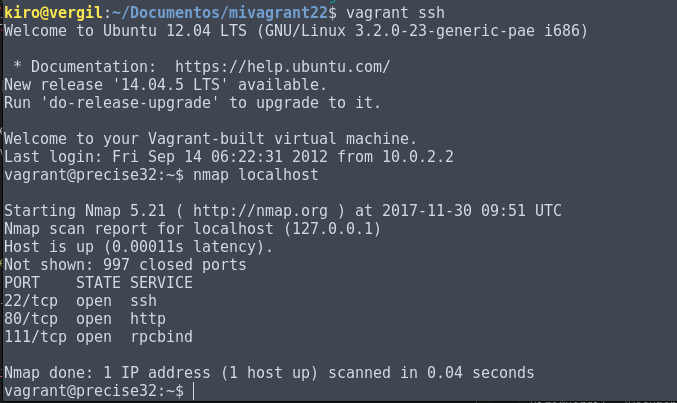

Tenemos otra opción para no destruir siempre la máquina virtual.

- Con el comando `vagrant reload` y el `vagrant provision`

En este caso recarga la configuración cambiada en el fichero `Vagrantfile` y ejecuta la provision.

## 6. Nuestra Caja Personalizada

Vamos a crear una máquina virtual con el `virtualbox` y vamos a personalizarla y luego crearemos la caja o box.

### 6.1 Preparar la MV VirtualBox

Tenemos que crear un usuario llamado `vagrant` y contraseña `vagrant`

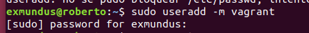

- Tenemos el usuario creado `vagrant`

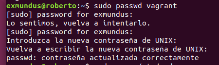

- Establecemos la contraseña a `vagrant`

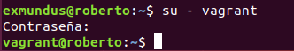

- Creamos la carpeta .ssh

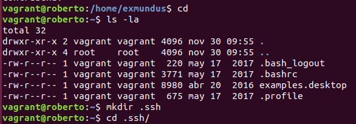

- Descargamos la clave publica para vagrant.

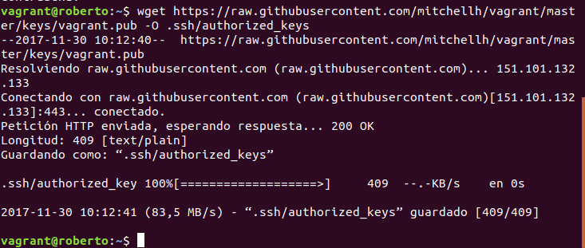

- Establecemos los siguientes permisos.


- Vamos al fichero `/etc/sudoers` para establecer a vagrant como superusuario.

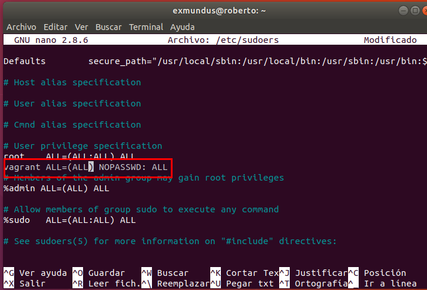

- Comprobamos si tenemos instalado las `guestadditions`

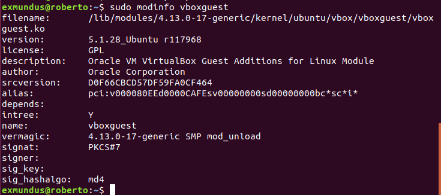

### 6.2 Crear la caja vagrant

Ya tenemos preparado la maguina virtual de ubuntu.

- Vamos a crear una nueva carpeta mivagrant22conmicaja, para este nuevo proyecto vagrant

```console

kiro@vergil:~/media/kiro/HDD KiRo$ mkdir mivagrant22conmicaja
kiro@vergil:~/media/kiro/HDD KiRo/mivagrant22conmicaja$ cd mivagrant22conmicaja/
kiro@vergil:~/media/kiro/HDD KiRo/mivagrant22conmicaja$
```
- Ejecutamos vagrant init para crear el fichero de configuración nuevo.

```console

kiro@vergil:/media/kiro/HDD KiRo/mivagrant22conmicaja$ vagrant init
A `Vagrantfile` has been placed in this directory. You are now
ready to `vagrant up` your first virtual environment! Please read
the comments in the Vagrantfile as well as documentation on
`vagrantup.com` for more information on using Vagrant.

```
- Localizar el nombre de nuestra máquina VirtualBox
    - `VBoxManage list vms`

```console
kiro@vergil:~/media/kiro/HDD KiRo/mivagrant22conmicaja$ VBoxManage list vms
"Kali Linux 2017.1" {3a171049-7777-42b3-8e96-5396397e5a15}
"Windows Server 2016" {eb087674-4c7e-41ab-b177-04c2515b127b}
"Windows 10" {7346d45a-3045-4419-b113-eea70988cbab}
"imw" {826d0764-c18d-49d7-80b5-46e238240c1d}
"Windows 7 Cliente" {f0ed8892-c098-48ee-89aa-c4424df23879}
"MSEdge - Win10_preview" {913f3757-a838-476a-a555-66287575dcb1}
"Server Windows 2012" {80d59eab-6e39-4590-999f-95e3d674c599}
"Windows 10 Cliente" {7bd592b5-16e4-4121-9911-46c96e28a819}
"Ubuntu Server" {f6dcd79f-ac1d-473d-9fde-c13561f8a42d}
"Ubuntu Cliente" {92660525-9513-45b6-860a-808e1e466a23}
"Win10Seguridad" {0f4a051f-9507-4c2e-8d00-01f4f92a0088}
"IE11 - Win7-Seguridad" {02865c52-bc3b-4932-af7d-92edf5e39ae8}
"Windows 7 Servidor" {199f6e92-a089-4373-8f11-012c3c3f9d63}
"OpenSuse42.2-Server" {188f0919-d09b-4bdd-8e85-48c9630369f3}
"Windows 7-server" {2d92703f-8f4e-48e3-82b3-4144dacdd644}
"Windows 7-Cliente" {2e4fa4ec-a918-479a-9bd7-3319288c1f29}
"OpenSuse42.2-cliente" {b466dc1a-e4b6-4d57-ae88-1fa27f3bad14}
"Ubuntu Server ADE" {e10ce868-2ee3-48d4-9ca7-db696f2c23eb}
"Ubuntu Cliente ade" {7bc6e059-9f65-4191-ac22-187634bfe7d4}
"Windows Server 2012 SQL 2014 Express" {5d102788-7b96-4db2-a132-ba711584c7e4}
"Server Windows 2012 (2)" {2abffb44-2ebd-46cf-91aa-0c45c9db643c}
"Server Windows 2012 RDP" {e0c5b11e-9465-4862-9d3c-905a221ac5c9}
"Ubuntu 17.10" {b206912e-d55a-4fd8-bfe3-380a11d86102}
"ipcop" {35c4b84f-e3b8-49cd-8348-a1c11bf246f2}
"Ubuntu Server DNS2-Slave" {dcb2e8a8-9a9e-4d2a-b619-71ac4a2e2897}
"OpenSuse42.2Client" {c18116a7-a53e-4671-bfec-bdb85ab41cb0}
"Kali Linux 2017.3" {fd32dd94-4998-4015-9825-9a67756787cf}
"Kali-Linux-2017.3-vbox-amd64" {2b73a01b-c84f-4ef2-a076-1f5491b59454}
"mivagrant22_default_1512035110766_25729" {d369f9bb-be84-4e2a-a1a6-741908f91310}
````

Seleccionamos la de ubuntu 17.10

```console
kiro@vergil:/media/kiro/HDD KiRo/mivagrant22conmicaja$ vagrant package --base "Ubuntu 17.10"
```

Al ejecutar ese comando, comienza a crear la caja  y solo tenemos que esperar.

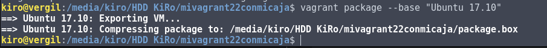

Vemos si tenemos creado la caja


Comprobamos si tenemos agregado las cajas.


