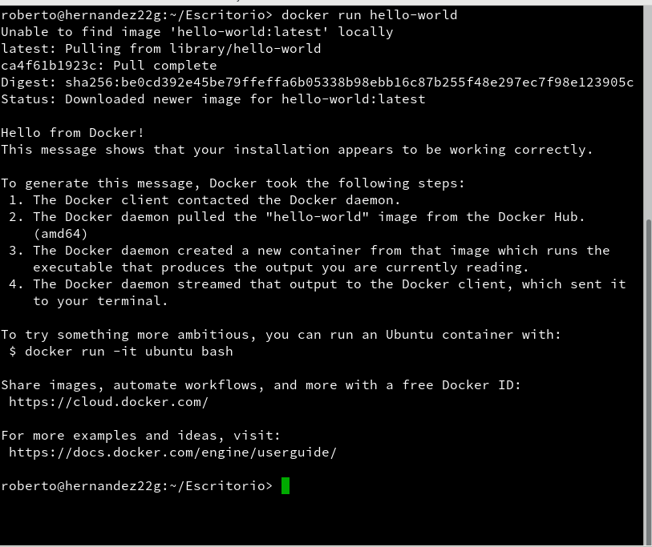
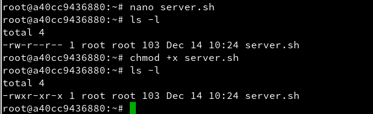
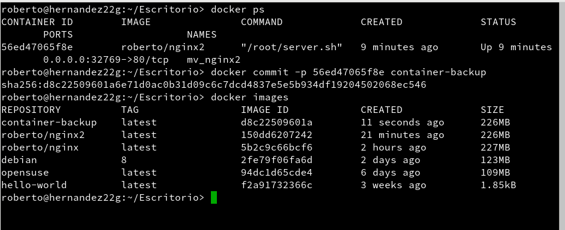

# Docker


## 1. Introducción

Es muy común que nos encontremos desarrollando una aplicación y llegue el momento que decidamos tomar todos sus archivos y migrarlos ya sea al ambiente de producción, de prueba o simplemente probar su comportamiento en diferentes plataformas y servicios. Para situaciones de este estilo existen herramientas que, entre otras cosas, nos facilitan el embalaje y despliegue de la aplicación, es aquí donde entra en juego Docker.

Esta herramienta nos permite crear lo que ellos denominan contenedores, lo cual son aplicaciones empaquetadas auto-suficientes, muy livianas que son capaces de funcionar en prácticamente cualquier ambiente, ya que tiene su propio sistema de archivos, librerías, terminal, etc.
Docker es una tecnología contenedor de aplicaciones construida sobre LXC.

## 2. Requisitos

Tenemos que mirar si nuestra versión del Kernel 3.10 o superior `(uname -a)` para poder realizar la práctica de Docker.


## 3. . Instalación y primeras pruebas

    Enlaces de interés Docker installation on SUSE
    Ejecutar como superusuario:
```console
zypper in docker              # Instala docker
systemctl start docker        # Inicia el servicio
                              # "docker daemon" hace el mismo efecto
docker version                # Debe mostrar información del cliente y del servidor
usermod -a -G docker USERNAME # Añade permisos a nuestro usuario
```

- Primero instalamos el docker

```console
roberto@hernandez22g:~/Escritorio> sudo zypper in docker
Cargando datos del repositorio...
Leyendo los paquetes instalados...
Resolviendo dependencias de paquete...

Los siguientes 14 paquetes NUEVOS van a ser instalados:
  bridge-utils containerd criu docker docker-bash-completion docker-libnetwork
  docker-zsh-completion git-core git-gui gitk perl-Error python-ipaddr
  python-protobuf runc

Se seleccionó automáticamente el siguiente paquete recomendado:
  criu

14 nuevos paquetes a instalar.
Tamaño total de descarga: 19,1 MiB. Ya en caché: 0 B. Después de la operación,
se utilizarán 89,8 MiB adicionales.
¿Desea continuar? [s/n/? mostrar todas las opciones] (s): s
Recuperando paquete perl-Error-0.17021-4.1.noarch
                                    (1/14),  28,3 KiB ( 49,8 KiB desempaquetado)
Recuperando: perl-Error-0.17021-4.1.noarch.rpm ......................[terminado]
Recuperando paquete bridge-utils-1.5-22.3.x86_64
                                    (2/14),  32,0 KiB ( 66,1 KiB desempaquetado)
Recuperando: bridge-utils-1.5-22.3.x86_64.rpm .......................[terminado]
Recuperando paquete python-protobuf-2.6.1-5.20.x86_64
                                    (3/14), 125,3 KiB (708,2 KiB desempaquetado)
Recuperando: python-protobuf-2.6.1-5.20.x86_64.rpm ..................[terminado]
Recuperando paquete docker-libnetwork-0.0.0+git20170119.7b2b1fe-2.1.x86_64
                                    (4/14), 462,8 KiB (  1,5 MiB desempaquetado)
Recuperando: docker-libnetwork-0.0.0+git20170119.7b2b1fe-[terminado (1,2 MiB/s)]
Recuperando paquete python-ipaddr-2.1.11-18.3.1.noarch
                                    (5/14),  31,6 KiB (137,5 KiB desempaquetado)
Recuperando: python-ipaddr-2.1.11-18.3.1.noarch.rpm .................[terminado]
Recuperando paquete runc-0.1.1+gitr2947_9c2d8d1-10.3.2.x86_64
                                    (6/14),   1,3 MiB (  4,8 MiB desempaquetado)
Recuperando: runc-0.1.1+gitr2947_9c2d8d1-10.3.2.x86_64.rp[terminado (2,4 MiB/s)]
Recuperando paquete git-core-2.12.3-5.14.1.x86_64
                                    (7/14),   4,4 MiB ( 29,5 MiB desempaquetado)
Recuperando: git-core-2.12.3-5.14.1.x86_64.rpm ..........[terminado (2,9 MiB/s)]
Recuperando paquete containerd-0.2.5+gitr639_422e31c-10.3.1.x86_64
                                    (8/14),   2,0 MiB (  8,4 MiB desempaquetado)
Recuperando: containerd-0.2.5+gitr639_422e31c-10.3.1.x86_64.rpm .....[terminado]
Recuperando paquete gitk-2.12.3-5.14.1.x86_64
                                    (9/14), 240,2 KiB (768,3 KiB desempaquetado)
Recuperando: gitk-2.12.3-5.14.1.x86_64.rpm ............[terminado (318,1 KiB/s)]
Recuperando paquete git-gui-2.12.3-5.14.1.x86_64
                                   (10/14), 301,3 KiB (  1,2 MiB desempaquetado)
Recuperando: git-gui-2.12.3-5.14.1.x86_64.rpm .......................[terminado]
Recuperando paquete docker-17.04.0_ce-30.6.9.x86_64
                                   (11/14),   9,5 MiB ( 40,6 MiB desempaquetado)
Recuperando: docker-17.04.0_ce-30.6.9.x86_64.rpm ........[terminado (3,2 MiB/s)]
Recuperando paquete docker-zsh-completion-17.04.0_ce-30.6.9.noarch
                                   (12/14), 139,0 KiB (118,0 KiB desempaquetado)
Recuperando: docker-zsh-completion-17.04.0_ce-30.6.9.noarch.rpm .....[terminado]
Recuperando paquete docker-bash-completion-17.04.0_ce-30.6.9.noarch
                                   (13/14), 136,2 KiB ( 88,2 KiB desempaquetado)
Recuperando: docker-bash-completion-17.04.0_ce-30.6.9.noarch.rpm ....[terminado]
Recuperando paquete criu-2.6-1.1.x86_64
                                   (14/14), 458,0 KiB (  1,8 MiB desempaquetado)
Recuperando: criu-2.6-1.1.x86_64.rpm ................................[terminado]
Buscando conflictos de archivos: ....................................[terminado]
( 1/14) Instalando: perl-Error-0.17021-4.1.noarch ...................[terminado]
( 2/14) Instalando: bridge-utils-1.5-22.3.x86_64 ....................[terminado]
( 3/14) Instalando: python-protobuf-2.6.1-5.20.x86_64 ...............[terminado]
( 4/14) Instalando: docker-libnetwork-0.0.0+git20170119.7b2b1fe-2.1.x[terminado]
( 5/14) Instalando: python-ipaddr-2.1.11-18.3.1.noarch ..............[terminado]
( 6/14) Instalando: runc-0.1.1+gitr2947_9c2d8d1-10.3.2.x86_64 .......[terminado]
( 7/14) Instalando: git-core-2.12.3-5.14.1.x86_64 ...................[terminado]
( 8/14) Instalando: containerd-0.2.5+gitr639_422e31c-10.3.1.x86_64 ..[terminado]
Salida de rpm adicional:
Updating /etc/sysconfig/containerd...


( 9/14) Instalando: gitk-2.12.3-5.14.1.x86_64 .......................[terminado]
(10/14) Instalando: git-gui-2.12.3-5.14.1.x86_64 ....................[terminado]
(11/14) Instalando: docker-17.04.0_ce-30.6.9.x86_64 .................[terminado]
Salida de rpm adicional:
Updating /etc/sysconfig/docker...


(12/14) Instalando: docker-zsh-completion-17.04.0_ce-30.6.9.noarch ..[terminado]
(13/14) Instalando: docker-bash-completion-17.04.0_ce-30.6.9.noarch .[terminado]
(14/14) Instalando: criu-2.6-1.1.x86_64 .............................[terminado]
roberto@hernandez22g:~/Escritorio>

```
- Tenemos que iniciar el servicio de docker y comprobar que funciona bien.

```console
roberto@hernandez22g:~/Escritorio> sudo systemctl start docker
roberto@hernandez22g:~/Escritorio> sudo systemctl status docker
● docker.service - Docker Application Container Engine
   Loaded: loaded (/usr/lib/systemd/system/docker.service; disabled; vendor preset: disabled)
   Active: active (running) since jue 2017-12-14 09:38:46 WET; 56s ago
     Docs: http://docs.docker.com
  Process: 3690 ExecStartPost=/usr/lib/docker/docker_service_helper.sh wait (code=exited, status=0/SUCCESS)
 Main PID: 3689 (dockerd)
    Tasks: 8
   Memory: 13.2M
      CPU: 185ms
   CGroup: /system.slice/docker.service
           └─3689 /usr/bin/dockerd --containerd /run/containerd/containerd.so...

dic 14 09:38:46 hernandez22g dockerd[3689]: time="2017-12-14T09:38:46.619595..."
dic 14 09:38:46 hernandez22g dockerd[3689]: time="2017-12-14T09:38:46.761872..."
dic 14 09:38:46 hernandez22g dockerd[3689]: time="2017-12-14T09:38:46.800042..."
dic 14 09:38:46 hernandez22g dockerd[3689]: time="2017-12-14T09:38:46.804656..."
dic 14 09:38:46 hernandez22g dockerd[3689]: time="2017-12-14T09:38:46.805109..."
dic 14 09:38:46 hernandez22g dockerd[3689]: time="2017-12-14T09:38:46.805498..."
dic 14 09:38:46 hernandez22g dockerd[3689]: time="2017-12-14T09:38:46.805701...e
dic 14 09:38:46 hernandez22g dockerd[3689]: time="2017-12-14T09:38:46.811161..."
dic 14 09:38:46 hernandez22g docker_service_helper.sh[3690]: Docker is alive
dic 14 09:38:46 hernandez22g systemd[1]: Started Docker Application Containe....
Hint: Some lines were ellipsized, use -l to show in full.
roberto@hernandez22g:~/Escritorio>
```
- Comprobamos la versión de docker

 

- Añadimos al grupo de docker el usuario roberto.


- Tenemos que reiniciar nuestro sistema operativo y comprobamos los siguientes comando para ver si todo funciona correctamente.

```console
docker images           # Muestra las imágenes descargadas hasta ahora
docker ps -a            # Muestra todos los contenedores creados
docker run hello-world  # Descarga y ejecuta un contenedor con la imagen hello-world
docker images
docker ps -a
```
- Comprobamos si tenemos imágenes descargadas.


- Descargamos una imagen de prueba llamada `hello-world`



- Comprobamos y tenemos la imagen descargada.


## 4. Configuración de la red

Habilitar el acceso a la red externa a los contenedores

Si queremos que nuestro contenedor tenga acceso a la red exterior, debemos activar la opción IP_FORWARD (net.ipv4.ip_forward). Lo podemos hacer en YAST.

¿Recuerdas lo que implica forwarding en los dispositivos de red?

- Para openSUSE42.2 (cuando el método de configuracion de red es Wicked). Yast -> Ajustes de red -> Encaminamiento -> Habilitar reenvío IPv4


Reiniciar el equipo para que se apliquen los cambios.

### 4.1 Más Comandos

Información sobre otros comandos útiles:

- `docker start CONTAINERID`, inicia un contenedor que estaba parado.
- `docker attach CONTAINERID`, conecta el terminal actual con el interior de contenedor.
- `docker rm CONTAINERID`, eliminar un contenedor.
- `docker rmi IMAGENAME`, eliminar una imagen.Información sobre otros comandos útiles:

## 5. Crear un contenedor manualmente

Nuestro SO base es OpenSUSE, pero vamos a crear un contenedor Debian8, y dentro instalaremos Nginx.

### 5.1 Crear una imagen

Vamos a crear una imagen de debian.

```console
docker images          # Vemos las imágenes disponibles localmente
docker search debian   # Buscamos en los repositorios de Docker Hub
                       # contenedores con la etiqueta `debian`
docker pull debian:8   # Descargamos contenedor `debian:8` en local
docker pull opensuse
docker images
docker ps -a           # Vemos todos los contenedores
docker ps              # Vemos sólo los contenedores en ejecución
```

Comenzamos con ver las imagenes que tenemos disponibles en modo local y buscamos en los repositios de Docker Hub.

```console
roberto@hernandez22g:~/Escritorio> docker images
REPOSITORY          TAG                 IMAGE ID            CREATED             SIZE
hello-world         latest              f2a91732366c        3 weeks ago         1.85kB
roberto@hernandez22g:~/Escritorio> docker search debian
NAME                                DESCRIPTION                                     STARS     OFFICIAL   AUTOMATED
ubuntu                              Ubuntu is a Debian-based Linux operating s...   6948      [OK]       
debian                              Debian is a Linux distribution that's comp...   2365      [OK]       
google/debian                                                                       52                   [OK]
neurodebian                         NeuroDebian provides neuroscience research...   40        [OK]       
armhf/debian                        Debian is a Linux distribution that's comp...   29                   
arm32v7/debian                      Debian is a Linux distribution that's comp...   23                   
itscaro/debian-ssh                  debian:jessie                                   20                   [OK]
samueldebruyn/debian-git            a minimal docker container with debian and...   16                   [OK]
resin/armv7hf-debian                Debian is a Linux distro composed entirely...   15                   
arm64v8/debian                      Debian is a Linux distribution that's comp...   8                    
eboraas/debian                      Debian base images, for all currently-avai...   8                    [OK]
i386/debian                         Debian is a Linux distribution that's comp...   7                    
rockyluke/debian                    Docker images of Debian.                        4                    
vergissberlin/debian-development    Docker debian image to use for development...   3                    [OK]
vicamo/debian                       Debian docker images for all versions/arch...   3                    
ppc64le/debian                      Debian is a Linux distribution that's comp...   2                    
vpgrp/debian                        Docker images of Debian.                        1                    
s390x/debian                        Debian is a Linux distribution that's comp...   1                    
dockershelf/debian                  Repository for docker images of Debian. Te...   1                    [OK]
smartentry/debian                   debian with smartentry                          1                    [OK]
jdub/debian-sources-resource        Concourse CI resource to check for updated...   0                    [OK]
trollin/debian                                                                      0                    
casept/debian-amd64                 A debian image built from scratch. Mostly ...   0                    
igneoussystems/base-debian-client   Base image for debian clients                   0                    
konstruktoid/debian                 Debian base image                               0                    [OK]
roberto@hernandez22g:~/Escritorio>
```
Comenzamos con la descargar de `debian8` y `opensuse`


Comprobamos los contenedores.


- Vamos a crear un contenedor con nombre mv_debian a partir de la imagen debian:8, y ejecutaremos /bin/bash:

docker run --name=mv_debian -i -t debian:8 /bin/bash

```console

(Estamos dentro del contenedor)
root@IDContenedor:/# cat /etc/motd            # Comprobamos que estamos en Debian
root@IDContenedor:/# apt-get update
root@IDContenedor:/# apt-get install -y nginx # Instalamos nginx en el contenedor
root@IDContenedor:/# apt-get install -y vim   # Instalamos editor vi en el contenedor
root@IDContenedor:/# /usr/sbin/nginx          # Iniciamos el servicio nginx
root@IDContenedor:/# ps -ef
```

- Primero comprobamos que accedemos al contenedor y que sea debian y un update.


- Instalamos en el contenedor debian el `nginx`

```console
root@a40cc9436880:/# apt-get install -y nginx
Reading package lists... Done
Building dependency tree       
Reading state information... Done
The following extra packages will be installed:
  fontconfig-config fonts-dejavu-core geoip-database init-system-helpers
  libalgorithm-c3-perl libarchive-extract-perl libcgi-fast-perl libcgi-pm-perl
  libclass-c3-perl libclass-c3-xs-perl libcpan-meta-perl libdata-optlist-perl
  libdata-section-perl libexpat1 libfcgi-perl libfontconfig1 libfreetype6 libgd3 libgdbm3
  libgeoip1 libjbig0 libjpeg62-turbo liblog-message-perl liblog-message-simple-perl
  libmodule-build-perl libmodule-pluggable-perl libmodule-signature-perl libmro-compat-perl
  libpackage-constants-perl libparams-util-perl libpng12-0 libpod-latex-perl
  libpod-readme-perl libregexp-common-perl libsoftware-license-perl libssl1.0.0
  libsub-exporter-perl libsub-install-perl libterm-ui-perl libtext-soundex-perl
  libtext-template-perl libtiff5 libvpx1 libx11-6 libx11-data libxau6 libxcb1 libxdmcp6
  libxml2 libxpm4 libxslt1.1 nginx-common nginx-full perl perl-modules rename sgml-base ucf
  xml-core
Suggested packages:
  libgd-tools geoip-bin fcgiwrap nginx-doc ssl-cert perl-doc libterm-readline-gnu-perl
  libterm-readline-perl-perl make libb-lint-perl libcpanplus-dist-build-perl
  libcpanplus-perl libfile-checktree-perl libobject-accessor-perl sgml-base-doc debhelper
Recommended packages:
  libarchive-tar-perl
The following NEW packages will be installed:
  fontconfig-config fonts-dejavu-core geoip-database init-system-helpers
  libalgorithm-c3-perl libarchive-extract-perl libcgi-fast-perl libcgi-pm-perl
  libclass-c3-perl libclass-c3-xs-perl libcpan-meta-perl libdata-optlist-perl
  libdata-section-perl libexpat1 libfcgi-perl libfontconfig1 libfreetype6 libgd3 libgdbm3
  libgeoip1 libjbig0 libjpeg62-turbo liblog-message-perl liblog-message-simple-perl
  libmodule-build-perl libmodule-pluggable-perl libmodule-signature-perl libmro-compat-perl
  libpackage-constants-perl libparams-util-perl libpng12-0 libpod-latex-perl
  libpod-readme-perl libregexp-common-perl libsoftware-license-perl libssl1.0.0
  libsub-exporter-perl libsub-install-perl libterm-ui-perl libtext-soundex-perl
  libtext-template-perl libtiff5 libvpx1 libx11-6 libx11-data libxau6 libxcb1 libxdmcp6
  libxml2 libxpm4 libxslt1.1 nginx nginx-common nginx-full perl perl-modules rename
  sgml-base ucf xml-core
0 upgraded, 60 newly installed, 0 to remove and 0 not upgraded.
Need to get 15.5 MB of archives.
After this operation, 62.6 MB of additional disk space will be used.
Get:1 http://deb.debian.org/debian/ jessie/main libgdbm3 amd64 1.8.3-13.1 [30.0 kB]
Get:2 http://deb.debian.org/debian/ jessie/main libssl1.0.0 amd64 1.0.1t-1+deb8u7 [1046 kB]
Get:3 http://deb.debian.org/debian/ jessie/main libxml2 amd64 2.9.1+dfsg1-5+deb8u5 [803 kB]
Get:4 http://deb.debian.org/debian/ jessie/main perl-modules all 5.20.2-3+deb8u9 [2553 kB]
Get:5 http://deb.debian.org/debian/ jessie/main perl amd64 5.20.2-3+deb8u9 [2641 kB]
Get:6 http://deb.debian.org/debian/ jessie/main libexpat1 amd64 2.1.0-6+deb8u4 [80.2 kB]
Get:7 http://deb.debian.org/debian/ jessie/main libpng12-0 amd64 1.2.50-2+deb8u3 [173 kB]
Get:8 http://deb.debian.org/debian/ jessie/main libfreetype6 amd64 2.5.2-3+deb8u2 [466 kB]
Get:9 http://deb.debian.org/debian/ jessie/main ucf all 3.0030 [69.7 kB]
Get:10 http://deb.debian.org/debian/ jessie/main fonts-dejavu-core all 2.34-1 [1047 kB]
Get:11 http://deb.debian.org/debian/ jessie/main fontconfig-config all 2.11.0-6.3+deb8u1 [274 kB]
Get:12 http://deb.debian.org/debian/ jessie/main libfontconfig1 amd64 2.11.0-6.3+deb8u1 [329 kB]
Get:13 http://deb.debian.org/debian/ jessie/main libjpeg62-turbo amd64 1:1.3.1-12 [116 kB]
Get:14 http://deb.debian.org/debian/ jessie/main libjbig0 amd64 2.1-3.1 [30.7 kB]
Get:15 http://deb.debian.org/debian/ jessie/main libtiff5 amd64 4.0.3-12.3+deb8u4 [221 kB]
Get:16 http://deb.debian.org/debian/ jessie/main libvpx1 amd64 1.3.0-3 [599 kB]
Get:17 http://deb.debian.org/debian/ jessie/main libxau6 amd64 1:1.0.8-1 [20.7 kB]
Get:18 http://deb.debian.org/debian/ jessie/main libxdmcp6 amd64 1:1.1.1-1+b1 [24.9 kB]
Get:19 http://deb.debian.org/debian/ jessie/main libxcb1 amd64 1.10-3+b1 [44.4 kB]
Get:20 http://deb.debian.org/debian/ jessie/main libx11-data all 2:1.6.2-3+deb8u1 [126 kB]
Get:21 http://deb.debian.org/debian/ jessie/main libx11-6 amd64 2:1.6.2-3+deb8u1 [728 kB]
Get:22 http://deb.debian.org/debian/ jessie/main libxpm4 amd64 1:3.5.12-0+deb8u1 [49.2 kB]
Get:23 http://deb.debian.org/debian/ jessie/main libgd3 amd64 2.1.0-5+deb8u11 [148 kB]
Get:24 http://deb.debian.org/debian/ jessie/main libgeoip1 amd64 1.6.2-4 [90.8 kB]
Get:25 http://deb.debian.org/debian/ jessie/main libxslt1.1 amd64 1.1.28-2+deb8u3 [232 kB]
Get:26 http://deb.debian.org/debian/ jessie/main sgml-base all 1.26+nmu4 [14.6 kB]
Get:27 http://deb.debian.org/debian/ jessie/main init-system-helpers all 1.22 [14.0 kB]
Get:28 http://deb.debian.org/debian/ jessie/main geoip-database all 20150317-1 [1517 kB]
Get:29 http://deb.debian.org/debian/ jessie/main libalgorithm-c3-perl all 0.09-1 [11.9 kB]
Get:30 http://deb.debian.org/debian/ jessie/main libarchive-extract-perl all 0.72-1 [24.8 kB]
Get:31 http://deb.debian.org/debian/ jessie/main libcgi-pm-perl all 4.09-1 [213 kB]
Get:32 http://deb.debian.org/debian/ jessie/main libfcgi-perl amd64 0.77-1+deb8u1 [39.0 kB]
Get:33 http://deb.debian.org/debian/ jessie/main libcgi-fast-perl all 1:2.04-1 [10.9 kB]
Get:34 http://deb.debian.org/debian/ jessie/main libclass-c3-perl all 0.26-1 [22.9 kB]
Get:35 http://deb.debian.org/debian/ jessie/main libclass-c3-xs-perl amd64 0.13-2+b1 [15.2 kB]
Get:36 http://deb.debian.org/debian/ jessie/main libcpan-meta-perl all 2.142690-1 [125 kB]
Get:37 http://deb.debian.org/debian/ jessie/main libparams-util-perl amd64 1.07-2+b1 [23.5 kB]
Get:38 http://deb.debian.org/debian/ jessie/main libsub-install-perl all 0.928-1 [11.4 kB]
Get:39 http://deb.debian.org/debian/ jessie/main libdata-optlist-perl all 0.109-1 [10.6 kB]
Get:40 http://deb.debian.org/debian/ jessie/main libmro-compat-perl all 0.12-1 [13.2 kB]
Get:41 http://deb.debian.org/debian/ jessie/main libsub-exporter-perl all 0.986-1 [49.9 kB]
Get:42 http://deb.debian.org/debian/ jessie/main libdata-section-perl all 0.200006-1 [13.4 kB]
Get:43 http://deb.debian.org/debian/ jessie/main liblog-message-perl all 0.8-1 [26.0 kB]
Get:44 http://deb.debian.org/debian/ jessie/main liblog-message-simple-perl all 0.10-2 [8126 B]
Get:45 http://deb.debian.org/debian/ jessie/main libmodule-build-perl all 0.421000-2+deb8u1 [265 kB]
Get:46 http://deb.debian.org/debian/ jessie/main libmodule-pluggable-perl all 5.1-1 [25.0 kB]
Get:47 http://deb.debian.org/debian/ jessie/main libmodule-signature-perl all 0.73-1+deb8u2 [30.4 kB]
Get:48 http://deb.debian.org/debian/ jessie/main libpackage-constants-perl all 0.04-1 [5820 B]
Get:49 http://deb.debian.org/debian/ jessie/main libpod-latex-perl all 0.61-1 [34.7 kB]
Get:50 http://deb.debian.org/debian/ jessie/main libregexp-common-perl all 2013031301-1 [173 kB]
Get:51 http://deb.debian.org/debian/ jessie/main libpod-readme-perl all 0.11-1 [15.3 kB]
Get:52 http://deb.debian.org/debian/ jessie/main libtext-template-perl all 1.46-1 [53.1 kB]
Get:53 http://deb.debian.org/debian/ jessie/main libsoftware-license-perl all 0.103010-3 [119 kB]
Get:54 http://deb.debian.org/debian/ jessie/main libterm-ui-perl all 0.42-1 [19.1 kB]
Get:55 http://deb.debian.org/debian/ jessie/main libtext-soundex-perl amd64 3.4-1+b2 [13.7 kB]
Get:56 http://deb.debian.org/debian/ jessie/main nginx-common all 1.6.2-5+deb8u5 [88.0 kB]
Get:57 http://deb.debian.org/debian/ jessie/main nginx-full amd64 1.6.2-5+deb8u5 [430 kB]
Get:58 http://deb.debian.org/debian/ jessie/main nginx all 1.6.2-5+deb8u5 [72.6 kB]
Get:59 http://deb.debian.org/debian/ jessie/main rename all 0.20-3 [12.4 kB]
Get:60 http://deb.debian.org/debian/ jessie/main xml-core all 0.13+nmu2 [24.2 kB]
Fetched 15.5 MB in 4s (3482 kB/s)
debconf: delaying package configuration, since apt-utils is not installed
Selecting previously unselected package libgdbm3:amd64.
(Reading database ... 7561 files and directories currently installed.)
Preparing to unpack .../libgdbm3_1.8.3-13.1_amd64.deb ...
Unpacking libgdbm3:amd64 (1.8.3-13.1) ...
Selecting previously unselected package libssl1.0.0:amd64.
Preparing to unpack .../libssl1.0.0_1.0.1t-1+deb8u7_amd64.deb ...
Unpacking libssl1.0.0:amd64 (1.0.1t-1+deb8u7) ...
Selecting previously unselected package libxml2:amd64.
Preparing to unpack .../libxml2_2.9.1+dfsg1-5+deb8u5_amd64.deb ...
Unpacking libxml2:amd64 (2.9.1+dfsg1-5+deb8u5) ...
Selecting previously unselected package perl-modules.
Preparing to unpack .../perl-modules_5.20.2-3+deb8u9_all.deb ...
Unpacking perl-modules (5.20.2-3+deb8u9) ...
Selecting previously unselected package perl.
Preparing to unpack .../perl_5.20.2-3+deb8u9_amd64.deb ...
Unpacking perl (5.20.2-3+deb8u9) ...
Selecting previously unselected package libexpat1:amd64.
Preparing to unpack .../libexpat1_2.1.0-6+deb8u4_amd64.deb ...
Unpacking libexpat1:amd64 (2.1.0-6+deb8u4) ...
Selecting previously unselected package libpng12-0:amd64.
Preparing to unpack .../libpng12-0_1.2.50-2+deb8u3_amd64.deb ...
Unpacking libpng12-0:amd64 (1.2.50-2+deb8u3) ...
Selecting previously unselected package libfreetype6:amd64.
Preparing to unpack .../libfreetype6_2.5.2-3+deb8u2_amd64.deb ...
Unpacking libfreetype6:amd64 (2.5.2-3+deb8u2) ...
Selecting previously unselected package ucf.
Preparing to unpack .../archives/ucf_3.0030_all.deb ...
Moving old data out of the way
Unpacking ucf (3.0030) ...
Selecting previously unselected package fonts-dejavu-core.
Preparing to unpack .../fonts-dejavu-core_2.34-1_all.deb ...
Unpacking fonts-dejavu-core (2.34-1) ...
Selecting previously unselected package fontconfig-config.
Preparing to unpack .../fontconfig-config_2.11.0-6.3+deb8u1_all.deb ...
Unpacking fontconfig-config (2.11.0-6.3+deb8u1) ...
Selecting previously unselected package libfontconfig1:amd64.
Preparing to unpack .../libfontconfig1_2.11.0-6.3+deb8u1_amd64.deb ...
Unpacking libfontconfig1:amd64 (2.11.0-6.3+deb8u1) ...
Selecting previously unselected package libjpeg62-turbo:amd64.
Preparing to unpack .../libjpeg62-turbo_1%3a1.3.1-12_amd64.deb ...
Unpacking libjpeg62-turbo:amd64 (1:1.3.1-12) ...
Selecting previously unselected package libjbig0:amd64.
Preparing to unpack .../libjbig0_2.1-3.1_amd64.deb ...
Unpacking libjbig0:amd64 (2.1-3.1) ...
Selecting previously unselected package libtiff5:amd64.
Preparing to unpack .../libtiff5_4.0.3-12.3+deb8u4_amd64.deb ...
Unpacking libtiff5:amd64 (4.0.3-12.3+deb8u4) ...
Selecting previously unselected package libvpx1:amd64.
Preparing to unpack .../libvpx1_1.3.0-3_amd64.deb ...
Unpacking libvpx1:amd64 (1.3.0-3) ...
Selecting previously unselected package libxau6:amd64.
Preparing to unpack .../libxau6_1%3a1.0.8-1_amd64.deb ...
Unpacking libxau6:amd64 (1:1.0.8-1) ...
Selecting previously unselected package libxdmcp6:amd64.
Preparing to unpack .../libxdmcp6_1%3a1.1.1-1+b1_amd64.deb ...
Unpacking libxdmcp6:amd64 (1:1.1.1-1+b1) ...
Selecting previously unselected package libxcb1:amd64.
Preparing to unpack .../libxcb1_1.10-3+b1_amd64.deb ...
Unpacking libxcb1:amd64 (1.10-3+b1) ...
Selecting previously unselected package libx11-data.
Preparing to unpack .../libx11-data_2%3a1.6.2-3+deb8u1_all.deb ...
Unpacking libx11-data (2:1.6.2-3+deb8u1) ...
Selecting previously unselected package libx11-6:amd64.
Preparing to unpack .../libx11-6_2%3a1.6.2-3+deb8u1_amd64.deb ...
Unpacking libx11-6:amd64 (2:1.6.2-3+deb8u1) ...
Selecting previously unselected package libxpm4:amd64.
Preparing to unpack .../libxpm4_1%3a3.5.12-0+deb8u1_amd64.deb ...
Unpacking libxpm4:amd64 (1:3.5.12-0+deb8u1) ...
Selecting previously unselected package libgd3:amd64.
Preparing to unpack .../libgd3_2.1.0-5+deb8u11_amd64.deb ...
Unpacking libgd3:amd64 (2.1.0-5+deb8u11) ...
Selecting previously unselected package libgeoip1:amd64.
Preparing to unpack .../libgeoip1_1.6.2-4_amd64.deb ...
Unpacking libgeoip1:amd64 (1.6.2-4) ...
Selecting previously unselected package libxslt1.1:amd64.
Preparing to unpack .../libxslt1.1_1.1.28-2+deb8u3_amd64.deb ...
Unpacking libxslt1.1:amd64 (1.1.28-2+deb8u3) ...
Selecting previously unselected package sgml-base.
Preparing to unpack .../sgml-base_1.26+nmu4_all.deb ...
Unpacking sgml-base (1.26+nmu4) ...
Selecting previously unselected package init-system-helpers.
Preparing to unpack .../init-system-helpers_1.22_all.deb ...
Unpacking init-system-helpers (1.22) ...
Selecting previously unselected package geoip-database.
Preparing to unpack .../geoip-database_20150317-1_all.deb ...
Unpacking geoip-database (20150317-1) ...
Selecting previously unselected package libalgorithm-c3-perl.
Preparing to unpack .../libalgorithm-c3-perl_0.09-1_all.deb ...
Unpacking libalgorithm-c3-perl (0.09-1) ...
Selecting previously unselected package libarchive-extract-perl.
Preparing to unpack .../libarchive-extract-perl_0.72-1_all.deb ...
Unpacking libarchive-extract-perl (0.72-1) ...
Selecting previously unselected package libcgi-pm-perl.
Preparing to unpack .../libcgi-pm-perl_4.09-1_all.deb ...
Unpacking libcgi-pm-perl (4.09-1) ...
Selecting previously unselected package libfcgi-perl.
Preparing to unpack .../libfcgi-perl_0.77-1+deb8u1_amd64.deb ...
Unpacking libfcgi-perl (0.77-1+deb8u1) ...
Selecting previously unselected package libcgi-fast-perl.
Preparing to unpack .../libcgi-fast-perl_1%3a2.04-1_all.deb ...
Unpacking libcgi-fast-perl (1:2.04-1) ...
Selecting previously unselected package libclass-c3-perl.
Preparing to unpack .../libclass-c3-perl_0.26-1_all.deb ...
Unpacking libclass-c3-perl (0.26-1) ...
Selecting previously unselected package libclass-c3-xs-perl.
Preparing to unpack .../libclass-c3-xs-perl_0.13-2+b1_amd64.deb ...
Unpacking libclass-c3-xs-perl (0.13-2+b1) ...
Selecting previously unselected package libcpan-meta-perl.
Preparing to unpack .../libcpan-meta-perl_2.142690-1_all.deb ...
Unpacking libcpan-meta-perl (2.142690-1) ...
Selecting previously unselected package libparams-util-perl.
Preparing to unpack .../libparams-util-perl_1.07-2+b1_amd64.deb ...
Unpacking libparams-util-perl (1.07-2+b1) ...
Selecting previously unselected package libsub-install-perl.
Preparing to unpack .../libsub-install-perl_0.928-1_all.deb ...
Unpacking libsub-install-perl (0.928-1) ...
Selecting previously unselected package libdata-optlist-perl.
Preparing to unpack .../libdata-optlist-perl_0.109-1_all.deb ...
Unpacking libdata-optlist-perl (0.109-1) ...
Selecting previously unselected package libmro-compat-perl.
Preparing to unpack .../libmro-compat-perl_0.12-1_all.deb ...
Unpacking libmro-compat-perl (0.12-1) ...
Selecting previously unselected package libsub-exporter-perl.
Preparing to unpack .../libsub-exporter-perl_0.986-1_all.deb ...
Unpacking libsub-exporter-perl (0.986-1) ...
Selecting previously unselected package libdata-section-perl.
Preparing to unpack .../libdata-section-perl_0.200006-1_all.deb ...
Unpacking libdata-section-perl (0.200006-1) ...
Selecting previously unselected package liblog-message-perl.
Preparing to unpack .../liblog-message-perl_0.8-1_all.deb ...
Unpacking liblog-message-perl (0.8-1) ...
Selecting previously unselected package liblog-message-simple-perl.
Preparing to unpack .../liblog-message-simple-perl_0.10-2_all.deb ...
Unpacking liblog-message-simple-perl (0.10-2) ...
Selecting previously unselected package libmodule-build-perl.
Preparing to unpack .../libmodule-build-perl_0.421000-2+deb8u1_all.deb ...
Adding 'diversion of /usr/bin/config_data to /usr/bin/config_data.diverted by libmodule-build-perl'
Adding 'diversion of /usr/share/man/man1/config_data.1.gz to /usr/share/man/man1/config_data.diverted.1.gz by libmodule-build-perl'
Unpacking libmodule-build-perl (0.421000-2+deb8u1) ...
Selecting previously unselected package libmodule-pluggable-perl.
Preparing to unpack .../libmodule-pluggable-perl_5.1-1_all.deb ...
Unpacking libmodule-pluggable-perl (5.1-1) ...
Selecting previously unselected package libmodule-signature-perl.
Preparing to unpack .../libmodule-signature-perl_0.73-1+deb8u2_all.deb ...
Unpacking libmodule-signature-perl (0.73-1+deb8u2) ...
Selecting previously unselected package libpackage-constants-perl.
Preparing to unpack .../libpackage-constants-perl_0.04-1_all.deb ...
Unpacking libpackage-constants-perl (0.04-1) ...
Selecting previously unselected package libpod-latex-perl.
Preparing to unpack .../libpod-latex-perl_0.61-1_all.deb ...
Adding 'diversion of /usr/bin/pod2latex to /usr/bin/pod2latex.bundled by libpod-latex-perl'
Adding 'diversion of /usr/share/man/man1/pod2latex.1.gz to /usr/share/man/man1/pod2latex.bundled.1.gz by libpod-latex-perl'
Unpacking libpod-latex-perl (0.61-1) ...
Selecting previously unselected package libregexp-common-perl.
Preparing to unpack .../libregexp-common-perl_2013031301-1_all.deb ...
Unpacking libregexp-common-perl (2013031301-1) ...
Selecting previously unselected package libpod-readme-perl.
Preparing to unpack .../libpod-readme-perl_0.11-1_all.deb ...
Unpacking libpod-readme-perl (0.11-1) ...
Selecting previously unselected package libtext-template-perl.
Preparing to unpack .../libtext-template-perl_1.46-1_all.deb ...
Unpacking libtext-template-perl (1.46-1) ...
Selecting previously unselected package libsoftware-license-perl.
Preparing to unpack .../libsoftware-license-perl_0.103010-3_all.deb ...
Unpacking libsoftware-license-perl (0.103010-3) ...
Selecting previously unselected package libterm-ui-perl.
Preparing to unpack .../libterm-ui-perl_0.42-1_all.deb ...
Unpacking libterm-ui-perl (0.42-1) ...
Selecting previously unselected package libtext-soundex-perl.
Preparing to unpack .../libtext-soundex-perl_3.4-1+b2_amd64.deb ...
Unpacking libtext-soundex-perl (3.4-1+b2) ...
Selecting previously unselected package nginx-common.
Preparing to unpack .../nginx-common_1.6.2-5+deb8u5_all.deb ...
Unpacking nginx-common (1.6.2-5+deb8u5) ...
Selecting previously unselected package nginx-full.
Preparing to unpack .../nginx-full_1.6.2-5+deb8u5_amd64.deb ...
Unpacking nginx-full (1.6.2-5+deb8u5) ...
Selecting previously unselected package nginx.
Preparing to unpack .../nginx_1.6.2-5+deb8u5_all.deb ...
Unpacking nginx (1.6.2-5+deb8u5) ...
Selecting previously unselected package rename.
Preparing to unpack .../archives/rename_0.20-3_all.deb ...
Unpacking rename (0.20-3) ...
Selecting previously unselected package xml-core.
Preparing to unpack .../xml-core_0.13+nmu2_all.deb ...
Unpacking xml-core (0.13+nmu2) ...
Processing triggers for systemd (215-17+deb8u7) ...
Setting up libgdbm3:amd64 (1.8.3-13.1) ...
Setting up libssl1.0.0:amd64 (1.0.1t-1+deb8u7) ...
debconf: unable to initialize frontend: Dialog
debconf: (No usable dialog-like program is installed, so the dialog based frontend cannot be used. at /usr/share/perl5/Debconf/FrontEnd/Dialog.pm line 76.)
debconf: falling back to frontend: Readline
Setting up libxml2:amd64 (2.9.1+dfsg1-5+deb8u5) ...
Setting up perl-modules (5.20.2-3+deb8u9) ...
Setting up perl (5.20.2-3+deb8u9) ...
update-alternatives: using /usr/bin/prename to provide /usr/bin/rename (rename) in auto mode
Setting up libexpat1:amd64 (2.1.0-6+deb8u4) ...
Setting up libpng12-0:amd64 (1.2.50-2+deb8u3) ...
Setting up libfreetype6:amd64 (2.5.2-3+deb8u2) ...
Setting up ucf (3.0030) ...
debconf: unable to initialize frontend: Dialog
debconf: (No usable dialog-like program is installed, so the dialog based frontend cannot be used. at /usr/share/perl5/Debconf/FrontEnd/Dialog.pm line 76.)
debconf: falling back to frontend: Readline
Setting up fonts-dejavu-core (2.34-1) ...
Setting up fontconfig-config (2.11.0-6.3+deb8u1) ...
debconf: unable to initialize frontend: Dialog
debconf: (No usable dialog-like program is installed, so the dialog based frontend cannot be used. at /usr/share/perl5/Debconf/FrontEnd/Dialog.pm line 76.)
debconf: falling back to frontend: Readline
Setting up libfontconfig1:amd64 (2.11.0-6.3+deb8u1) ...
Setting up libjpeg62-turbo:amd64 (1:1.3.1-12) ...
Setting up libjbig0:amd64 (2.1-3.1) ...
Setting up libtiff5:amd64 (4.0.3-12.3+deb8u4) ...
Setting up libvpx1:amd64 (1.3.0-3) ...
Setting up libxau6:amd64 (1:1.0.8-1) ...
Setting up libxdmcp6:amd64 (1:1.1.1-1+b1) ...
Setting up libxcb1:amd64 (1.10-3+b1) ...
Setting up libx11-data (2:1.6.2-3+deb8u1) ...
Setting up libx11-6:amd64 (2:1.6.2-3+deb8u1) ...
Setting up libxpm4:amd64 (1:3.5.12-0+deb8u1) ...
Setting up libgd3:amd64 (2.1.0-5+deb8u11) ...
Setting up libgeoip1:amd64 (1.6.2-4) ...
Setting up libxslt1.1:amd64 (1.1.28-2+deb8u3) ...
Setting up sgml-base (1.26+nmu4) ...
Setting up init-system-helpers (1.22) ...
Setting up geoip-database (20150317-1) ...
Setting up libalgorithm-c3-perl (0.09-1) ...
Setting up libarchive-extract-perl (0.72-1) ...
Setting up libcgi-pm-perl (4.09-1) ...
Setting up libfcgi-perl (0.77-1+deb8u1) ...
Setting up libcgi-fast-perl (1:2.04-1) ...
Setting up libclass-c3-perl (0.26-1) ...
Setting up libclass-c3-xs-perl (0.13-2+b1) ...
Setting up libcpan-meta-perl (2.142690-1) ...
Setting up libparams-util-perl (1.07-2+b1) ...
Setting up libsub-install-perl (0.928-1) ...
Setting up libdata-optlist-perl (0.109-1) ...
Setting up libmro-compat-perl (0.12-1) ...
Setting up libsub-exporter-perl (0.986-1) ...
Setting up libdata-section-perl (0.200006-1) ...
Setting up liblog-message-perl (0.8-1) ...
Setting up liblog-message-simple-perl (0.10-2) ...
Setting up libmodule-build-perl (0.421000-2+deb8u1) ...
Setting up libmodule-pluggable-perl (5.1-1) ...
Setting up libmodule-signature-perl (0.73-1+deb8u2) ...
Setting up libpackage-constants-perl (0.04-1) ...
Setting up libpod-latex-perl (0.61-1) ...
Setting up libregexp-common-perl (2013031301-1) ...
Setting up libpod-readme-perl (0.11-1) ...
Setting up libtext-template-perl (1.46-1) ...
Setting up libsoftware-license-perl (0.103010-3) ...
Setting up libterm-ui-perl (0.42-1) ...
Setting up libtext-soundex-perl (3.4-1+b2) ...
Setting up nginx-common (1.6.2-5+deb8u5) ...
debconf: unable to initialize frontend: Dialog
debconf: (No usable dialog-like program is installed, so the dialog based frontend cannot be used. at /usr/share/perl5/Debconf/FrontEnd/Dialog.pm line 76.)
debconf: falling back to frontend: Readline
Setting up nginx-full (1.6.2-5+deb8u5) ...
invoke-rc.d: policy-rc.d denied execution of start.
Setting up nginx (1.6.2-5+deb8u5) ...
Setting up rename (0.20-3) ...
update-alternatives: using /usr/bin/file-rename to provide /usr/bin/rename (rename) in auto mode
Setting up xml-core (0.13+nmu2) ...
Processing triggers for libc-bin (2.19-18+deb8u10) ...
Processing triggers for systemd (215-17+deb8u7) ...
Processing triggers for sgml-base (1.26+nmu4) ...
root@a40cc9436880:/#
```
- Instalamos el editor de texto nano, ejecutamos el servicio de nginx y comprobamos que se está ejecutando.

```console
root@a40cc9436880:/# apt install nano -y
Reading package lists... Done
Building dependency tree       
Reading state information... Done
Suggested packages:
  spell
The following NEW packages will be installed:
  nano
0 upgraded, 1 newly installed, 0 to remove and 0 not upgraded.
Need to get 369 kB of archives.
After this operation, 1707 kB of additional disk space will be used.
Get:1 http://deb.debian.org/debian/ jessie/main nano amd64 2.2.6-3 [369 kB]
Fetched 369 kB in 0s (571 kB/s)
debconf: delaying package configuration, since apt-utils is not installed
Selecting previously unselected package nano.
(Reading database ... 9939 files and directories currently installed.)
Preparing to unpack .../nano_2.2.6-3_amd64.deb ...
Unpacking nano (2.2.6-3) ...
Setting up nano (2.2.6-3) ...
update-alternatives: using /bin/nano to provide /usr/bin/editor (editor) in auto mode
update-alternatives: using /bin/nano to provide /usr/bin/pico (pico) in auto mode
root@a40cc9436880:/# sudo systemctl enable nginx
bash: sudo: command not found
root@a40cc9436880:/# systemctl enable nginx
Synchronizing state for nginx.service with sysvinit using update-rc.d...
Executing /usr/sbin/update-rc.d nginx defaults
Executing /usr/sbin/update-rc.d nginx enable
root@a40cc9436880:/# systemctl start nginx
Failed to get D-Bus connection: Unknown error -1
root@a40cc9436880:/# /usr/sbin/nginx
root@a40cc9436880:/# ps -ef
UID        PID  PPID  C STIME TTY          TIME CMD
root         1     0  0 10:11 ?        00:00:00 /bin/bash
root      1018     1  0 10:17 ?        00:00:00 nginx: master process /usr/sbin/nginx
www-data  1019  1018  0 10:17 ?        00:00:00 nginx: worker process
www-data  1020  1018  0 10:17 ?        00:00:00 nginx: worker process
www-data  1021  1018  0 10:17 ?        00:00:00 nginx: worker process
www-data  1022  1018  0 10:17 ?        00:00:00 nginx: worker process
root      1023     1  0 10:17 ?        00:00:00 ps -ef
root@a40cc9436880:/#
```

- Creamos un fichero HTML (holamundo.html).

root@IDContenedor:/# echo "<p>Hola nombre-del-alumno</p>" > /var/www/html/holamundo.html


- Creamos tambien un script /root/server.sh con el siguiente contenido:

```console
#!/bin/bash

echo "Booting Nginx!"
/usr/sbin/nginx &

echo "Waiting..."
while(true) do
  sleep 60
done
```


- Tenemos que darle permiso de ejecución.



Recordatorio:

- Hay que poner permisos de ejecución al script para que se pueda ejecutar.
- La primera línea de un script, siempre debe comenzar por #!/, sin espacios.
- Este script inicia el programa/servicio y entra en un bucle, para permanecer activo y que no se cierre el contenedor. Más adelante cambiaremos este script por la herramienta supervisor
        - apt-get install -y supervisor
        - Crear fichero /etc/supervisor/conf.d/nginx.conf
        - Incluir
            - [program:nginx]
            - user = www-data
            - command = /usr/sbin/nginx

- Primero instalamos el `supervisor`

```console
root@a40cc9436880:~# apt install supervisor -y
Reading package lists... Done
Building dependency tree       
Reading state information... Done
The following extra packages will be installed:
  file libffi6 libmagic1 libpython-stdlib libpython2.7-minimal libpython2.7-stdlib
  libsqlite3-0 mime-support python python-meld3 python-minimal python-pkg-resources
  python2.7 python2.7-minimal
Suggested packages:
  python-doc python-tk python-distribute python-distribute-doc python2.7-doc binutils
  binfmt-support
The following NEW packages will be installed:
  file libffi6 libmagic1 libpython-stdlib libpython2.7-minimal libpython2.7-stdlib
  libsqlite3-0 mime-support python python-meld3 python-minimal python-pkg-resources
  python2.7 python2.7-minimal supervisor
0 upgraded, 15 newly installed, 0 to remove and 0 not upgraded.
Need to get 5261 kB of archives.
After this operation, 22.7 MB of additional disk space will be used.
Get:1 http://deb.debian.org/debian/ jessie/main libmagic1 amd64 1:5.22+15-2+deb8u3 [250 kB]
Get:2 http://deb.debian.org/debian/ jessie/main libsqlite3-0 amd64 3.8.7.1-1+deb8u2 [438 kB]
Get:3 http://deb.debian.org/debian/ jessie/main libpython2.7-minimal amd64 2.7.9-2+deb8u1 [378 kB]
Get:4 http://deb.debian.org/debian/ jessie/main python2.7-minimal amd64 2.7.9-2+deb8u1 [1401 kB]
Get:5 http://deb.debian.org/debian/ jessie/main python-minimal amd64 2.7.9-1 [40.3 kB]
Get:6 http://deb.debian.org/debian/ jessie/main mime-support all 3.58 [36.0 kB]
Get:7 http://deb.debian.org/debian/ jessie/main libffi6 amd64 3.1-2+deb8u1 [20.2 kB]
Get:8 http://deb.debian.org/debian/ jessie/main libpython2.7-stdlib amd64 2.7.9-2+deb8u1 [1847 kB]
Get:9 http://deb.debian.org/debian/ jessie/main python2.7 amd64 2.7.9-2+deb8u1 [252 kB]
Get:10 http://deb.debian.org/debian/ jessie/main libpython-stdlib amd64 2.7.9-1 [19.5 kB]
Get:11 http://deb.debian.org/debian/ jessie/main python amd64 2.7.9-1 [151 kB]
Get:12 http://deb.debian.org/debian/ jessie/main file amd64 1:5.22+15-2+deb8u3 [60.4 kB]
Get:13 http://deb.debian.org/debian/ jessie/main python-pkg-resources all 5.5.1-1 [64.4 kB]
Get:14 http://deb.debian.org/debian/ jessie/main python-meld3 amd64 1.0.0-1 [37.0 kB]
Get:15 http://deb.debian.org/debian/ jessie/main supervisor all 3.0r1-1+deb8u1 [267 kB]
Fetched 5261 kB in 3s (1590 kB/s)
debconf: delaying package configuration, since apt-utils is not installed
Selecting previously unselected package libmagic1:amd64.
(Reading database ... 10024 files and directories currently installed.)
Preparing to unpack .../libmagic1_1%3a5.22+15-2+deb8u3_amd64.deb ...
Unpacking libmagic1:amd64 (1:5.22+15-2+deb8u3) ...
Selecting previously unselected package libsqlite3-0:amd64.
Preparing to unpack .../libsqlite3-0_3.8.7.1-1+deb8u2_amd64.deb ...
Unpacking libsqlite3-0:amd64 (3.8.7.1-1+deb8u2) ...
Selecting previously unselected package libpython2.7-minimal:amd64.
Preparing to unpack .../libpython2.7-minimal_2.7.9-2+deb8u1_amd64.deb ...
Unpacking libpython2.7-minimal:amd64 (2.7.9-2+deb8u1) ...
Selecting previously unselected package python2.7-minimal.
Preparing to unpack .../python2.7-minimal_2.7.9-2+deb8u1_amd64.deb ...
Unpacking python2.7-minimal (2.7.9-2+deb8u1) ...
Selecting previously unselected package python-minimal.
Preparing to unpack .../python-minimal_2.7.9-1_amd64.deb ...
Unpacking python-minimal (2.7.9-1) ...
Selecting previously unselected package mime-support.
Preparing to unpack .../mime-support_3.58_all.deb ...
Unpacking mime-support (3.58) ...
Selecting previously unselected package libffi6:amd64.
Preparing to unpack .../libffi6_3.1-2+deb8u1_amd64.deb ...
Unpacking libffi6:amd64 (3.1-2+deb8u1) ...
Selecting previously unselected package libpython2.7-stdlib:amd64.
Preparing to unpack .../libpython2.7-stdlib_2.7.9-2+deb8u1_amd64.deb ...
Unpacking libpython2.7-stdlib:amd64 (2.7.9-2+deb8u1) ...
Selecting previously unselected package python2.7.
Preparing to unpack .../python2.7_2.7.9-2+deb8u1_amd64.deb ...
Unpacking python2.7 (2.7.9-2+deb8u1) ...
Selecting previously unselected package libpython-stdlib:amd64.
Preparing to unpack .../libpython-stdlib_2.7.9-1_amd64.deb ...
Unpacking libpython-stdlib:amd64 (2.7.9-1) ...
Setting up libpython2.7-minimal:amd64 (2.7.9-2+deb8u1) ...
Setting up python2.7-minimal (2.7.9-2+deb8u1) ...
Linking and byte-compiling packages for runtime python2.7...
Setting up python-minimal (2.7.9-1) ...
Selecting previously unselected package python.
(Reading database ... 10828 files and directories currently installed.)
Preparing to unpack .../python_2.7.9-1_amd64.deb ...
Unpacking python (2.7.9-1) ...
Selecting previously unselected package file.
Preparing to unpack .../file_1%3a5.22+15-2+deb8u3_amd64.deb ...
Unpacking file (1:5.22+15-2+deb8u3) ...
Selecting previously unselected package python-pkg-resources.
Preparing to unpack .../python-pkg-resources_5.5.1-1_all.deb ...
Unpacking python-pkg-resources (5.5.1-1) ...
Selecting previously unselected package python-meld3.
Preparing to unpack .../python-meld3_1.0.0-1_amd64.deb ...
Unpacking python-meld3 (1.0.0-1) ...
Selecting previously unselected package supervisor.
Preparing to unpack .../supervisor_3.0r1-1+deb8u1_all.deb ...
Unpacking supervisor (3.0r1-1+deb8u1) ...
Processing triggers for systemd (215-17+deb8u7) ...
Setting up libmagic1:amd64 (1:5.22+15-2+deb8u3) ...
Setting up libsqlite3-0:amd64 (3.8.7.1-1+deb8u2) ...
Setting up mime-support (3.58) ...
Setting up libffi6:amd64 (3.1-2+deb8u1) ...
Setting up libpython2.7-stdlib:amd64 (2.7.9-2+deb8u1) ...
Setting up python2.7 (2.7.9-2+deb8u1) ...
Setting up libpython-stdlib:amd64 (2.7.9-1) ...
Setting up python (2.7.9-1) ...
Setting up file (1:5.22+15-2+deb8u3) ...
Setting up python-pkg-resources (5.5.1-1) ...
Setting up python-meld3 (1.0.0-1) ...
Setting up supervisor (3.0r1-1+deb8u1) ...
invoke-rc.d: policy-rc.d denied execution of start.
Processing triggers for libc-bin (2.19-18+deb8u10) ...
Processing triggers for systemd (215-17+deb8u7) ...
root@a40cc9436880:~#
```
- Ya tenemos instalado el `supervisor`, comenzamos con la creación del fichero en el supervisor.


- Ya tenemos nuestro contenedor auto-suficiente de Nginx, ahora debemos crear una nueva imagen con los cambios que hemos hecho, para esto abrimos otra ventana de terminal y busquemos el IDContenedor:

```console
david@camaleon:~/devops> docker ps
CONTAINER ID   IMAGE      COMMAND       CREATED          STATUS         PORTS  NAMES
7d193d728925   debian:8   "/bin/bash"   2 minutes ago    Up 2 minutes          mv_debian
```


- Ahora con esto podemos crear la nueva imagen a partir de los cambios que realizamos sobre la imagen base:

`docker commit 7d193d728925 roberto/nginx`
`docker images`


- Los estándares de Docker estipulan que los nombres de las imagenes deben seguir el formato nombreusuario/nombreimagen. Todo cambio que se haga en la imagen y no se le haga commit se perderá en cuanto se cierre el contenedor.

```console

docker ps
docker stop mv_debian  # Paramos el contenedor
docker ps
docker ps -a           # Vemos el contenedor parado
docker rm IDcontenedor # Eliminamos el contenedor
docker ps -a

```


### 5.2 Crear contenedor

Bien, tenemos una imagen con Nginx instalado, probemos ahora la magia de Docker.

- Iniciemos el contenedor de la siguiente manera:

```console
docker ps
docker ps -a
docker run --name=mv_nginx -p 80 -t roberto/nginx /root/server.sh
Booting Nginx!
Waiting...
```

Los mensajes muestran que el script server.sh está en ejecución. No parar el programa. Es correcto.


- El argumento -p 80 le indica a Docker que debe mapear el puerto especificado del contenedor, en nuestro caso el puerto 80 es el puerto por defecto sobre el cual se levanta Nginx.

- El script server.sh nos sirve para iniciar el servicio y permanecer en espera. Lo podemos hacer también con el prgorama Supervisor.
    - docker run --name=mv_nginx -p 80 -t roberto/nginx /usr/sbin/supervisor

- Abrimos una nueva terminal.
- docker ps, nos muestra los contenedores en ejecución. Podemos apreciar que la última columna nos indica que el puerto 80 del contenedor está redireccionado a un puerto local 0.0.0.0.:32768->80/tcp.

- Abrir navegador web y poner URL 0.0.0.0.:32768. De esta forma nos conectaremos con el servidor Nginx que se está ejecutando dentro del contenedor.


- Paramos el contenedor y lo eliminamos.
```
docker ps
docker stop mv_nginx
docker ps
docker ps -a
docker rm mv_nginx
docker ps -a
```


## 6. Crear un contenedor con Dockerfile

Ahora vamos a conseguir el mismo resultado del apartado anterior, pero usando un fichero de configuración, llamado Dockerfile6. Crear un contenedor con Dockerfile

Ahora vamos a conseguir el mismo resultado del apartado anterior, pero usando un fichero de configuración, llamado Dockerfile

### 6.1 Comprobaciones iniciales:

```console
docker images
docker ps
docker ps -a
```


### 6.2 Preparar ficheros

- Crear directorio /home/roberto/docker22, poner dentro los siguientes ficheros.

- Crear el fichero Dockerfile con el siguiente contenido:

```console
FROM debian:8

MAINTAINER Nombre-del-Alumno 1.0

RUN apt-get update
RUN apt-get install -y apt-utils
RUN apt-get install -y nginx
RUN apt-get install -y vim

COPY holamundo.html /var/www/html
RUN chmod 666 /var/www/html/holamundo.html

COPY server.sh /root
RUN chmod +x /root/server.sh

EXPOSE 80

CMD ["/root/server.sh"]
```
- Los ficheros server.sh y holamundo.html que vimos en el apartado anterior, tienen que estar en el mismo directorio del fichero Dockerfile.


### 6.3 Crear imagen

El fichero Dockerfile contiene la información necesaria para construir el contenedor, veamos:
```
cd /home/alumno/docker            # Entramos al directorio del Dockerfile
docker images                     # Consultamos las imágenes disponibles
docker build -t roberto/nginx2 .  # Construye imagen a partir del Dockefile
                                  # OJO el punto es necesario
docker images                     # Debe aparecer nuestra nueva imagen
```

Creamos la imagen.

```console
roberto@hernandez22g:~/docker22> docker images
REPOSITORY          TAG                 IMAGE ID            CREATED             SIZE
roberto/nginx       latest              5b2c9c66bcf6        About an hour ago   227MB
debian              8                   2fe79f06fa6d        2 days ago          123MB
opensuse            latest              94dc1d65cde4        6 days ago          109MB
hello-world         latest              f2a91732366c        3 weeks ago         1.85kB
roberto@hernandez22g:~/docker22> docker build -t roberto/nginx2 .
Sending build context to Docker daemon  4.096kB
Step 1/12 : FROM debian:8
 ---> 2fe79f06fa6d
Step 2/12 : MAINTAINER roberto 1.0
 ---> Running in e0106665f77b
 ---> 5dd967349ef3
Removing intermediate container e0106665f77b
Step 3/12 : RUN apt-get update
 ---> Running in e8cdb49ef63b
Get:1 http://security.debian.org jessie/updates InRelease [63.1 kB]
Ign http://deb.debian.org jessie InRelease
Get:2 http://deb.debian.org jessie-updates InRelease [145 kB]
Get:3 http://deb.debian.org jessie Release.gpg [2434 B]
Get:4 http://deb.debian.org jessie Release [148 kB]
Get:5 http://security.debian.org jessie/updates/main amd64 Packages [598 kB]
Get:6 http://deb.debian.org jessie-updates/main amd64 Packages [23.2 kB]
Get:7 http://deb.debian.org jessie/main amd64 Packages [9064 kB]
Fetched 10.0 MB in 9s (1019 kB/s)
Reading package lists...
 ---> 6854fa0572c5
Removing intermediate container e8cdb49ef63b
Step 4/12 : RUN apt-get install -y apt-utils
 ---> Running in 56aca94211e1
Reading package lists...
Building dependency tree...
Reading state information...
The following extra packages will be installed:
  libapt-inst1.5
The following NEW packages will be installed:
  apt-utils libapt-inst1.5
0 upgraded, 2 newly installed, 0 to remove and 0 not upgraded.
Need to get 537 kB of archives.
After this operation, 1333 kB of additional disk space will be used.
Get:1 http://deb.debian.org/debian/ jessie/main libapt-inst1.5 amd64 1.0.9.8.4 [169 kB]
Get:2 http://deb.debian.org/debian/ jessie/main apt-utils amd64 1.0.9.8.4 [368 kB]
debconf: delaying package configuration, since apt-utils is not installed
Fetched 537 kB in 1s (529 kB/s)
Selecting previously unselected package libapt-inst1.5:amd64.
(Reading database ... 7561 files and directories currently installed.)
Preparing to unpack .../libapt-inst1.5_1.0.9.8.4_amd64.deb ...
Unpacking libapt-inst1.5:amd64 (1.0.9.8.4) ...
Selecting previously unselected package apt-utils.
Preparing to unpack .../apt-utils_1.0.9.8.4_amd64.deb ...
Unpacking apt-utils (1.0.9.8.4) ...
Setting up libapt-inst1.5:amd64 (1.0.9.8.4) ...
Setting up apt-utils (1.0.9.8.4) ...
Processing triggers for libc-bin (2.19-18+deb8u10) ...
 ---> dc4d628ebe7f
Removing intermediate container 56aca94211e1
Step 5/12 : RUN apt-get install -y nginx
 ---> Running in 04af8be4ca77
Reading package lists...
Building dependency tree...
Reading state information...
The following extra packages will be installed:
  fontconfig-config fonts-dejavu-core geoip-database init-system-helpers
  libalgorithm-c3-perl libarchive-extract-perl libcgi-fast-perl libcgi-pm-perl
  libclass-c3-perl libclass-c3-xs-perl libcpan-meta-perl libdata-optlist-perl
  libdata-section-perl libexpat1 libfcgi-perl libfontconfig1 libfreetype6
  libgd3 libgdbm3 libgeoip1 libjbig0 libjpeg62-turbo liblog-message-perl
  liblog-message-simple-perl libmodule-build-perl libmodule-pluggable-perl
  libmodule-signature-perl libmro-compat-perl libpackage-constants-perl
  libparams-util-perl libpng12-0 libpod-latex-perl libpod-readme-perl
  libregexp-common-perl libsoftware-license-perl libssl1.0.0
  libsub-exporter-perl libsub-install-perl libterm-ui-perl
  libtext-soundex-perl libtext-template-perl libtiff5 libvpx1 libx11-6
  libx11-data libxau6 libxcb1 libxdmcp6 libxml2 libxpm4 libxslt1.1
  nginx-common nginx-full perl perl-modules rename sgml-base ucf xml-core
Suggested packages:
  libgd-tools geoip-bin fcgiwrap nginx-doc ssl-cert perl-doc
  libterm-readline-gnu-perl libterm-readline-perl-perl make libb-lint-perl
  libcpanplus-dist-build-perl libcpanplus-perl libfile-checktree-perl
  libobject-accessor-perl sgml-base-doc debhelper
Recommended packages:
  libarchive-tar-perl
The following NEW packages will be installed:
  fontconfig-config fonts-dejavu-core geoip-database init-system-helpers
  libalgorithm-c3-perl libarchive-extract-perl libcgi-fast-perl libcgi-pm-perl
  libclass-c3-perl libclass-c3-xs-perl libcpan-meta-perl libdata-optlist-perl
  libdata-section-perl libexpat1 libfcgi-perl libfontconfig1 libfreetype6
  libgd3 libgdbm3 libgeoip1 libjbig0 libjpeg62-turbo liblog-message-perl
  liblog-message-simple-perl libmodule-build-perl libmodule-pluggable-perl
  libmodule-signature-perl libmro-compat-perl libpackage-constants-perl
  libparams-util-perl libpng12-0 libpod-latex-perl libpod-readme-perl
  libregexp-common-perl libsoftware-license-perl libssl1.0.0
  libsub-exporter-perl libsub-install-perl libterm-ui-perl
  libtext-soundex-perl libtext-template-perl libtiff5 libvpx1 libx11-6
  libx11-data libxau6 libxcb1 libxdmcp6 libxml2 libxpm4 libxslt1.1 nginx
  nginx-common nginx-full perl perl-modules rename sgml-base ucf xml-core
0 upgraded, 60 newly installed, 0 to remove and 0 not upgraded.
Need to get 15.5 MB of archives.
After this operation, 62.6 MB of additional disk space will be used.
Get:1 http://deb.debian.org/debian/ jessie/main libgdbm3 amd64 1.8.3-13.1 [30.0 kB]
Get:2 http://deb.debian.org/debian/ jessie/main libssl1.0.0 amd64 1.0.1t-1+deb8u7 [1046 kB]
Get:3 http://deb.debian.org/debian/ jessie/main libxml2 amd64 2.9.1+dfsg1-5+deb8u5 [803 kB]
Get:4 http://deb.debian.org/debian/ jessie/main perl-modules all 5.20.2-3+deb8u9 [2553 kB]
Get:5 http://deb.debian.org/debian/ jessie/main perl amd64 5.20.2-3+deb8u9 [2641 kB]
Get:6 http://deb.debian.org/debian/ jessie/main libexpat1 amd64 2.1.0-6+deb8u4 [80.2 kB]
Get:7 http://deb.debian.org/debian/ jessie/main libpng12-0 amd64 1.2.50-2+deb8u3 [173 kB]
Get:8 http://deb.debian.org/debian/ jessie/main libfreetype6 amd64 2.5.2-3+deb8u2 [466 kB]
Get:9 http://deb.debian.org/debian/ jessie/main ucf all 3.0030 [69.7 kB]
Get:10 http://deb.debian.org/debian/ jessie/main fonts-dejavu-core all 2.34-1 [1047 kB]
Get:11 http://deb.debian.org/debian/ jessie/main fontconfig-config all 2.11.0-6.3+deb8u1 [274 kB]
Get:12 http://deb.debian.org/debian/ jessie/main libfontconfig1 amd64 2.11.0-6.3+deb8u1 [329 kB]
Get:13 http://deb.debian.org/debian/ jessie/main libjpeg62-turbo amd64 1:1.3.1-12 [116 kB]
Get:14 http://deb.debian.org/debian/ jessie/main libjbig0 amd64 2.1-3.1 [30.7 kB]
Get:15 http://deb.debian.org/debian/ jessie/main libtiff5 amd64 4.0.3-12.3+deb8u4 [221 kB]
Get:16 http://deb.debian.org/debian/ jessie/main libvpx1 amd64 1.3.0-3 [599 kB]
Get:17 http://deb.debian.org/debian/ jessie/main libxau6 amd64 1:1.0.8-1 [20.7 kB]
Get:18 http://deb.debian.org/debian/ jessie/main libxdmcp6 amd64 1:1.1.1-1+b1 [24.9 kB]
Get:19 http://deb.debian.org/debian/ jessie/main libxcb1 amd64 1.10-3+b1 [44.4 kB]
Get:20 http://deb.debian.org/debian/ jessie/main libx11-data all 2:1.6.2-3+deb8u1 [126 kB]
Get:21 http://deb.debian.org/debian/ jessie/main libx11-6 amd64 2:1.6.2-3+deb8u1 [728 kB]
Get:22 http://deb.debian.org/debian/ jessie/main libxpm4 amd64 1:3.5.12-0+deb8u1 [49.2 kB]
Get:23 http://deb.debian.org/debian/ jessie/main libgd3 amd64 2.1.0-5+deb8u11 [148 kB]
Get:24 http://deb.debian.org/debian/ jessie/main libgeoip1 amd64 1.6.2-4 [90.8 kB]
Get:25 http://deb.debian.org/debian/ jessie/main libxslt1.1 amd64 1.1.28-2+deb8u3 [232 kB]
Get:26 http://deb.debian.org/debian/ jessie/main sgml-base all 1.26+nmu4 [14.6 kB]
Get:27 http://deb.debian.org/debian/ jessie/main init-system-helpers all 1.22 [14.0 kB]
Get:28 http://deb.debian.org/debian/ jessie/main geoip-database all 20150317-1 [1517 kB]
Get:29 http://deb.debian.org/debian/ jessie/main libalgorithm-c3-perl all 0.09-1 [11.9 kB]
Get:30 http://deb.debian.org/debian/ jessie/main libarchive-extract-perl all 0.72-1 [24.8 kB]
Get:31 http://deb.debian.org/debian/ jessie/main libcgi-pm-perl all 4.09-1 [213 kB]
Get:32 http://deb.debian.org/debian/ jessie/main libfcgi-perl amd64 0.77-1+deb8u1 [39.0 kB]
Get:33 http://deb.debian.org/debian/ jessie/main libcgi-fast-perl all 1:2.04-1 [10.9 kB]
Get:34 http://deb.debian.org/debian/ jessie/main libclass-c3-perl all 0.26-1 [22.9 kB]
Get:35 http://deb.debian.org/debian/ jessie/main libclass-c3-xs-perl amd64 0.13-2+b1 [15.2 kB]
Get:36 http://deb.debian.org/debian/ jessie/main libcpan-meta-perl all 2.142690-1 [125 kB]
Get:37 http://deb.debian.org/debian/ jessie/main libparams-util-perl amd64 1.07-2+b1 [23.5 kB]
Get:38 http://deb.debian.org/debian/ jessie/main libsub-install-perl all 0.928-1 [11.4 kB]
Get:39 http://deb.debian.org/debian/ jessie/main libdata-optlist-perl all 0.109-1 [10.6 kB]
Get:40 http://deb.debian.org/debian/ jessie/main libmro-compat-perl all 0.12-1 [13.2 kB]
Get:41 http://deb.debian.org/debian/ jessie/main libsub-exporter-perl all 0.986-1 [49.9 kB]
Get:42 http://deb.debian.org/debian/ jessie/main libdata-section-perl all 0.200006-1 [13.4 kB]
Get:43 http://deb.debian.org/debian/ jessie/main liblog-message-perl all 0.8-1 [26.0 kB]
Get:44 http://deb.debian.org/debian/ jessie/main liblog-message-simple-perl all 0.10-2 [8126 B]
Get:45 http://deb.debian.org/debian/ jessie/main libmodule-build-perl all 0.421000-2+deb8u1 [265 kB]
Get:46 http://deb.debian.org/debian/ jessie/main libmodule-pluggable-perl all 5.1-1 [25.0 kB]
Get:47 http://deb.debian.org/debian/ jessie/main libmodule-signature-perl all 0.73-1+deb8u2 [30.4 kB]
Get:48 http://deb.debian.org/debian/ jessie/main libpackage-constants-perl all 0.04-1 [5820 B]
Get:49 http://deb.debian.org/debian/ jessie/main libpod-latex-perl all 0.61-1 [34.7 kB]
Get:50 http://deb.debian.org/debian/ jessie/main libregexp-common-perl all 2013031301-1 [173 kB]
Get:51 http://deb.debian.org/debian/ jessie/main libpod-readme-perl all 0.11-1 [15.3 kB]
Get:52 http://deb.debian.org/debian/ jessie/main libtext-template-perl all 1.46-1 [53.1 kB]
Get:53 http://deb.debian.org/debian/ jessie/main libsoftware-license-perl all 0.103010-3 [119 kB]
Get:54 http://deb.debian.org/debian/ jessie/main libterm-ui-perl all 0.42-1 [19.1 kB]
Get:55 http://deb.debian.org/debian/ jessie/main libtext-soundex-perl amd64 3.4-1+b2 [13.7 kB]
Get:56 http://deb.debian.org/debian/ jessie/main nginx-common all 1.6.2-5+deb8u5 [88.0 kB]
Get:57 http://deb.debian.org/debian/ jessie/main nginx-full amd64 1.6.2-5+deb8u5 [430 kB]
Get:58 http://deb.debian.org/debian/ jessie/main nginx all 1.6.2-5+deb8u5 [72.6 kB]
Get:59 http://deb.debian.org/debian/ jessie/main rename all 0.20-3 [12.4 kB]
Get:60 http://deb.debian.org/debian/ jessie/main xml-core all 0.13+nmu2 [24.2 kB]
debconf: unable to initialize frontend: Dialog
debconf: (TERM is not set, so the dialog frontend is not usable.)
debconf: falling back to frontend: Readline
debconf: unable to initialize frontend: Readline
debconf: (Can't locate Term/ReadLine.pm in @INC (you may need to install the Term::ReadLine module) (@INC contains: /etc/perl /usr/local/lib/x86_64-linux-gnu/perl/5.20.2 /usr/local/share/perl/5.20.2 /usr/lib/x86_64-linux-gnu/perl5/5.20 /usr/share/perl5 /usr/lib/x86_64-linux-gnu/perl/5.20 /usr/share/perl/5.20 /usr/local/lib/site_perl .) at /usr/share/perl5/Debconf/FrontEnd/Readline.pm line 7, <> line 60.)
debconf: falling back to frontend: Teletype
Fetched 15.5 MB in 8s (1794 kB/s)
dpkg-preconfigure: unable to re-open stdin:
Selecting previously unselected package libgdbm3:amd64.
(Reading database ... 7687 files and directories currently installed.)
Preparing to unpack .../libgdbm3_1.8.3-13.1_amd64.deb ...
Unpacking libgdbm3:amd64 (1.8.3-13.1) ...
Selecting previously unselected package libssl1.0.0:amd64.
Preparing to unpack .../libssl1.0.0_1.0.1t-1+deb8u7_amd64.deb ...
Unpacking libssl1.0.0:amd64 (1.0.1t-1+deb8u7) ...
Selecting previously unselected package libxml2:amd64.
Preparing to unpack .../libxml2_2.9.1+dfsg1-5+deb8u5_amd64.deb ...
Unpacking libxml2:amd64 (2.9.1+dfsg1-5+deb8u5) ...
Selecting previously unselected package perl-modules.
Preparing to unpack .../perl-modules_5.20.2-3+deb8u9_all.deb ...
Unpacking perl-modules (5.20.2-3+deb8u9) ...
Selecting previously unselected package perl.
Preparing to unpack .../perl_5.20.2-3+deb8u9_amd64.deb ...
Unpacking perl (5.20.2-3+deb8u9) ...
Selecting previously unselected package libexpat1:amd64.
Preparing to unpack .../libexpat1_2.1.0-6+deb8u4_amd64.deb ...
Unpacking libexpat1:amd64 (2.1.0-6+deb8u4) ...
Selecting previously unselected package libpng12-0:amd64.
Preparing to unpack .../libpng12-0_1.2.50-2+deb8u3_amd64.deb ...
Unpacking libpng12-0:amd64 (1.2.50-2+deb8u3) ...
Selecting previously unselected package libfreetype6:amd64.
Preparing to unpack .../libfreetype6_2.5.2-3+deb8u2_amd64.deb ...
Unpacking libfreetype6:amd64 (2.5.2-3+deb8u2) ...
Selecting previously unselected package ucf.
Preparing to unpack .../archives/ucf_3.0030_all.deb ...
Moving old data out of the way
Unpacking ucf (3.0030) ...
Selecting previously unselected package fonts-dejavu-core.
Preparing to unpack .../fonts-dejavu-core_2.34-1_all.deb ...
Unpacking fonts-dejavu-core (2.34-1) ...
Selecting previously unselected package fontconfig-config.
Preparing to unpack .../fontconfig-config_2.11.0-6.3+deb8u1_all.deb ...
Unpacking fontconfig-config (2.11.0-6.3+deb8u1) ...
Selecting previously unselected package libfontconfig1:amd64.
Preparing to unpack .../libfontconfig1_2.11.0-6.3+deb8u1_amd64.deb ...
Unpacking libfontconfig1:amd64 (2.11.0-6.3+deb8u1) ...
Selecting previously unselected package libjpeg62-turbo:amd64.
Preparing to unpack .../libjpeg62-turbo_1%3a1.3.1-12_amd64.deb ...
Unpacking libjpeg62-turbo:amd64 (1:1.3.1-12) ...
Selecting previously unselected package libjbig0:amd64.
Preparing to unpack .../libjbig0_2.1-3.1_amd64.deb ...
Unpacking libjbig0:amd64 (2.1-3.1) ...
Selecting previously unselected package libtiff5:amd64.
Preparing to unpack .../libtiff5_4.0.3-12.3+deb8u4_amd64.deb ...
Unpacking libtiff5:amd64 (4.0.3-12.3+deb8u4) ...
Selecting previously unselected package libvpx1:amd64.
Preparing to unpack .../libvpx1_1.3.0-3_amd64.deb ...
Unpacking libvpx1:amd64 (1.3.0-3) ...
Selecting previously unselected package libxau6:amd64.
Preparing to unpack .../libxau6_1%3a1.0.8-1_amd64.deb ...
Unpacking libxau6:amd64 (1:1.0.8-1) ...
Selecting previously unselected package libxdmcp6:amd64.
Preparing to unpack .../libxdmcp6_1%3a1.1.1-1+b1_amd64.deb ...
Unpacking libxdmcp6:amd64 (1:1.1.1-1+b1) ...
Selecting previously unselected package libxcb1:amd64.
Preparing to unpack .../libxcb1_1.10-3+b1_amd64.deb ...
Unpacking libxcb1:amd64 (1.10-3+b1) ...
Selecting previously unselected package libx11-data.
Preparing to unpack .../libx11-data_2%3a1.6.2-3+deb8u1_all.deb ...
Unpacking libx11-data (2:1.6.2-3+deb8u1) ...
Selecting previously unselected package libx11-6:amd64.
Preparing to unpack .../libx11-6_2%3a1.6.2-3+deb8u1_amd64.deb ...
Unpacking libx11-6:amd64 (2:1.6.2-3+deb8u1) ...
Selecting previously unselected package libxpm4:amd64.
Preparing to unpack .../libxpm4_1%3a3.5.12-0+deb8u1_amd64.deb ...
Unpacking libxpm4:amd64 (1:3.5.12-0+deb8u1) ...
Selecting previously unselected package libgd3:amd64.
Preparing to unpack .../libgd3_2.1.0-5+deb8u11_amd64.deb ...
Unpacking libgd3:amd64 (2.1.0-5+deb8u11) ...
Selecting previously unselected package libgeoip1:amd64.
Preparing to unpack .../libgeoip1_1.6.2-4_amd64.deb ...
Unpacking libgeoip1:amd64 (1.6.2-4) ...
Selecting previously unselected package libxslt1.1:amd64.
Preparing to unpack .../libxslt1.1_1.1.28-2+deb8u3_amd64.deb ...
Unpacking libxslt1.1:amd64 (1.1.28-2+deb8u3) ...
Selecting previously unselected package sgml-base.
Preparing to unpack .../sgml-base_1.26+nmu4_all.deb ...
Unpacking sgml-base (1.26+nmu4) ...
Selecting previously unselected package init-system-helpers.
Preparing to unpack .../init-system-helpers_1.22_all.deb ...
Unpacking init-system-helpers (1.22) ...
Selecting previously unselected package geoip-database.
Preparing to unpack .../geoip-database_20150317-1_all.deb ...
Unpacking geoip-database (20150317-1) ...
Selecting previously unselected package libalgorithm-c3-perl.
Preparing to unpack .../libalgorithm-c3-perl_0.09-1_all.deb ...
Unpacking libalgorithm-c3-perl (0.09-1) ...
Selecting previously unselected package libarchive-extract-perl.
Preparing to unpack .../libarchive-extract-perl_0.72-1_all.deb ...
Unpacking libarchive-extract-perl (0.72-1) ...
Selecting previously unselected package libcgi-pm-perl.
Preparing to unpack .../libcgi-pm-perl_4.09-1_all.deb ...
Unpacking libcgi-pm-perl (4.09-1) ...
Selecting previously unselected package libfcgi-perl.
Preparing to unpack .../libfcgi-perl_0.77-1+deb8u1_amd64.deb ...
Unpacking libfcgi-perl (0.77-1+deb8u1) ...
Selecting previously unselected package libcgi-fast-perl.
Preparing to unpack .../libcgi-fast-perl_1%3a2.04-1_all.deb ...
Unpacking libcgi-fast-perl (1:2.04-1) ...
Selecting previously unselected package libclass-c3-perl.
Preparing to unpack .../libclass-c3-perl_0.26-1_all.deb ...
Unpacking libclass-c3-perl (0.26-1) ...
Selecting previously unselected package libclass-c3-xs-perl.
Preparing to unpack .../libclass-c3-xs-perl_0.13-2+b1_amd64.deb ...
Unpacking libclass-c3-xs-perl (0.13-2+b1) ...
Selecting previously unselected package libcpan-meta-perl.
Preparing to unpack .../libcpan-meta-perl_2.142690-1_all.deb ...
Unpacking libcpan-meta-perl (2.142690-1) ...
Selecting previously unselected package libparams-util-perl.
Preparing to unpack .../libparams-util-perl_1.07-2+b1_amd64.deb ...
Unpacking libparams-util-perl (1.07-2+b1) ...
Selecting previously unselected package libsub-install-perl.
Preparing to unpack .../libsub-install-perl_0.928-1_all.deb ...
Unpacking libsub-install-perl (0.928-1) ...
Selecting previously unselected package libdata-optlist-perl.
Preparing to unpack .../libdata-optlist-perl_0.109-1_all.deb ...
Unpacking libdata-optlist-perl (0.109-1) ...
Selecting previously unselected package libmro-compat-perl.
Preparing to unpack .../libmro-compat-perl_0.12-1_all.deb ...
Unpacking libmro-compat-perl (0.12-1) ...
Selecting previously unselected package libsub-exporter-perl.
Preparing to unpack .../libsub-exporter-perl_0.986-1_all.deb ...
Unpacking libsub-exporter-perl (0.986-1) ...
Selecting previously unselected package libdata-section-perl.
Preparing to unpack .../libdata-section-perl_0.200006-1_all.deb ...
Unpacking libdata-section-perl (0.200006-1) ...
Selecting previously unselected package liblog-message-perl.
Preparing to unpack .../liblog-message-perl_0.8-1_all.deb ...
Unpacking liblog-message-perl (0.8-1) ...
Selecting previously unselected package liblog-message-simple-perl.
Preparing to unpack .../liblog-message-simple-perl_0.10-2_all.deb ...
Unpacking liblog-message-simple-perl (0.10-2) ...
Selecting previously unselected package libmodule-build-perl.
Preparing to unpack .../libmodule-build-perl_0.421000-2+deb8u1_all.deb ...
Adding 'diversion of /usr/bin/config_data to /usr/bin/config_data.diverted by libmodule-build-perl'
Adding 'diversion of /usr/share/man/man1/config_data.1.gz to /usr/share/man/man1/config_data.diverted.1.gz by libmodule-build-perl'
Unpacking libmodule-build-perl (0.421000-2+deb8u1) ...
Selecting previously unselected package libmodule-pluggable-perl.
Preparing to unpack .../libmodule-pluggable-perl_5.1-1_all.deb ...
Unpacking libmodule-pluggable-perl (5.1-1) ...
Selecting previously unselected package libmodule-signature-perl.
Preparing to unpack .../libmodule-signature-perl_0.73-1+deb8u2_all.deb ...
Unpacking libmodule-signature-perl (0.73-1+deb8u2) ...
Selecting previously unselected package libpackage-constants-perl.
Preparing to unpack .../libpackage-constants-perl_0.04-1_all.deb ...
Unpacking libpackage-constants-perl (0.04-1) ...
Selecting previously unselected package libpod-latex-perl.
Preparing to unpack .../libpod-latex-perl_0.61-1_all.deb ...
Adding 'diversion of /usr/bin/pod2latex to /usr/bin/pod2latex.bundled by libpod-latex-perl'
Adding 'diversion of /usr/share/man/man1/pod2latex.1.gz to /usr/share/man/man1/pod2latex.bundled.1.gz by libpod-latex-perl'
Unpacking libpod-latex-perl (0.61-1) ...
Selecting previously unselected package libregexp-common-perl.
Preparing to unpack .../libregexp-common-perl_2013031301-1_all.deb ...
Unpacking libregexp-common-perl (2013031301-1) ...
Selecting previously unselected package libpod-readme-perl.
Preparing to unpack .../libpod-readme-perl_0.11-1_all.deb ...
Unpacking libpod-readme-perl (0.11-1) ...
Selecting previously unselected package libtext-template-perl.
Preparing to unpack .../libtext-template-perl_1.46-1_all.deb ...
Unpacking libtext-template-perl (1.46-1) ...
Selecting previously unselected package libsoftware-license-perl.
Preparing to unpack .../libsoftware-license-perl_0.103010-3_all.deb ...
Unpacking libsoftware-license-perl (0.103010-3) ...
Selecting previously unselected package libterm-ui-perl.
Preparing to unpack .../libterm-ui-perl_0.42-1_all.deb ...
Unpacking libterm-ui-perl (0.42-1) ...
Selecting previously unselected package libtext-soundex-perl.
Preparing to unpack .../libtext-soundex-perl_3.4-1+b2_amd64.deb ...
Unpacking libtext-soundex-perl (3.4-1+b2) ...
Selecting previously unselected package nginx-common.
Preparing to unpack .../nginx-common_1.6.2-5+deb8u5_all.deb ...
Unpacking nginx-common (1.6.2-5+deb8u5) ...
Selecting previously unselected package nginx-full.
Preparing to unpack .../nginx-full_1.6.2-5+deb8u5_amd64.deb ...
Unpacking nginx-full (1.6.2-5+deb8u5) ...
Selecting previously unselected package nginx.
Preparing to unpack .../nginx_1.6.2-5+deb8u5_all.deb ...
Unpacking nginx (1.6.2-5+deb8u5) ...
Selecting previously unselected package rename.
Preparing to unpack .../archives/rename_0.20-3_all.deb ...
Unpacking rename (0.20-3) ...
Selecting previously unselected package xml-core.
Preparing to unpack .../xml-core_0.13+nmu2_all.deb ...
Unpacking xml-core (0.13+nmu2) ...
Processing triggers for systemd (215-17+deb8u7) ...
Setting up libgdbm3:amd64 (1.8.3-13.1) ...
Setting up libssl1.0.0:amd64 (1.0.1t-1+deb8u7) ...
debconf: unable to initialize frontend: Dialog
debconf: (TERM is not set, so the dialog frontend is not usable.)
debconf: falling back to frontend: Readline
Setting up libxml2:amd64 (2.9.1+dfsg1-5+deb8u5) ...
Setting up perl-modules (5.20.2-3+deb8u9) ...
Setting up perl (5.20.2-3+deb8u9) ...
update-alternatives: using /usr/bin/prename to provide /usr/bin/rename (rename) in auto mode
Setting up libexpat1:amd64 (2.1.0-6+deb8u4) ...
Setting up libpng12-0:amd64 (1.2.50-2+deb8u3) ...
Setting up libfreetype6:amd64 (2.5.2-3+deb8u2) ...
Setting up ucf (3.0030) ...
debconf: unable to initialize frontend: Dialog
debconf: (TERM is not set, so the dialog frontend is not usable.)
debconf: falling back to frontend: Readline
Setting up fonts-dejavu-core (2.34-1) ...
Setting up fontconfig-config (2.11.0-6.3+deb8u1) ...
debconf: unable to initialize frontend: Dialog
debconf: (TERM is not set, so the dialog frontend is not usable.)
debconf: falling back to frontend: Readline
Setting up libfontconfig1:amd64 (2.11.0-6.3+deb8u1) ...
Setting up libjpeg62-turbo:amd64 (1:1.3.1-12) ...
Setting up libjbig0:amd64 (2.1-3.1) ...
Setting up libtiff5:amd64 (4.0.3-12.3+deb8u4) ...
Setting up libvpx1:amd64 (1.3.0-3) ...
Setting up libxau6:amd64 (1:1.0.8-1) ...
Setting up libxdmcp6:amd64 (1:1.1.1-1+b1) ...
Setting up libxcb1:amd64 (1.10-3+b1) ...
Setting up libx11-data (2:1.6.2-3+deb8u1) ...
Setting up libx11-6:amd64 (2:1.6.2-3+deb8u1) ...
Setting up libxpm4:amd64 (1:3.5.12-0+deb8u1) ...
Setting up libgd3:amd64 (2.1.0-5+deb8u11) ...
Setting up libgeoip1:amd64 (1.6.2-4) ...
Setting up libxslt1.1:amd64 (1.1.28-2+deb8u3) ...
Setting up sgml-base (1.26+nmu4) ...
Setting up init-system-helpers (1.22) ...
Setting up geoip-database (20150317-1) ...
Setting up libalgorithm-c3-perl (0.09-1) ...
Setting up libarchive-extract-perl (0.72-1) ...
Setting up libcgi-pm-perl (4.09-1) ...
Setting up libfcgi-perl (0.77-1+deb8u1) ...
Setting up libcgi-fast-perl (1:2.04-1) ...
Setting up libclass-c3-perl (0.26-1) ...
Setting up libclass-c3-xs-perl (0.13-2+b1) ...
Setting up libcpan-meta-perl (2.142690-1) ...
Setting up libparams-util-perl (1.07-2+b1) ...
Setting up libsub-install-perl (0.928-1) ...
Setting up libdata-optlist-perl (0.109-1) ...
Setting up libmro-compat-perl (0.12-1) ...
Setting up libsub-exporter-perl (0.986-1) ...
Setting up libdata-section-perl (0.200006-1) ...
Setting up liblog-message-perl (0.8-1) ...
Setting up liblog-message-simple-perl (0.10-2) ...
Setting up libmodule-build-perl (0.421000-2+deb8u1) ...
Setting up libmodule-pluggable-perl (5.1-1) ...
Setting up libmodule-signature-perl (0.73-1+deb8u2) ...
Setting up libpackage-constants-perl (0.04-1) ...
Setting up libpod-latex-perl (0.61-1) ...
Setting up libregexp-common-perl (2013031301-1) ...
Setting up libpod-readme-perl (0.11-1) ...
Setting up libtext-template-perl (1.46-1) ...
Setting up libsoftware-license-perl (0.103010-3) ...
Setting up libterm-ui-perl (0.42-1) ...
Setting up libtext-soundex-perl (3.4-1+b2) ...
Setting up nginx-common (1.6.2-5+deb8u5) ...
debconf: unable to initialize frontend: Dialog
debconf: (TERM is not set, so the dialog frontend is not usable.)
debconf: falling back to frontend: Readline
Setting up nginx-full (1.6.2-5+deb8u5) ...
invoke-rc.d: policy-rc.d denied execution of start.
Setting up nginx (1.6.2-5+deb8u5) ...
Setting up rename (0.20-3) ...
update-alternatives: using /usr/bin/file-rename to provide /usr/bin/rename (rename) in auto mode
Setting up xml-core (0.13+nmu2) ...
Processing triggers for libc-bin (2.19-18+deb8u10) ...
Processing triggers for systemd (215-17+deb8u7) ...
Processing triggers for sgml-base (1.26+nmu4) ...
 ---> b92848e32a91
Removing intermediate container 04af8be4ca77
Step 6/12 : RUN apt-get install -y vim
 ---> Running in c2a95e7f0e9b
Reading package lists...
Building dependency tree...
Reading state information...
The following extra packages will be installed:
  libgpm2 vim-common vim-runtime
Suggested packages:
  gpm ctags vim-doc vim-scripts
The following NEW packages will be installed:
  libgpm2 vim vim-common vim-runtime
0 upgraded, 4 newly installed, 0 to remove and 0 not upgraded.
Need to get 6219 kB of archives.
After this operation, 28.9 MB of additional disk space will be used.
Get:1 http://deb.debian.org/debian/ jessie/main libgpm2 amd64 1.20.4-6.1+b2 [34.0 kB]
Get:2 http://deb.debian.org/debian/ jessie/main vim-common amd64 2:7.4.488-7+deb8u3 [185 kB]
Get:3 http://deb.debian.org/debian/ jessie/main vim-runtime all 2:7.4.488-7+deb8u3 [5048 kB]
Get:4 http://deb.debian.org/debian/ jessie/main vim amd64 2:7.4.488-7+deb8u3 [953 kB]
debconf: unable to initialize frontend: Dialog
debconf: (TERM is not set, so the dialog frontend is not usable.)
debconf: falling back to frontend: Readline
debconf: unable to initialize frontend: Readline
debconf: (This frontend requires a controlling tty.)
debconf: falling back to frontend: Teletype
dpkg-preconfigure: unable to re-open stdin:
Fetched 6219 kB in 1s (4140 kB/s)
Selecting previously unselected package libgpm2:amd64.
(Reading database ... 10065 files and directories currently installed.)
Preparing to unpack .../libgpm2_1.20.4-6.1+b2_amd64.deb ...
Unpacking libgpm2:amd64 (1.20.4-6.1+b2) ...
Selecting previously unselected package vim-common.
Preparing to unpack .../vim-common_2%3a7.4.488-7+deb8u3_amd64.deb ...
Unpacking vim-common (2:7.4.488-7+deb8u3) ...
Selecting previously unselected package vim-runtime.
Preparing to unpack .../vim-runtime_2%3a7.4.488-7+deb8u3_all.deb ...
Adding 'diversion of /usr/share/vim/vim74/doc/help.txt to /usr/share/vim/vim74/doc/help.txt.vim-tiny by vim-runtime'
Adding 'diversion of /usr/share/vim/vim74/doc/tags to /usr/share/vim/vim74/doc/tags.vim-tiny by vim-runtime'
Unpacking vim-runtime (2:7.4.488-7+deb8u3) ...
Selecting previously unselected package vim.
Preparing to unpack .../vim_2%3a7.4.488-7+deb8u3_amd64.deb ...
Unpacking vim (2:7.4.488-7+deb8u3) ...
Setting up libgpm2:amd64 (1.20.4-6.1+b2) ...
Setting up vim-common (2:7.4.488-7+deb8u3) ...
Setting up vim-runtime (2:7.4.488-7+deb8u3) ...
Processing /usr/share/vim/addons/doc
Setting up vim (2:7.4.488-7+deb8u3) ...
update-alternatives: using /usr/bin/vim.basic to provide /usr/bin/vim (vim) in auto mode
update-alternatives: using /usr/bin/vim.basic to provide /usr/bin/vimdiff (vimdiff) in auto mode
update-alternatives: using /usr/bin/vim.basic to provide /usr/bin/rvim (rvim) in auto mode
update-alternatives: using /usr/bin/vim.basic to provide /usr/bin/rview (rview) in auto mode
update-alternatives: using /usr/bin/vim.basic to provide /usr/bin/vi (vi) in auto mode
update-alternatives: using /usr/bin/vim.basic to provide /usr/bin/view (view) in auto mode
update-alternatives: using /usr/bin/vim.basic to provide /usr/bin/ex (ex) in auto mode
update-alternatives: using /usr/bin/vim.basic to provide /usr/bin/editor (editor) in auto mode
Processing triggers for libc-bin (2.19-18+deb8u10) ...
 ---> 0773bd73ec21
Removing intermediate container c2a95e7f0e9b
Step 7/12 : COPY holamundo.html /var/www/html
 ---> de53b365a828
Removing intermediate container 52268b1eeee6
Step 8/12 : RUN chmod 666 /var/www/html/holamundo.html
 ---> Running in 06322f3b2ffd
 ---> 4c7bc0f7dbab
Removing intermediate container 06322f3b2ffd
Step 9/12 : COPY server.sh /root
 ---> db3b7230cac4
Removing intermediate container 3186c3fe2e59
Step 10/12 : RUN chmod +x /root/server.sh
 ---> Running in 89e75923134d
 ---> 211e4d4e1382
Removing intermediate container 89e75923134d
Step 11/12 : EXPOSE 80
 ---> Running in 1ec40f674914
 ---> 0adb80476717
Removing intermediate container 1ec40f674914
Step 12/12 : CMD /root/server.sh
 ---> Running in 1e8d4bcd428f
 ---> 150dd6207242
Removing intermediate container 1e8d4bcd428f
Successfully built 150dd6207242
roberto@hernandez22g:~/docker22>

```
Ya tenemos creado la imagen


### 6.4 Crear contenedor y comprobar

- A continuación vamos a crear un contenedor con el nombre mv_nginx2, a partir de la imagen roberto/nginx, y queremos que este contenedor ejecute el programa /root/server.sh.

`docker run --name mv_nginx2 -p 80 -t roberto/nginx2 /root/server.sh`


- Desde otra terminal hacer docker..., para averiguar el puerto de escucha del servidor Nginx.


- Comprobar en el navegador URL: http://localhost:32729


- Comprobar en el navegador URL: http://localhost:32729/holamundo.html


## 7. Migrar las imágenes de docker a otro servidor

- ¿Cómo puedo llevar los contenedores docker a un nuevo servidor?

    - Enlaces de interés

        - <a name="https://www.odooargentina.com/forum/ayuda-1/question/migrar-todo-a-otro-servidor-imagenes-docker-397">Migrar todo a otro servidor</a>
        - <a name="http://linoxide.com/linux-how-to/backup-restore-migrate-containers-docker/">Restaurar un contenedor</a>

- Crear un imagen de contenedor:

    - `docker ps`, muestra los contenedores que tengo en ejecución.
    - `docker commit -p 30b8f18f20b4 container-backup`, grabar una imagen de nombre "container-backup" a partir del contenedor 30b8f18f20b4.
    - `docker images` que se ha creado la imagen "container-backup".



- Exportar imagen docker a fichero:

    `docker save -o ~/container-backup.tar container-backup, guardamos la imagen "container-backup" en un fichero tar.`


- Importar imagen docker desde fichero:

    - Nos llevamos el tar a otra máquina con docker instalado, y restauramos.
    - docker load -i ~/container-backup.tar, cargamos la imagen docker a partir del fichero tar.
    - docker images, comprobamos que la nueva imagen está disponible.


Comprobamos que se ejecuta el contenedor de `kevin`.


