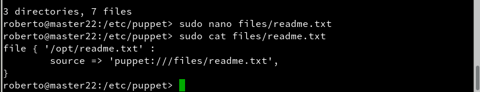

# Puppet


## ¿Qué es Puppet?

Según Wikipedia, Puppet es una herramienta diseñada para administrar la configuración de sistemas Unix-like y de Microsoft Windows de forma declarativa. El usuario describe los recursos del sistema y sus estados, ya sea utilizando el lenguaje declarativo de Puppet o un DSL (lenguaje específico del dominio) de Ruby.

Existen varias herramientas para realizar instalaciones desde un punto central, como Chef, Ansible, CFEngine, etc. En este ejemplo, vamos a usar Puppet.

Enlaces de interés:

- Vídeo en inglés [LINUX: Installing the Puppet Master on openSUSE" by TheUrbanPenguin](https://www.youtube.com/watch?v=8jBlUKimPVc&feature=youtu.be)"
- Vídeo en inglés ["LINUX: The Puppet Client and basic site.pp" by por TheUrbanPenguin](https://www.youtube.com/watch?v=KLF1-i8RzGU&feature=youtu.be)
- [Puppetcookbook](http://www.puppetcookbook.com/posts/show-resources-with-ralsh.html)
- Vídeo sin audio (14 minutos) sobre [Puppet en Debian](https://www.youtube.com/watch?v=kPyaI--iAcA&feature=youtu.be)
- [Vídeo en inglés](https://www.youtube.com/watch?v=Hiu_ui2nZa0&feature=youtu.be)minuto 15, 36 minutos de duración.

## 1. Configuración de las Máquinas Virtuales

Antes de comenzar con la configuración de los nombres de equipos, usuarios y dominio, deben estar en minúscula.

### 1.1 Máquina Virtual Master (OpenSUSE)

- Nombre de Equipo: `master22`
- IP estática: `172.18.22.100`
- Dominio: `curso1718`

```console
roberto@master22:~> hostname
master22
roberto@master22:~> hostname -d
curso1718
roberto@master22:~> ip a
1: lo: <LOOPBACK,UP,LOWER_UP> mtu 65536 qdisc noqueue state UNKNOWN group default qlen 1
    link/loopback 00:00:00:00:00:00 brd 00:00:00:00:00:00
    inet 127.0.0.1/8 scope host lo
       valid_lft forever preferred_lft forever
    inet6 ::1/128 scope host
       valid_lft forever preferred_lft forever
2: eth0: <BROADCAST,MULTICAST,UP,LOWER_UP> mtu 1500 qdisc pfifo_fast state UP group default qlen 1000
    link/ether 08:00:27:b9:f7:e9 brd ff:ff:ff:ff:ff:ff
    inet 172.18.22.100/16 brd 172.18.255.255 scope global eth0
       valid_lft forever preferred_lft forever
    inet6 fe80::a00:27ff:feb9:f7e9/64 scope link
       valid_lft forever preferred_lft forever
roberto@master22:~>
```
#### 1.1.1 Comprobación de la Máquina Virtual(Master22)

```console
roberto@master22:~> date
jue ene 11 09:27:11 WET 2018
roberto@master22:~> ip a
1: lo: <LOOPBACK,UP,LOWER_UP> mtu 65536 qdisc noqueue state UNKNOWN group default qlen 1
    link/loopback 00:00:00:00:00:00 brd 00:00:00:00:00:00
    inet 127.0.0.1/8 scope host lo
       valid_lft forever preferred_lft forever
    inet6 ::1/128 scope host
       valid_lft forever preferred_lft forever
2: eth0: <BROADCAST,MULTICAST,UP,LOWER_UP> mtu 1500 qdisc pfifo_fast state UP group default qlen 1000
    link/ether 08:00:27:b9:f7:e9 brd ff:ff:ff:ff:ff:ff
    inet 172.18.22.100/16 brd 172.18.255.255 scope global eth0
       valid_lft forever preferred_lft forever
    inet6 fe80::a00:27ff:feb9:f7e9/64 scope link
       valid_lft forever preferred_lft forever
roberto@master22:~> sudo route -n
root's password:
Kernel IP routing table
Destination     Gateway         Genmask         Flags Metric Ref    Use Iface
0.0.0.0         172.18.0.1      0.0.0.0         UG    0      0        0 eth0
172.18.0.0      0.0.0.0         255.255.0.0     U     0      0        0 eth0
roberto@master22:~> host www.google.es
www.google.es has address 216.58.201.131
www.google.es has IPv6 address 2a00:1450:4003:804::2003
roberto@master22:~> hostname -a
master22
roberto@master22:~> hostname -f
master22.curso1718
roberto@master22:~> hostname -d
curso1718
roberto@master22:~> tail -n 5 /etc/hosts
ff02::2         ipv6-allrouters
ff02::3         ipv6-allhosts
172.18.22.100   master22.curso1718 master22
172.18.22.101	cli1alu22.curso1718	cli1alu22
172.18.22.102	cli2alu22
roberto@master22:~> ping master22
PING master22.curso1718 (127.0.0.2) 56(84) bytes of data.
64 bytes from master22.curso1718 (127.0.0.2): icmp_seq=1 ttl=64 time=0.024 ms
64 bytes from master22.curso1718 (127.0.0.2): icmp_seq=2 ttl=64 time=0.029 ms
64 bytes from master22.curso1718 (127.0.0.2): icmp_seq=3 ttl=64 time=0.031 ms
^C
--- master22.curso1718 ping statistics ---
3 packets transmitted, 3 received, 0% packet loss, time 1998ms
rtt min/avg/max/mdev = 0.024/0.028/0.031/0.003 ms
roberto@master22:~> ping master22.curso1718
PING master22.curso1718 (127.0.0.2) 56(84) bytes of data.
64 bytes from master22.curso1718 (127.0.0.2): icmp_seq=1 ttl=64 time=0.023 ms
64 bytes from master22.curso1718 (127.0.0.2): icmp_seq=2 ttl=64 time=0.035 ms
64 bytes from master22.curso1718 (127.0.0.2): icmp_seq=3 ttl=64 time=0.039 ms
^C
--- master22.curso1718 ping statistics ---
3 packets transmitted, 3 received, 0% packet loss, time 1998ms
rtt min/avg/max/mdev = 0.023/0.032/0.039/0.008 ms
roberto@master22:~> ping cli1alu22
PING cli1alu22.curso1718 (172.18.22.101) 56(84) bytes of data.
64 bytes from cli1alu22.curso1718 (172.18.22.101): icmp_seq=1 ttl=64 time=0.389 ms
64 bytes from cli1alu22.curso1718 (172.18.22.101): icmp_seq=2 ttl=64 time=0.325 ms
64 bytes from cli1alu22.curso1718 (172.18.22.101): icmp_seq=3 ttl=64 time=0.267 ms
^C
--- cli1alu22.curso1718 ping statistics ---
3 packets transmitted, 3 received, 0% packet loss, time 2000ms
rtt min/avg/max/mdev = 0.267/0.327/0.389/0.049 ms
roberto@master22:~> ping cli1alu22.curso1718
PING cli1alu22.curso1718 (172.18.22.101) 56(84) bytes of data.
64 bytes from cli1alu22.curso1718 (172.18.22.101): icmp_seq=1 ttl=64 time=0.271 ms
64 bytes from cli1alu22.curso1718 (172.18.22.101): icmp_seq=2 ttl=64 time=0.319 ms
64 bytes from cli1alu22.curso1718 (172.18.22.101): icmp_seq=3 ttl=64 time=0.319 ms
^C
--- cli1alu22.curso1718 ping statistics ---
3 packets transmitted, 3 received, 0% packet loss, time 1999ms
rtt min/avg/max/mdev = 0.271/0.303/0.319/0.022 ms
roberto@master22:~> ping cli2alu22
PING cli2alu22 (172.18.22.102) 56(84) bytes of data.
64 bytes from cli2alu22 (172.18.22.102): icmp_seq=22 ttl=128 time=0.247 ms
64 bytes from cli2alu22 (172.18.22.102): icmp_seq=23 ttl=128 time=0.344 ms
64 bytes from cli2alu22 (172.18.22.102): icmp_seq=24 ttl=128 time=0.352 ms
64 bytes from cli2alu22 (172.18.22.102): icmp_seq=25 ttl=128 time=0.355 ms
^C
--- cli2alu22 ping statistics ---
25 packets transmitted, 4 received, 84% packet loss, time 24164ms
rtt min/avg/max/mdev = 0.247/0.324/0.355/0.048 ms
roberto@master22:~>

```
### 1.2 Máquina Virtual cliente1 (OpenSUSE)

- Nombre de Equipo: `cli1alu22`
- IP estática: `172.18.22.101`
- Dominio: `curso1718`

```console
roberto@cli1alu22:~> hostname
cli1alu22
roberto@cli1alu22:~> hostname -d
curso1718
roberto@cli1alu22:~> ip a
1: lo: <LOOPBACK,UP,LOWER_UP> mtu 65536 qdisc noqueue state UNKNOWN group default qlen 1
    link/loopback 00:00:00:00:00:00 brd 00:00:00:00:00:00
    inet 127.0.0.1/8 scope host lo
       valid_lft forever preferred_lft forever
    inet6 ::1/128 scope host
       valid_lft forever preferred_lft forever
2: eth1: <BROADCAST,MULTICAST,UP,LOWER_UP> mtu 1500 qdisc pfifo_fast state UP group default qlen 1000
    link/ether 08:00:27:66:f7:12 brd ff:ff:ff:ff:ff:ff
    inet 172.18.22.101/16 brd 172.18.255.255 scope global eth1
       valid_lft forever preferred_lft forever
    inet6 fe80::a00:27ff:fe66:f712/64 scope link
       valid_lft forever preferred_lft forever
roberto@cli1alu22:~>

```
#### 1.2.1 Comprobación de la Máquina Virtual(cli1alu22)

```console
roberto@cli1alu22:~/Escritorio> date
jue ene 11 09:35:18 WET 2018
roberto@cli1alu22:~/Escritorio> ip a
1: lo: <LOOPBACK,UP,LOWER_UP> mtu 65536 qdisc noqueue state UNKNOWN group default qlen 1
    link/loopback 00:00:00:00:00:00 brd 00:00:00:00:00:00
    inet 127.0.0.1/8 scope host lo
       valid_lft forever preferred_lft forever
    inet6 ::1/128 scope host
       valid_lft forever preferred_lft forever
2: eth1: <BROADCAST,MULTICAST,UP,LOWER_UP> mtu 1500 qdisc pfifo_fast state UP group default qlen 1000
    link/ether 08:00:27:66:f7:12 brd ff:ff:ff:ff:ff:ff
    inet 172.18.22.101/16 brd 172.18.255.255 scope global eth1
       valid_lft forever preferred_lft forever
    inet6 fe80::a00:27ff:fe66:f712/64 scope link
       valid_lft forever preferred_lft forever
roberto@cli1alu22:~/Escritorio> sudo route -n
root's password:
Kernel IP routing table
Destination     Gateway         Genmask         Flags Metric Ref    Use Iface
0.0.0.0         172.18.0.1      0.0.0.0         UG    0      0        0 eth1
172.18.0.0      0.0.0.0         255.255.0.0     U     0      0        0 eth1
roberto@cli1alu22:~/Escritorio> host www.google.es
hwww.google.es has address 216.58.214.163
www.google.es has IPv6 address 2a00:1450:4003:804::2003
oroberto@cli1alu22:~/Escritorio> hostname -a
cli1alu22
roberto@cli1alu22:~/Escritorio> hostname -f
cli1alu22.curso1718
roberto@cli1alu22:~/Escritorio> hostname -d
curso1718
roberto@cli1alu22:~/Escritorio> tail -n 5 /etc/hosts
ff02::2         ipv6-allrouters
ff02::3         ipv6-allhosts
172.18.22.101   cli1alu22.curso1718	cli1alu22
172.18.22.100	master22.curso1718	master22
172.18.22.102	cli2alu22
roberto@cli1alu22:~/Escritorio> ping master22
PING master22.curso1718 (172.18.22.100) 56(84) bytes of data.
64 bytes from master22.curso1718 (172.18.22.100): icmp_seq=1 ttl=64 time=0.289 ms
64 bytes from master22.curso1718 (172.18.22.100): icmp_seq=2 ttl=64 time=0.305 ms
^C
--- master22.curso1718 ping statistics ---
2 packets transmitted, 2 received, 0% packet loss, time 999ms
rtt min/avg/max/mdev = 0.289/0.297/0.305/0.008 ms
roberto@cli1alu22:~/Escritorio> ping master22.curso1718
PING master22.curso1718 (172.18.22.100) 56(84) bytes of data.
64 bytes from master22.curso1718 (172.18.22.100): icmp_seq=1 ttl=64 time=0.279 ms
64 bytes from master22.curso1718 (172.18.22.100): icmp_seq=2 ttl=64 time=0.299 ms
64 bytes from master22.curso1718 (172.18.22.100): icmp_seq=3 ttl=64 time=0.322 ms
^C
--- master22.curso1718 ping statistics ---
3 packets transmitted, 3 received, 0% packet loss, time 1998ms
rtt min/avg/max/mdev = 0.279/0.300/0.322/0.017 ms
roberto@cli1alu22:~/Escritorio> ping cli1alu22
PING cli1alu22.curso1718 (127.0.0.2) 56(84) bytes of data.
64 bytes from cli1alu22.curso1718 (127.0.0.2): icmp_seq=1 ttl=64 time=0.016 ms
64 bytes from cli1alu22.curso1718 (127.0.0.2): icmp_seq=2 ttl=64 time=0.025 ms
64 bytes from cli1alu22.curso1718 (127.0.0.2): icmp_seq=3 ttl=64 time=0.025 ms
^C
--- cli1alu22.curso1718 ping statistics ---
3 packets transmitted, 3 received, 0% packet loss, time 1998ms
rtt min/avg/max/mdev = 0.016/0.022/0.025/0.004 ms
roberto@cli1alu22:~/Escritorio> ping cli1alu22.curso1718
PING cli1alu22.curso1718 (127.0.0.2) 56(84) bytes of data.
64 bytes from cli1alu22.curso1718 (127.0.0.2): icmp_seq=1 ttl=64 time=0.013 ms
64 bytes from cli1alu22.curso1718 (127.0.0.2): icmp_seq=2 ttl=64 time=0.023 ms
64 bytes from cli1alu22.curso1718 (127.0.0.2): icmp_seq=3 ttl=64 time=0.026 ms
^C
--- cli1alu22.curso1718 ping statistics ---
3 packets transmitted, 3 received, 0% packet loss, time 1998ms
rtt min/avg/max/mdev = 0.013/0.020/0.026/0.007 ms
roberto@cli1alu22:~/Escritorio> ping cli2alu22
PING cli2alu22 (172.18.22.102) 56(84) bytes of data.
64 bytes from cli2alu22 (172.18.22.102): icmp_seq=1 ttl=128 time=0.451 ms
64 bytes from cli2alu22 (172.18.22.102): icmp_seq=2 ttl=128 time=0.334 ms
64 bytes from cli2alu22 (172.18.22.102): icmp_seq=3 ttl=128 time=0.356 ms
^C
--- cli2alu22 ping statistics ---
3 packets transmitted, 3 received, 0% packet loss, time 1999ms
rtt min/avg/max/mdev = 0.334/0.380/0.451/0.053 ms
roberto@cli1alu22:~/Escritorio>

```
### 1.3 Máquina Virtual cliente1 (Windows 7)

- Nombre de Equipo: `cli2alu22`
- IP estática: `172.18.22.102`
- Dominio: `curso1718`

```console
C:\Windows\System32\drivers\etc>hostname
cli2alu22

C:\Windows\System32\drivers\etc>ipconfig

Configuración IP de Windows


Adaptador de Ethernet Conexión de área local:

   Sufijo DNS específico para la conexión. . :
   Vínculo: dirección IPv6 local. . . : fe80::1036:42a:63e0:b9b%11
   Dirección IPv4. . . . . . . . . . . . . . : 172.18.22.102
   Máscara de subred . . . . . . . . . . . . : 255.255.0.0
   Puerta de enlace predeterminada . . . . . : 172.18.0.1

Adaptador de túnel isatap.{EDAC9220-24B4-4EBD-BF38-DB29514CDEB7}:

   Estado de los medios. . . . . . . . . . . : medios desconectados
   Sufijo DNS específico para la conexión. . :

C:\Windows\System32\drivers\etc>

```

#### 1.3.1 Comprobación de la Máquina Virtual(cli2alu22)

```console
C:\Windows\System32\drivers\etc>date
La fecha actual es: 11/01/2018
Escriba la nueva fecha: (dd-mm-aa)

C:\Windows\System32\drivers\etc>ipconfig

Configuración IP de Windows


Adaptador de Ethernet Conexión de área local:

   Sufijo DNS específico para la conexión. . :
   Vínculo: dirección IPv6 local. . . : fe80::1036:42a:63e0:b9b%11
   Dirección IPv4. . . . . . . . . . . . . . : 172.18.22.102
   Máscara de subred . . . . . . . . . . . . : 255.255.0.0
   Puerta de enlace predeterminada . . . . . : 172.18.0.1

Adaptador de túnel isatap.{EDAC9220-24B4-4EBD-BF38-DB29514CDEB7}:

   Estado de los medios. . . . . . . . . . . : medios desconectados
   Sufijo DNS específico para la conexión. . :

C:\Windows\System32\drivers\etc>route print
===========================================================================
ILista de interfaces
 11...08 00 27 c4 71 26 ......Adaptador de escritorio Intel(R) PRO/1000 MT
  1...........................Software Loopback Interface 1
 12...00 00 00 00 00 00 00 e0 Adaptador ISATAP de Microsoft
===========================================================================

IPv4 Tabla de enrutamiento
===========================================================================
Rutas activas:
Destino de red        Máscara de red   Puerta de enlace   Interfaz  Métrica
          0.0.0.0          0.0.0.0       172.18.0.1    172.18.22.102    266
        127.0.0.0        255.0.0.0      En vínculo         127.0.0.1    306
        127.0.0.1  255.255.255.255      En vínculo         127.0.0.1    306
  127.255.255.255  255.255.255.255      En vínculo         127.0.0.1    306
       172.18.0.0      255.255.0.0      En vínculo     172.18.22.102    266
    172.18.22.102  255.255.255.255      En vínculo     172.18.22.102    266
   172.18.255.255  255.255.255.255      En vínculo     172.18.22.102    266
        224.0.0.0        240.0.0.0      En vínculo         127.0.0.1    306
        224.0.0.0        240.0.0.0      En vínculo     172.18.22.102    266
  255.255.255.255  255.255.255.255      En vínculo         127.0.0.1    306
  255.255.255.255  255.255.255.255      En vínculo     172.18.22.102    266
===========================================================================
Rutas persistentes:
  Dirección de red  Máscara de red  Dirección de puerta de enlace  Métrica
          0.0.0.0          0.0.0.0       172.18.0.1  Predeterminada
===========================================================================

IPv6 Tabla de enrutamiento
===========================================================================
Rutas activas:
 Cuando destino de red métrica      Puerta de enlace
  1    306 ::1/128                  En vínculo
 11    266 fe80::/64                En vínculo
 11    266 fe80::1036:42a:63e0:b9b/128
                                    En vínculo
  1    306 ff00::/8                 En vínculo
 11    266 ff00::/8                 En vínculo
===========================================================================
Rutas persistentes:
  Ninguno

C:\Windows\System32\drivers\etc>nslookup www.google.es
Servidor:  google-public-dns-a.google.com
Address:  8.8.8.8

Respuesta no autoritativa:
Nombre:  www.google.es
Addresses:  2a00:1450:4003:801::2003
          216.58.211.227


C:\Windows\System32\drivers\etc>ping master22

Haciendo ping a master22.curso1718 [172.18.22.100] con 32 bytes de datos:
Respuesta desde 172.18.22.100: bytes=32 tiempo<1m TTL=64
Respuesta desde 172.18.22.100: bytes=32 tiempo<1m TTL=64
Respuesta desde 172.18.22.100: bytes=32 tiempo<1m TTL=64
Respuesta desde 172.18.22.100: bytes=32 tiempo<1m TTL=64

Estadísticas de ping para 172.18.22.100:
    Paquetes: enviados = 4, recibidos = 4, perdidos = 0
    (0% perdidos),
Tiempos aproximados de ida y vuelta en milisegundos:
    Mínimo = 0ms, Máximo = 0ms, Media = 0ms

C:\Windows\System32\drivers\etc>ping master22.curso1718

Haciendo ping a master22.curso1718 [172.18.22.100] con 32 bytes de datos:
Respuesta desde 172.18.22.100: bytes=32 tiempo<1m TTL=64
Respuesta desde 172.18.22.100: bytes=32 tiempo<1m TTL=64
Respuesta desde 172.18.22.100: bytes=32 tiempo<1m TTL=64
Respuesta desde 172.18.22.100: bytes=32 tiempo<1m TTL=64

Estadísticas de ping para 172.18.22.100:
    Paquetes: enviados = 4, recibidos = 4, perdidos = 0
    (0% perdidos),
Tiempos aproximados de ida y vuelta en milisegundos:
    Mínimo = 0ms, Máximo = 0ms, Media = 0ms

C:\Windows\System32\drivers\etc>ping cli1alu22.curso1718

Haciendo ping a cli1alu22.curso1718 [172.18.22.101] con 32 bytes de datos:
Respuesta desde 172.18.22.101: bytes=32 tiempo<1m TTL=64
Respuesta desde 172.18.22.101: bytes=32 tiempo<1m TTL=64
Respuesta desde 172.18.22.101: bytes=32 tiempo<1m TTL=64
Respuesta desde 172.18.22.101: bytes=32 tiempo<1m TTL=64

Estadísticas de ping para 172.18.22.101:
    Paquetes: enviados = 4, recibidos = 4, perdidos = 0
    (0% perdidos),
Tiempos aproximados de ida y vuelta en milisegundos:
    Mínimo = 0ms, Máximo = 0ms, Media = 0ms

C:\Windows\System32\drivers\etc>ping cli2alu22.curso1718
La solicitud de ping no pudo encontrar el host cli2alu22.curso1718. Compruebe el
 nombre y
vuelva a intentarlo.

C:\Windows\System32\drivers\etc>ping cli2alu22

Haciendo ping a cli2alu22 [127.0.0.2] con 32 bytes de datos:
Respuesta desde 127.0.0.2: bytes=32 tiempo<1m TTL=128
Respuesta desde 127.0.0.2: bytes=32 tiempo<1m TTL=128
Respuesta desde 127.0.0.2: bytes=32 tiempo<1m TTL=128
Respuesta desde 127.0.0.2: bytes=32 tiempo<1m TTL=128

Estadísticas de ping para 127.0.0.2:
    Paquetes: enviados = 4, recibidos = 4, perdidos = 0
    (0% perdidos),
Tiempos aproximados de ida y vuelta en milisegundos:
    Mínimo = 0ms, Máximo = 0ms, Media = 0ms

C:\Windows\System32\drivers\etc>type hosts
    # Copyright (c) 1993-2009 Microsoft Corp.
    #
    # This is a sample HOSTS file used by Microsoft TCP/IP for Windows.
    #
    # This file contains the mappings of IP addresses to host names. Each
    # entry should be kept on an individual line. The IP address should
    # be placed in the first column followed by the corresponding host name.
    # The IP address and the host name should be separated by at least one
    # space.
    #
    # Additionally, comments (such as these) may be inserted on individual
    # lines or following the machine name denoted by a '#' symbol.
    #
    # For example:
    #
    #      102.54.94.97     rhino.acme.com          # source server
    #       38.25.63.10     x.acme.com              # x client host

    # localhost name resolution is handled within DNS itself.
    #       127.0.0.1       localhost
    #       ::1             localhost
            127.0.0.2       cli2alu22
            172.18.22.102   cli2alu22
            172.18.22.101   cli1alu22.curso1718     cli1alu22
            172.18.22.100   master22.curso1718      master22
C:\Windows\System32\drivers\etc>
```
## 2. Instalación de Puppet en OpenSUSE - Master22

Tenemos que escribir en la terminal el siguiente comando.

- `zypper install rubygem-puppet-master`

```console
roberto@master22:~> sudo zypper install rubygem-puppet-master
root's password:
Cargando datos del repositorio...
Leyendo los paquetes instalados...
Resolviendo dependencias de paquete...

Los siguientes 13 paquetes NUEVOS van a ser instalados:
  make ruby2.1-rubygem-facter ruby2.1-rubygem-hiera ruby2.1-rubygem-json_pure
  ruby2.1-rubygem-puppet ruby2.1-rubygem-ruby-shadow rubygem-facter
  rubygem-hiera rubygem-puppet rubygem-puppet-master rubygem-puppet-vim
  site-config virt-what

Se seleccionó automáticamente el siguiente paquete recomendado:
  ruby2.1-rubygem-ruby-shadow

13 nuevos paquetes a instalar.
Tamaño total de descarga: 5,1 MiB. Ya en caché: 0 B. Después de la operación, se
utilizarán 11,7 MiB adicionales.
¿Desea continuar? [s/n/? mostrar todas las opciones] (s): s
```

- Estos son los comandos para parar, reiniciar, el servicio.
    - `systemctl status puppetmaster`: Consultar el estado del servicio.
    - `systemctl enable puppetmaster`: Permitir que el servicio se inicie automáticamente en el inicio de la máquina.
    - `systemctl start puppetmaster`: Iniciar el servicio.
    - `systemctl status puppetmaster`: Consultar el estado del servicio.

Establecemos el siguiente orden de comandos para tener activado el servicio de `puppetmaster` cada vez que inicie openSUSE.

```console
roberto@master22:~> sudo systemctl start puppetmaster.service
roberto@master22:~> sudo systemctl status puppetmaster.service
● puppetmaster.service - Puppet master
   Loaded: loaded (/usr/lib/systemd/system/puppetmaster.service; disabled; vendor preset: disabled)
   Active: active (running) since jue 2018-01-11 09:59:45 WET; 2s ago
 Main PID: 3416 (puppet)
    Tasks: 2 (limit: 512)
   CGroup: /system.slice/puppetmaster.service
           └─3416 /usr/bin/ruby.ruby2.1 /usr/bin/puppet master --no-daemonize...

ene 11 09:59:45 master22 systemd[1]: Started Puppet master.
roberto@master22:~> sudo systemctl enable puppetmaster.service
Created symlink from /etc/systemd/system/multi-user.target.wants/puppetmaster.service to /usr/lib/systemd/system/puppetmaster.service.
roberto@master22:~>
```
### 2.1 Primera versión del fichero pp

Tenemos que ir a la siguiente ruta `/etc/puppet` y debemos crear los siguientes directorios y ficheros.

```console
mkdir /etc/puppet/files
touch /etc/puppet/files/readme.txt
mkdir /etc/puppet/manifests
touch /etc/puppet/manifests/site.pp
mkdir /etc/puppet/manifests/classes
touch /etc/puppet/manifests/classes/hostlinux1.pp
```

Comprobamos con el comando `tree` el resultado de los directorios y ficheros creados.

```console
roberto@master22:/etc/puppet> tree
.
├── auth.conf
├── files
│   └── readme.txt
├── fileserver.conf
├── manifests
│   ├── classes
│   │   └── hostlinux1.pp
│   └── site.pp
├── puppet.conf
└── tagmail.conf

3 directories, 7 files
```
### 2.2 readme.txt

Los ficheros que se guardan en `/etc/puppet/files` se pueden descargar desde el resto de máquinas cliente puppet.

    Contenido para readme.txt: "¡Al abordaje!".



### 2.3 site.pp

- `/etc/puppet/manifests/site.pp` es el fichero principal de configuración de órdenes para los agentes/nodos puppet.

- Contenido de nuestro site.pp:

```console
import "classes/*"

node default {
  include hostlinux1
}
```


- Esta configuración significa:

    - Todos los ficheros de configuración del directorio classes se añadirán a este fichero.
    - Todos los nodos/clientes van a usar la configuración hostlinux1

### 2.4 hostlinux1.pp

Como podemos tener muchas configuraciones, vamos a separarlas en distintos ficheros para organizarnos mejor, y las vamos a guardar en la ruta `/etc/puppet/manifests/classes`

- Vamos a crear una primera configuración para máquina estándar GNU/Linux.

    - Contenido para /etc/puppet/manifests/classes/hostlinux1.pp:

```console
class hostlinux1 {
  package { "tree": ensure => installed }
  package { "traceroute": ensure => installed }
  package { "geany": ensure => installed }
}
```


- `tree /etc/puppet`, consultar los ficheros/directorios que tenemos creado.


- Comprobar que tenemos los permisos adecuados en la ruta `/var/lib/puppet`. Esto es, usuario puppet y grupo puppet.

```console
roberto@master22:/etc/puppet> sudo ls -l /var/lib/puppet/
total 0
drwxr-x--- 1 puppet puppet   0 ene 11 09:59 bucket
drwxr-xr-x 1 root   root     0 ene 11 09:59 facts.d
drwxr-xr-x 1 root   root     0 ene 11 09:59 lib
drwxr-x--- 1 puppet puppet   0 ene 11 09:59 preview
drwxr-x--- 1 puppet puppet   0 ene 11 09:59 reports
drwxr-x--- 1 puppet puppet   0 ene 11 09:59 rrd
drwxr-x--- 1 puppet puppet   0 ene 11 09:59 server_data
drwxrwx--x 1 puppet puppet 128 ene 11 09:59 ssl
drwxr-xr-t 1 root   root     0 ene 11 09:59 state
drwxr-x--- 1 puppet puppet   0 ene 11 09:59 yaml
roberto@master22:/etc/puppet>

```
- Reiniciamos el servicio systemctl restart puppetmaster.

```console
roberto@master22:/etc/puppet> sudo systemctl restart puppetmaster.service
```

- Comprobamos que el servicio está en ejecución de forma correcta.
    - `systemctl status puppetmaster`

```console
roberto@master22:/etc/puppet> sudo systemctl status puppetmaster.service
● puppetmaster.service - Puppet master
   Loaded: loaded (/usr/lib/systemd/system/puppetmaster.service; enabled; vendor preset: disabled)
   Active: active (running) since jue 2018-01-11 10:27:02 WET; 10s ago
 Main PID: 4397 (puppet)
    Tasks: 3 (limit: 512)
   CGroup: /system.slice/puppetmaster.service
           └─4397 /usr/bin/ruby.ruby2.1 /usr/bin/puppet master --no-daemonize...

ene 11 10:27:02 master22 systemd[1]: Stopped Puppet master.
ene 11 10:27:02 master22 systemd[1]: Started Puppet master.
ene 11 10:27:03 master22 puppet[4397]: Notice: Starting Puppet master versi....7
Hint: Some lines were ellipsized, use -l to show in full.
roberto@master22:/etc/puppet>
```
    - `netstat -ntap | grep ruby`

```console
roberto@master22:/etc/puppet> sudo netstat -ntap | grep ruby
tcp        0      0 0.0.0.0:8140            0.0.0.0:*               LISTEN      4397/ruby.ruby2.1   
roberto@master22:/etc/puppet>
```
- Consultamos log por si hay errores: `tail /var/log/puppet/*.log`

```console
roberto@master22:/etc/puppet> sudo tail /var/log/puppet/*.log
tail: no se puede abrir '/var/log/puppet/*.log' para lectura: No existe el fichero o el directorio
roberto@master22:/etc/puppet>
```

No existe el fichero porque el servicio `puppet` no ha tenido errores.

- Abrir el cortafuegos para el servicio. Tenemos que ir a `Yast -> cortafuegos`

    - Vamos a servicios autorizados y agregamos los servicio de `Puppet`


## 3. Instalación y configuración del cliente1

Vamos a instalar y configurar en el cliente1 el `puppet agente`

- `sudo zypper install rubygem-puppet`

```console
roberto@cli1alu22:~> sudo zypper install rubygem-puppet
root's password:
Cargando datos del repositorio...
Leyendo los paquetes instalados...
Resolviendo dependencias de paquete...

Los siguientes 12 paquetes NUEVOS van a ser instalados:
  make ruby2.1-rubygem-facter ruby2.1-rubygem-hiera ruby2.1-rubygem-json_pure
  ruby2.1-rubygem-puppet ruby2.1-rubygem-ruby-shadow rubygem-facter
  rubygem-hiera rubygem-puppet rubygem-puppet-vim site-config virt-what

Se seleccionó automáticamente el siguiente paquete recomendado:
  ruby2.1-rubygem-ruby-shadow

12 nuevos paquetes a instalar.
Tamaño total de descarga: 5,1 MiB. Ya en caché: 0 B. Después de la operación, se
utilizarán 11,7 MiB adicionales.
¿Desea continuar? [s/n/? mostrar todas las opciones] (s): s
Recuperando paquete make-4.0-5.54.x86_64
                                    (1/12), 381,3 KiB (  1,0 MiB desempaquetado)
Recuperando: make-4.0-5.54.x86_64.rpm .................[terminado (333,4 KiB/s)]
```

- Tenemos que modificar el siguiente fichero de configuración de `puppet` en el cliente1.
- La ruta del fichero es: `/etc/puppet/puppet.conf`


- Comprobar que tenemos los permisos adecuados en la ruta /var/lib/puppet.

    - `systemctl status puppet`: Ver el estado del servicio puppet.

```console
roberto@cli1alu22:~> sudo systemctl status puppet
● puppet.service - Puppet agent
   Loaded: loaded (/usr/lib/systemd/system/puppet.service; disabled; vendor preset: disabled)
   Active: active (running) since jue 2018-01-11 10:43:11 WET; 4s ago
 Main PID: 3454 (puppet)
    Tasks: 2 (limit: 512)
   CGroup: /system.slice/puppet.service
           └─3454 /usr/bin/ruby.ruby2.1 /usr/bin/puppet agent --no-daemonize

ene 11 10:43:11 cli1alu22 systemd[1]: Started Puppet agent.

```
    - `systemctl enable puppet`: Activar el servicio en cada reinicio de la máquina.

```console
roberto@cli1alu22:~> sudo systemctl enable puppet
Created symlink from /etc/systemd/system/multi-user.target.wants/puppet.service to /usr/lib/systemd/system/puppet.service.
roberto@cli1alu22:~>

    - `systemctl start puppet`: Iniciar el servicio puppet.

```console
roberto@cli1alu22:~> sudo systemctl start puppet
```

## 4. Certificados

Tenemos que intercambiar los certificados entre ambas máquinas.

### 4.1 Aceptar certificados

- Vamos a la MV Master22
- Nos aseguramos de que somos el usuario `root`
- `puppet cert list`, consultamos las peticiones pendiente de unión al master22.


- Vamos aceptar el certificado del cliente cli1alu22.curso1718 en el master22.

```console
master22:~ # puppet cert sign "cli1alu22.curso1718"
Notice: Signed certificate request for cli1alu22.curso1718
Notice: Removing file Puppet::SSL::CertificateRequest cli1alu22.curso1718 at '/var/lib/puppet/ssl/ca/requests/cli1alu22.curso1718.pem'
master22:~ # puppet cert list
master22:~ # puppet cert print cli1alu22.curso1718
Certificate:
    Data:
        Version: 3 (0x2)
        Serial Number: 3 (0x3)
    Signature Algorithm: sha256WithRSAEncryption
        Issuer: CN=Puppet CA: master22.curso1718
        Validity
            Not Before: Jan 15 10:07:33 2018 GMT
            Not After : Jan 15 10:07:33 2023 GMT
        Subject: CN=cli1alu22.curso1718
        Subject Public Key Info:
            Public Key Algorithm: rsaEncryption
                Public-Key: (4096 bit)
                Modulus:
                    00:b3:e2:da:40:46:20:68:6b:09:7a:a8:fa:88:ae:
                    8c:14:46:b0:20:92:5a:f4:d4:d4:73:57:f2:fb:79:
                    df:1b:19:33:ab:f2:8e:a8:41:e8:ea:00:36:b1:b3:
                    44:7a:20:67:93:40:27:98:24:2c:d9:1b:f9:9a:0d:
                    a0:f2:fe:1a:ca:70:eb:fc:37:ec:5e:71:a8:64:b3:
                    63:88:70:ae:af:a1:db:ac:44:83:11:b5:02:e6:27:
                    c0:8d:e4:fe:02:ae:8d:11:d5:df:67:cc:52:80:51:
                    6d:d8:c0:50:31:8d:21:6c:f6:3c:b4:d3:cf:a5:6b:
                    61:f2:fd:5b:2a:4d:90:cb:ed:5f:e8:3b:51:b4:bf:
                    77:54:57:d9:43:07:d2:77:7e:4c:58:68:ef:65:30:
                    b1:bd:9a:d0:ec:3a:7a:95:32:94:b1:ed:d4:57:f0:
                    5a:0c:a3:42:2c:ba:04:b0:61:65:f4:e2:4f:95:91:
                    0f:3d:84:df:41:35:72:fa:f6:20:6f:14:18:e5:bf:
                    04:95:23:62:12:ac:33:20:bb:8d:86:91:99:19:d1:
                    08:29:fa:48:d1:b4:64:ad:51:9e:eb:cd:e1:0d:7d:
                    3b:43:46:36:cc:6b:c4:55:9e:df:71:36:af:14:ea:
                    42:8f:75:2a:f0:11:d4:f4:cb:bb:91:03:c6:fb:50:
                    9e:03:ec:8f:92:e5:38:80:ed:c6:d2:fe:ac:2f:cb:
                    a5:32:58:d6:58:a1:48:02:57:b4:08:93:37:98:a4:
                    6f:32:4d:34:b5:e2:8d:bd:1e:f3:8e:a5:64:66:c1:
                    25:0e:5d:0f:ee:42:97:48:90:b6:30:5e:e0:e2:a7:
                    6d:e0:49:e4:44:f3:c2:9c:99:ff:67:33:2b:7a:fc:
                    40:2c:2c:82:50:d1:4e:eb:7f:70:af:6e:10:2e:9a:
                    c8:da:82:87:30:f5:ba:5c:ee:c8:1f:ef:31:21:1e:
                    3c:0b:75:57:bf:68:39:bf:84:e6:aa:4c:19:88:90:
                    5d:c3:47:d0:c6:90:15:e1:b2:fa:71:38:28:f7:66:
                    ab:ec:aa:5b:73:40:d3:22:e0:41:33:c2:19:16:a6:
                    23:ac:dd:4a:51:55:a9:83:1f:a0:97:43:79:ec:3f:
                    7a:75:98:fc:51:34:bd:56:67:0f:b0:ac:3c:e5:ac:
                    56:06:4c:29:c7:6a:d0:d6:bb:56:2c:19:62:46:0b:
                    8a:7a:c4:63:bb:62:30:49:44:99:f7:df:dd:88:d5:
                    6a:89:d3:20:0b:ff:a2:41:95:1b:84:4d:a3:4a:93:
                    fd:12:37:fc:7f:fa:7d:fe:15:f9:00:3f:2b:99:eb:
                    f5:8b:b1:2f:84:23:8c:f5:d6:38:4d:91:2d:ec:8f:
                    7f:5b:d3
                Exponent: 65537 (0x10001)
        X509v3 extensions:
            Netscape Comment:
                Puppet Ruby/OpenSSL Internal Certificate
            X509v3 Key Usage: critical
                Digital Signature, Key Encipherment
            X509v3 Extended Key Usage: critical
                TLS Web Server Authentication, TLS Web Client Authentication
            X509v3 Basic Constraints: critical
                CA:FALSE
            X509v3 Subject Key Identifier:
                1D:37:08:33:33:61:A3:14:7A:4B:C7:E6:8F:BF:AE:D8:DD:D3:55:A9
            X509v3 Authority Key Identifier:
                keyid:E5:E3:6C:D5:3D:69:83:5D:F4:14:65:A9:BB:87:4D:AE:71:6C:1B:B8

    Signature Algorithm: sha256WithRSAEncryption
         1f:6d:c9:98:81:8e:c4:b1:8c:08:4e:a0:3a:d7:b6:5e:9a:1b:
         72:f2:30:c9:57:6e:bf:5a:47:0b:de:15:5f:c4:83:37:5f:73:
         25:95:2e:43:b9:92:e7:23:cf:07:4a:07:18:e3:f6:18:f5:ea:
         61:4c:b3:1f:ef:4a:26:06:b8:e4:42:23:c3:4b:e1:cf:dd:18:
         d2:66:cb:c5:1b:2c:a8:dc:13:6a:48:e3:cd:69:79:9d:13:21:
         19:72:c7:71:a2:0f:01:8a:c7:49:fa:d4:86:1d:4c:0c:79:55:
         f7:2c:ab:00:0b:74:9b:4b:4d:8b:32:97:37:a2:fe:89:80:6f:
         9b:0d:4d:42:4f:0a:20:9f:83:bb:76:46:94:34:35:48:50:06:
         e1:36:fc:d7:75:d3:d4:14:96:ad:77:8f:eb:c5:39:dc:e9:c4:
         2c:e9:22:22:f0:13:83:1d:4b:a4:ce:c9:b2:28:0d:4b:2b:73:
         65:99:8e:b8:16:08:9c:34:06:91:ca:3e:a6:56:7d:23:f7:e9:
         59:a8:e6:f6:4f:c2:03:6a:94:e5:77:0c:5c:21:c9:a7:56:de:
         61:7e:8c:cf:8e:e0:0d:ba:e6:6d:e5:55:07:37:13:85:7b:e0:
         82:10:9e:1c:d6:6e:13:aa:39:ea:df:49:02:02:8a:17:e1:f9:
         db:b0:a9:57:69:f3:27:93:39:43:75:5d:f2:77:c0:13:81:ad:
         3a:e7:a1:c5:dc:7a:88:6a:34:51:ed:30:05:aa:b0:7c:30:97:
         44:11:b8:73:e5:91:82:31:da:a9:6d:11:50:9c:96:63:1b:07:
         24:73:8f:e5:1e:25:de:39:69:11:8e:fc:65:a1:63:d6:ee:5e:
         52:2e:ad:b9:fa:99:09:8f:fa:fb:f3:4c:b5:9a:8c:f1:4d:aa:
         5b:1e:bb:00:70:71:f9:b4:ff:5f:c2:2c:dd:59:90:dc:f3:f7:
         78:7b:b1:ec:53:3d:34:1c:94:65:2d:b1:29:4c:3b:24:13:f7:
         08:8a:be:71:9f:82:76:cf:19:58:08:be:d1:25:76:24:4e:3c:
         dc:33:84:42:c2:b5:ae:01:04:7d:98:fd:fe:fb:14:54:19:25:
         13:0c:0f:4b:e7:9c:73:b9:60:2b:8e:63:ed:59:6a:2a:80:b3:
         26:1d:ff:c9:62:7d:71:8e:8b:d0:47:52:b4:32:90:3d:34:1b:
         af:1b:76:44:e9:9e:d9:36:06:98:60:e1:ca:4a:80:d3:de:b1:
         8c:76:04:1b:a9:63:70:69:5d:93:81:f9:e2:43:00:f9:ca:84:
         7d:77:27:04:6d:15:0d:6c:78:a4:e6:bc:da:e0:6b:f4:11:e8:
         a4:28:ed:99:22:b5:0c:44
master22:~ #
```
### 4.2 Comprobación

Vamos a comprobar que las órdenes (manifiesto) del master, llega bien al cliente y éste las ejecuta.

- Vamos a cliente1 y reiniciamos la máquina y/o el servicio Puppet.
- Comprobar que los cambios configurados en Puppet se han realizado.
- En caso contrario, ejecutar comando para comprobar errores:
    - `puppet agent --test`
    - `puppet agent --server master42.curso1617 --test`


- Para ver el detalle de los errores, podemos reiniciar el servicio puppet en el cliente, y consultar el archivo de log del cliente: `tail /var/log/puppet/puppet.log`.
- Puede ser que tengamos algún mensaje de error de configuración del fichero `/etc/puppet/manifests/site.pp del master`. En tal caso, ir a los ficheros del master y corregir los errores de sintáxis.

### 4.3 Problemas y eliminar certificados.

Si tenemos problemas con los certificados, y queremos eliminar los certificados actuales, podemos hacer lo siguiente:

- `puppet cert revoke cli1alu42.curso1617`: Lo ejecutamos en el master para revocar certificado del cliente.
- `puppet cert clean cli1alu42.curso1617`: Lo ejecutamos en el master para eliminar ficheros del certificado del cliente.
- `puppet cert print --all`: Muestra todos los certificados del servidor. No debe verse el del cliente que queremos eliminar.
 - `rm -rf /var/lib/puppet/ssl`: Lo ejecutamos en el cliente para eliminar los certificados del cliente.


## 5. Segunda versión del fichero pp

Ya hemos probado una configuración sencilla en PuppetMaster. Ahora vamos a pasar a configurar algo más complejo.

    - Contenido para `/etc/puppet/manifests/classes/hostlinux2.pp`:

Tenemos que modificar el fichero nombrado anteriormente `hostlinux2.pp`.

```console

master22:~ # nano /etc/puppet/manifests/classes/hostlinux1.pp
master22:~ # cat /etc/puppet/manifests/classes/hostlinux1.pp
class hostlinux2 {
  package { "tree": ensure => installed }
  package { "traceroute": ensure => installed }
  package { "geany": ensure => installed }

  group { "piratas": ensure => "present", }
  group { "admin": ensure => "present", }

  user { 'barbaroja':
    home => '/home/barbaroja',
    shell => '/bin/bash',
    password => 'saqueo',
    groups => ['piratas','admin','root']
  }

  file { "/home/barbaroja":
    ensure => "directory",
    owner => "barbaroja",
    group => "piratas",
    mode => 750
  }

  file { "/home/barbaroja/share":
    ensure => "directory",
    owner => "barbaroja",
    group => "piratas",
    mode => 750
  }

  file { "/home/barbaroja/share/private":
    ensure => "directory",
    owner => "barbaroja",
    group => "piratas",
    mode => 700
  }

  file { "/home/barbaroja/share/public":
    ensure => "directory",
    owner => "barbaroja",
    group => "piratas",
    mode => 755
  }
}
master22:~ #
```

```
Las órdenes anteriores de configuración de recursos puppet, tienen el significado siguiente:

        - `package`: indica paquetes que queremos que estén o no en el sistema.
        - `group`: creación o eliminación de grupos.
        - `user`: Creación o eliminación de usuarios.
        - `file`: directorios o ficheros para crear o descargar desde servidor.
        - `exec`: Para ejecutar comandos/scripts.
```

- Modificar `/etc/puppet/manifests/site.pp` para que se use la configuración de hostlinux2 el lugar de la anterior:


