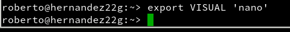

# Tareas programadas


## 1. Windows

Vamos hacer una tarea programada y otra diferida con `Windows 7`

### 1.1 Tarea diferida

La tarea diferida se define para ejecutarse una sola vez en una fecha futura.

- En Windows 7 para abrir el programador de tareas hacemos `Panel de control -> Herramientas administrativas -> Programador de tareas`.
- Vamos a programar una tarea diferida. Por ejemplo:
    - Para que nos muestre un mensaje en pantalla.
    - O para que inicie un programa determinado (Firefox).


- Seleccionamos `programador de tareas`


- Crear tarea.


- Acciones y le damos a `nuevo`


- En la Pestaña `Desencadenadores` le damos a nuevo y especificamos a al iniciar la sesión.


- Crear un mensaje al iniciar la sesión.


- Crear una tarea para que al iniciar el Windows 7, se inicie el Internet Explorer.


- Comprobamos las acciones creadas.


- Comprobamos que la tarea diferida está creada.


- Reiniciamos el ordenador y nos muestra el mensaje creado en la tarea.


- Se ejecuta Internet Explorer al iniciar la sesión.


## 2. Windows - Tarea periódica

La tarea programada se define para ejecutarse periódicamente cada intervalo de tiempo.

- Vamos a programar una tarea periódica para apagar el equipo.
- El comando para apagar el sistema es shutdown.

    - `shutdown /?`: Muestra la ayuda del comando.

Vamos a crear una tarea básica.


- Seleccionamos una vez.


- Iniciar un programa.


- Seleccionamos el comando `shutdown` y establecemos en agregar argumentos `/s`


- Escribimos el nombre de la Tarea.


- Comprobamos que tenemos dos tareas programas.


- Vemos que la tarea programada de apagar el equipo es efectiva. Vemos que nos muestra un mensaje como que en 1 minuto se apagará.


## 3. SO GNU/Linux - Tarea diferida

Vamos a hacer una tarea diferida con GNU/Linux.


El servicio atd es el responsable de la ejecución de los comandos at. Comprobar que esté en ejecución:

- `Yast -> Servicios`
- `systemctl status atd`

Tenemos que iniciar el servicio de `atd`.

```console
roberto@hernandez22g:~/Escritorio> sudo systemctl status atd
root's password:
● atd.service - Deferred execution scheduler
   Loaded: loaded (/usr/lib/systemd/system/atd.service; disabled; vendor preset: disabled)
   Active: inactive (dead)
roberto@hernandez22g:~/Escritorio> sudo systemctl start atd
roberto@hernandez22g:~/Escritorio> sudo systemctl status atd
● atd.service - Deferred execution scheduler
   Loaded: loaded (/usr/lib/systemd/system/atd.service; disabled; vendor preset: disabled)
   Active: active (running) since jue 2018-01-25 11:42:29 WET; 2s ago
 Main PID: 3401 (atd)
    Tasks: 1 (limit: 512)
   CGroup: /system.slice/atd.service
           └─3401 /usr/sbin/atd -f

ene 25 11:42:29 hernandez22g systemd[1]: Started Deferred execution scheduler.
roberto@hernandez22g:~/Escritorio>
```

    Ejemplos de comandos:

    - `at`, crea una tarea diferida.
    - `atq`, muestra los trabajos en cola.
    - `at -c 1`, muestra la configuración del trabajo ID=1.
    - `atrm 1`, elimina el trabajo con ID=1.

Otra forma de trabajar con at: at 11:45 Feb 28 < scriptname.sh

- Si el usuario no tuviera permisos para ejecutar at, consultar los ficheros: `/etc/at.deny y /etc/at.allow`.

- atq, consultamos que no hay ninguna tarea programada.

Ejemplo de script que muestra un mensaje de aviso:

```bash
#!/bin/sh
# Mostrar mensaje en pantalla
DISPLAY=:0
export DISPLAY
zenity --info --text="¡Que la fuerza te acompañe!"

```


- Antes de crear una tarea debemos instalar el `zenity`.


- Ya tenemos creado el script y ahora vamos a crear una tarea programada.

```console
roberto@hernandez22g:~> at 12:00 Jan 25 < scriptroberto.sh
warning: commands will be executed using /bin/sh
job 1 at Thu Jan 25 12:00:00 2018
roberto@hernandez22g:~> atq
1	Thu Jan 25 12:00:00 2018 a roberto
roberto@hernandez22g:~> at -c 1
#!/bin/sh
# atrun uid=1000 gid=100
# mail roberto 0
umask 22
XDG_VTNR=7; export XDG_VTNR
LESSKEY=/etc/lesskey.bin; export LESSKEY
MANPATH=/usr/local/man:/usr/share/man; export MANPATH
NNTPSERVER=news; export NNTPSERVER
XDG_SESSION_ID=2; export XDG_SESSION_ID
XDG_GREETER_DATA_DIR=/var/lib/lightdm-data/roberto; export XDG_GREETER_DATA_DIR
HOSTNAME=hernandez22g; export HOSTNAME
XKEYSYMDB=/usr/X11R6/lib/X11/XKeysymDB; export XKEYSYMDB
GLADE_PIXMAP_PATH=:/usr/share/glade3/pixmaps; export GLADE_PIXMAP_PATH
XDG_MENU_PREFIX=xfce-; export XDG_MENU_PREFIX
HOST=hernandez22g; export HOST
PROFILEREAD=true; export PROFILEREAD
HISTSIZE=1000; export HISTSIZE
WINDOWID=73400324; export WINDOWID
MORE=-sl; export MORE
OLDPWD=/home/roberto/Escritorio; export OLDPWD
XSESSION_IS_UP=yes; export XSESSION_IS_UP
GTK_MODULES=canberra-gtk-module; export GTK_MODULES
USER=roberto; export USER
JRE_HOME=/usr/lib64/jvm/jre; export JRE_HOME
LS_COLORS=no=00:fi=00:di=01\;34:ln=00\;36:pi=40\;33:so=01\;35:do=01\;35:bd=40\;33\;01:cd=40\;33\;01:or=41\;33\;01:ex=00\;32:\*.cmd=00\;32:\*.exe=01\;32:\*.com=01\;32:\*.bat=01\;32:\*.btm=01\;32:\*.dll=01\;32:\*.tar=00\;31:\*.tbz=00\;31:\*.tgz=00\;31:\*.rpm=00\;31:\*.deb=00\;31:\*.arj=00\;31:\*.taz=00\;31:\*.lzh=00\;31:\*.lzma=00\;31:\*.zip=00\;31:\*.zoo=00\;31:\*.z=00\;31:\*.Z=00\;31:\*.gz=00\;31:\*.bz2=00\;31:\*.tb2=00\;31:\*.tz2=00\;31:\*.tbz2=00\;31:\*.xz=00\;31:\*.avi=01\;35:\*.bmp=01\;35:\*.fli=01\;35:\*.gif=01\;35:\*.jpg=01\;35:\*.jpeg=01\;35:\*.mng=01\;35:\*.mov=01\;35:\*.mpg=01\;35:\*.pcx=01\;35:\*.pbm=01\;35:\*.pgm=01\;35:\*.png=01\;35:\*.ppm=01\;35:\*.tga=01\;35:\*.tif=01\;35:\*.xbm=01\;35:\*.xpm=01\;35:\*.dl=01\;35:\*.gl=01\;35:\*.wmv=01\;35:\*.aiff=00\;32:\*.au=00\;32:\*.mid=00\;32:\*.mp3=00\;32:\*.ogg=00\;32:\*.voc=00\;32:\*.wav=00\;32:; export LS_COLORS
XNLSPATH=/usr/share/X11/nls; export XNLSPATH
XDG_SESSION_PATH=/org/freedesktop/DisplayManager/Session0; export XDG_SESSION_PATH
GLADE_MODULE_PATH=:/usr/lib64/glade3/modules; export GLADE_MODULE_PATH
XDG_SEAT_PATH=/org/freedesktop/DisplayManager/Seat0; export XDG_SEAT_PATH
HOSTTYPE=x86_64; export HOSTTYPE
SSH_AUTH_SOCK=/run/user/1000/keyring/ssh; export SSH_AUTH_SOCK
SESSION_MANAGER=local/hernandez22g:@/tmp/.ICE-unix/1886,unix/hernandez22g:/tmp/.ICE-unix/1886; export SESSION_MANAGER
CONFIG_SITE=/usr/share/site/x86_64-unknown-linux-gnu; export CONFIG_SITE
FROM_HEADER=; export FROM_HEADER
PAGER=less; export PAGER
CSHEDIT=emacs; export CSHEDIT
XDG_CONFIG_DIRS=/etc/xdg:/etc/xdg; export XDG_CONFIG_DIRS
MINICOM=-c\ on; export MINICOM
DESKTOP_SESSION=xfce; export DESKTOP_SESSION
MAIL=/var/spool/mail/roberto; export MAIL
PATH=/home/roberto/bin:/usr/local/bin:/usr/bin:/bin:/usr/bin/X11:/usr/games; export PATH
CPU=x86_64; export CPU
QT_IM_MODULE=xim; export QT_IM_MODULE
JAVA_BINDIR=/usr/lib64/jvm/jre/bin; export JAVA_BINDIR
XDG_SESSION_TYPE=x11; export XDG_SESSION_TYPE
INPUTRC=/home/roberto/.inputrc; export INPUTRC
PWD=/home/roberto; export PWD
XMODIFIERS=@im=local; export XMODIFIERS
JAVA_HOME=/usr/lib64/jvm/jre; export JAVA_HOME
LANG=es_ES.utf8; export LANG
PYTHONSTARTUP=/etc/pythonstart; export PYTHONSTARTUP
GDMFLEXISERVER=/usr/lib/lightdm/gdmflexiserver; export GDMFLEXISERVER
GDMSESSION=xfce; export GDMSESSION
GPG_TTY=/dev/pts/0; export GPG_TTY
SHLVL=3; export SHLVL
HOME=/home/roberto; export HOME
QT_SYSTEM_DIR=/usr/share/desktop-data; export QT_SYSTEM_DIR
XDG_SEAT=seat0; export XDG_SEAT
LESS_ADVANCED_PREPROCESSOR=no; export LESS_ADVANCED_PREPROCESSOR
OSTYPE=linux; export OSTYPE
LS_OPTIONS=-N\ --color=tty\ -T\ 0; export LS_OPTIONS
XCURSOR_THEME=DMZ; export XCURSOR_THEME
WINDOWMANAGER=/usr/bin/startxfce4; export WINDOWMANAGER
G_FILENAME_ENCODING=@locale,UTF-8,ISO-8859-15,CP1252; export G_FILENAME_ENCODING
LESS=-M\ -I\ -R; export LESS
XDG_SESSION_DESKTOP=xfce; export XDG_SESSION_DESKTOP
LOGNAME=roberto; export LOGNAME
MACHTYPE=x86_64-suse-linux; export MACHTYPE
XDG_DATA_DIRS=/usr/share/xfce:/usr/share:/usr/share; export XDG_DATA_DIRS
LC_CTYPE=es_ES.UTF-8; export LC_CTYPE
DBUS_SESSION_BUS_ADDRESS=unix:abstract=/tmp/dbus-ozGJi4Xh1E,guid=8e677242f967c9039b65036d5a69c21e; export DBUS_SESSION_BUS_ADDRESS
LESSOPEN=lessopen.sh\ %s; export LESSOPEN
XDG_RUNTIME_DIR=/run/user/1000; export XDG_RUNTIME_DIR
GLADE_CATALOG_PATH=:/usr/share/glade3/catalogs; export GLADE_CATALOG_PATH
XAUTHLOCALHOSTNAME=hernandez22g; export XAUTHLOCALHOSTNAME
GTK_IM_MODULE=cedilla; export GTK_IM_MODULE
XDG_CURRENT_DESKTOP=XFCE; export XDG_CURRENT_DESKTOP
LESSCLOSE=lessclose.sh\ %s\ %s; export LESSCLOSE
G_BROKEN_FILENAMES=1; export G_BROKEN_FILENAMES
QT_IM_SWITCHER=imsw-multi; export QT_IM_SWITCHER
JAVA_ROOT=/usr/lib64/jvm/jre; export JAVA_ROOT
XAUTHORITY=/home/roberto/.Xauthority; export XAUTHORITY
COLORTERM=xfce4-terminal; export COLORTERM
cd /home/roberto || {
	 echo 'Execution directory inaccessible' >&2
	 exit 1
}
#!/bin/sh
# Mostrar mensaje en pantalla
DISPLAY=:0
export DISPLAY
zenity --info --text="¡Que la fuerza te acompañe!"

roberto@hernandez22g:~>
```

Comandos para utilizar en el ejercicio anterior

- Usar comando at para programar una tarea diferida. Por ejemplo para mostrar un mensaje en pantalla.
- `atq`, consultamos que SI hay una tarea programada.
- `at -c 1`, muestra la configuración del trabajo ID=1.

- Capturar imagen cuando se ejecute la tarea.


- `atq`, consultamos que ya NO hay tareas.


## 4. GNU/Linux - Tarea periódica

Consultar

- Vídeo Scheduling tasks with cron
- Enlaces de interés [Tareas programadas]](https://www.nerion.es/soporte/tutoriales/tareas-programadas-en-linux/)

Para programar una tarea periódica tenemos dos formas:

- Los usuarios normales usan el comando crontab para programar sus tareas periódicas.

- El usuario root o usuario con privilegios de administrador, además puede usar el fichero `/etc/crontab` para programar las tareas del sistema.

- Entrar con mi usuario normal.
- `crontab -l`, para consultar que no hay tareas programadas.


- Por defecto se usa el editor vim para modificar `crontab`. Si queremos usar el editor nano, hacemos `export VISUAL'nano'`.




- `crontab -e`, abre el editor para crear una nueva tarea periódica.

- Definir una tarea periódica (crontab) para apagar el equipo todos los días a una hora/minuto determinada.

- Para salir del editor vim, escribimos la secuencia ESC, : y wq.


- `crontab -l`, para consultar la tarea que tenemos programada.


```
    Otro script de ejemplo:

        #!/bin/bash
        # Añade la fecha/hora a un fichero cron.log
        date >> /home/usuario/cron.log
```

Para definir una tarea ASINCRONA ponemos el script de ejecución en alguno de los directorios siguientes:

- `/etc/cron.hourly`, cada hora
- `/etc/cron.daily`, diariamente
- `/etc/cron.weekly`, semanalmente
- `/etc/cron.monthly`, mensualmente
