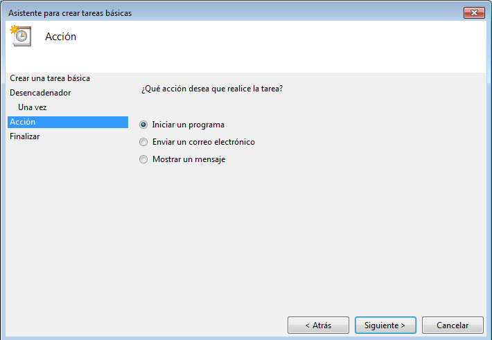

# Tareas programadas

## 1. Windows

Vamos hacer una tarea programada y otra diferida con `Windows 7`

### 1.1 Tarea diferida

La tarea diferida se define para ejecutarse una sola vez en una fecha futura.

- En Windows 7 para abrir el programador de tareas hacemos `Panel de control -> Herramientas administrativas -> Programador de tareas`.
- Vamos a programar una tarea diferida. Por ejemplo:
    - Para que nos muestre un mensaje en pantalla.
    - O para que inicie un programa determinado (Firefox).

## 2. Windows - Tarea periódica

La tarea programada se define para ejecutarse periódicamente cada intervalo de tiempo.

- Vamos a programar una tarea periódica para apagar el equipo.
- El comando para apagar el sistema es shutdown.

    - `shutdown /?`: Muestra la ayuda del comando.

